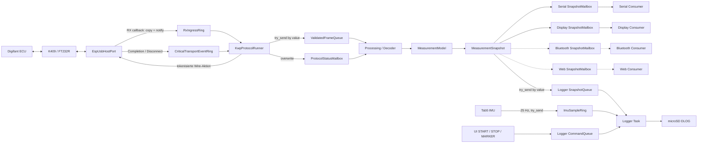

# M5Tab5 Digifant Analyzer – Architecture V2

**Status:** verbindliche Architektur; Zielbild und Iststand sind getrennt ausgewiesen
**Zielplattform:** M5Stack Tab5 / ESP32-P4, AutoDia K409 mit FTDI FT232R,
Digifant 1.7
**Zielprojekt:** `M5Tab5_Digifant_Analyzer/`

**Iststand 2026-08-25:** Die V2-009–V2-019-Pipeline und die reale ECU-/IMU-/SD-
Abnahme sind in `M5Tab5_Digifant_Analyzer/verification.md` als PASS
dokumentiert. Die folgenden Namen (`EspUsbHostPort`, `FtdiK409Phy`,
`KwpProtocolRunner`, `ProtocolStatusMailbox`) beschreiben das verbindliche
Verantwortungsmodell; die aktuelle Targetverdrahtung liegt noch teilweise in
der `.ino` und wird erst mit den risikoarmen Refactoring-Schritten in
`REFACTORING_REVIEW_SOL_HIGH.md` physisch auf diese Grenzen geschnitten.

## 1. Zweck

Die Anwendung besitzt genau eine produktive Datenpipeline:

```text
ECU / K409
  → zeitkritischer RX-/KWP-Pfad
  → bounded ValidatedFrameQueue
  → entkoppelter Decoder
  → MeasurementModel
  → immutable MeasurementSnapshot
  → unabhängige Consumer
      → Serial
      → Display
      → optionale/derzeit nicht produktive Bluetooth-Testmailbox
      → optionale/derzeit nicht produktive Web-Testmailbox
```

Diese Pipeline ist die Architektur. Zusätzliche parallele RX-, Frame-, Decoder-
oder UI-Pfade sind nicht zulässig.

Für Diagnoseaufzeichnungen darf ein separater, rein beobachtender
Fahrzustandspfad existieren:

```text
Tab5 IMU → bounded ImuSampleRing ─┐
MeasurementSnapshot ──────────────┼→ Logger-Task → versioniertes DLOG
UI START/STOP/MARKER ─────────────┘
```

Dieser Pfad ist kein Teil der ECU-Interpretation. IMU-Werte gelangen weder in
`MeasurementModel` noch in `MeasurementSnapshot`; sie können KWP, Decoder,
Messgruppenplan oder Consumerzustände nicht steuern.

Die Vereinfachung betrifft Organisation und Datenfluss. Die bereits bewiesenen
Transport- und Timingverträge bleiben verbindlich: tokenisierte TX-/Control-
Operationen, korrelierte Completion, Quiescence, Generation/Retirement,
Core-eigene Deadlines sowie SPSC-Poison-/Overflow-Semantik.

## 2. Bewährte Ausgangsbasis

### 2.1 Known-Good-Referenz

`M5Tab5_Digifant_Proto/` bleibt eine ausschließlich lesbare Behavioral
Reference. Vor Arbeiten an Hardware-, KWP- oder Decoderverhalten wird dort
zuerst das funktionierende Verhalten geprüft.

Bewährtes Fach- und Hardwarewissen wird übernommen:

- FT232R-K409: VID `0x0403`, PID `0x6001`;
- Digifant-Datenphase mit 1200 Baud;
- 5-Baud-Adresse `0x01`, zehn Zellen mit 200 ms je Bit;
- mindestens 2600 ms Busruhe als funktionierender Referenzwert;
- FTDI-Break/Mark, DTR/RTS und 1-ms-Latency-Timer;
- lokales TX-Echo, inverse Bytequittungen, Blockcounter und Terminator `0x03`;
- Requests `0x12`, `0x29 <group>` und `0x09`;
- Identifikation und Messgruppen 000–004;
- belegte Digifant-Formeln und unveränderte Captures/Goldenwerte.

Nicht übernommen werden die direkte Kopplung von Empfang, KWP, Console,
Decoder und Dashboard, blockierende Sleeps im Protokollfluss, globale UI-
Fachzustände oder Decoderlogik in Views.

Konkrete Referenzquellen:

| Referenzdatei | wiederverwendbares Wissen | nicht übernehmen |
|---|---|---|
| `EcuInitTester.cpp/.h` | 5-Baud-Folge, Busruhe, Echo/ACK, Blockaufbau, Gruppenplan | Loop-/Console-/Dashboard-Kopplung |
| `UsbCdcLink.cpp/.h` | FTDI Baud, DTR/RTS, Break und Latency-Control | unkorrelierte öffentliche Transfersemantik |
| `ReplayData.h` und Fahrzeugcaptures | reale Telegramme, Counter, Gruppen 000–004 | alte Simulationsklassen |
| `Dashboard.cpp/.h` | bewährte Darstellung und Feldwahl | Formeln, mutable Fachzustände und direkte KWP-Aufrufe in der UI |

### 2.2 Bereits bewährte V2-Funktionalität

Folgende Teile werden erhalten und nur dort umverdrahtet, wo die vereinfachte
Pipeline es verlangt:

- gepinnter minimaler EspUsbHost-2.7.8-Port/Fork;
- tokenisierte Bulk-OUT- und FTDI-Control-Completions;
- Cancel/Drain, Retirement, Quiescence und Transportgeneration;
- K409-Erkennung und Hotplug-/Reconnect-Verhalten;
- `RxIngressRing` einschließlich SPSC-, Poison- und Epochenvertrag;
- KWP Byte Engine, Core, MeasurementPlan und Gruppenfolge 000–004;
- reale ECU-Funktion sowie die vorhandenen Host-/Targettests;
- KWP-Parser, Digifant-Decoder, Formeln und Golden-Captures.

Die fehlende Logic-Analyzer-Messung bleibt transparent als
`PENDING-OPTIONAL-HARDWARE-EVIDENCE`. Sie ist kein Grund für einen Rewrite der
funktionierenden Produktivlogik.

## 3. Unverhandelbare Invarianten

1. Es gibt genau einen produktiven RX-Pfad:
   `EspUsbHost callback → RxIngressRing → KwpProtocolRunner`.
2. Der `RxIngressRing` hat genau einen Producer und genau einen Consumer.
3. Nur der KWP-Runner konsumiert RX-Bytes, besitzt den KWP-Zustand und reicht
   TX-/Control-Operationen ein.
4. Es gibt genau eine Queue für validierte Frames: `ValidatedFrameQueue`.
5. Der KWP-Runner publiziert Frames by value mit Wartezeit null. Eine volle
   FrameQueue erzeugt einen gezählten Drop, niemals KWP-Backpressure.
6. Parser, Digifant-Decoder und MeasurementModel liegen vollständig hinter der
   FrameQueue. Kein Decoderresultat steuert ACK, Counter, Keep-Alive oder
   Messgruppenfolge.
7. Genau die Processing-/Decoder-Task verändert das `MeasurementModel`.
8. Consumer erhalten ausschließlich immutable Snapshots by value.
9. Serial und Display rufen weder Transport noch KWP noch Decoder direkt auf.
10. Transport, KWP und Decoder rufen weder Serial noch Display direkt auf.
11. Jeder Consumer besitzt einen eigenen bounded Kanal. Ein langsamer Consumer
    kann keinen anderen Consumer oder Upstream-Task blockieren.
12. Bluetooth und Webserver werden ausschließlich durch zusätzliche
    Snapshot-Mailboxen und Consumer ergänzt; Dummy-Consumer sind ausschließlich
    im expliziten Stressbuild aktiv und keine Produktfunktionen.
13. Nach Startup gibt es im zeitkritischen Pfad keine dynamische Allokation,
    Stringformatierung, Datei-, Netzwerk-, Serial- oder Displayoperation.
14. Jeder Ring und jede Queue hat feste Kapazität, Full-Policy, Dropzähler und
    High-Watermark.
15. Die IMU besitzt genau einen Target-Owner. Sie publiziert ausschließlich
    feste, timestamped `ImuSample`-Werte nonblocking an den Logger.
16. ECU-Snapshot, IMU-Sample und manuelle Logger-Events verwenden dieselbe
    monotone 64-Bit-Mikrosekundenuhr; ihre Zusammenführung findet nur in der
    Logger-Task statt.
17. Aus IMU-Beschleunigungen werden weder Geschwindigkeit noch absolute
    Fahrzeuglage oder Fahrmanöver als gesicherte ECU-Werte abgeleitet.

## 4. Komponenten und Datenrichtung



Die gestrichelten Consumer sind Erweiterungspunkte und noch nicht Teil des
Minimalprodukts. Ihr späteres Hinzufügen ändert ausschließlich die
Startverdrahtung und den jeweiligen Consumer.

Logger und IMU sind ebenfalls ausschließlich Downstream-Beobachter. Das
Dateisystem ist nur der Logger-Task bekannt; der IMU-Sampler kennt weder SD
noch Snapshot, KWP oder UI.

### 4.1 `EspUsbHostPort` und `FtdiK409Phy`

Der vorhandene gepinnte Port bleibt die einzige Verbindung zu EspUsbHost. Er:

- filtert ausschließlich den FT232R-K409;
- vergibt pro Handle-Inkarnation eine neue `transport_generation`;
- kopiert RX-Batches ausschließlich in den `RxIngressRing`;
- publiziert tokenisierte Completion-/Disconnect-Ereignisse in den kritischen
  Transportevent-Ring;
- hält TX-/EP0-Ressourcen bis zum Retirement gültig;
- enthält keine KWP-, Decoder-, Serial- oder Displaylogik.

Der Callback speichert keine USB-Pointer. Er erfasst Batchtimestamp,
Transportgeneration, Ingress-Epoche und monotone Eventsequenz, publiziert den
vollständigen Batch und weckt danach einmal den Runner. Notification ist nur
ein Wake-Hinweis; die Information liegt immer im Ring.

### 4.2 `RxIngressRing`

Der Ring besitzt 512 Slots, davon 511 nutzbar. EspUsbHost ist der einzige
Producer, der KWP-Runner der einzige Consumer.

Bei der ersten Lücke wechselt die aktuelle Ingress-Epoche nach `Poisoned`.
Danach werden alle weiteren Bytes bis zum expliziten Reset verworfen. Der
Runner verwirft Session und Framebuilder und öffnet eine neue Epoche erst bei
nachgewiesener Producer-Quieszenz. Ein Callback, der poisoned begonnen hat oder
währenddessen poisont, bleibt bis zu seinem Ende drop-only.

`wire_rx`, EspUsbHost-CDC-Schattenringe oder andere Bytepuffer dürfen nicht als
zweiter produktiver Eingang des KWP-Runners verwendet werden.

### 4.3 `KwpProtocolRunner` und Core (Verantwortungsmodell)

Der Runner ist der einzige Owner von PHY, KWP-Core, Byte Engine, Session,
Framebuilder, Counter und MeasurementPlan. Er:

- merged RX- und kritische Transportereignisse deterministisch;
- prüft Disconnect/Overflow vor normalem Fortschritt;
- führt Core-Aktionen bis zur Quieszenz aus;
- validiert nur KWP-kritische Frameeigenschaften;
- publiziert vollständige `KwpFrameEnvelope`s nonblocking;
- publiziert einen kompakten Status per Overwrite-Mailbox.

Im Runner finden keine Payloadformeln, Hexdumps, Strings, Serial-, Display-,
Storage- oder Netzwerkaufrufe statt. Die Messgruppenfolge bleibt autonom und
wartet niemals auf Decoder oder Consumer.

### 4.4 `ValidatedFrameQueue`

Dies ist die einzige Runtime-Queue für validierte Frames:

```text
Producer: KwpProtocolRunner
Consumer: Processing/Decoder Task
Kapazität: 32 Envelopes
Übergabe: by value
Full-Policy: drop newest, frame_drop_full++, niemals warten
```

`rx_sequence` wird vor dem Publikationsversuch vergeben. Ein Drop erzeugt damit
eine sichtbare Sequenzlücke. Der Decoder invalidiert nach einer Lücke
abhängige Header-/Bodyzustände, bis ein neuer passender Header vorliegt.

Eine zusätzliche `PersistenceQueue`, `DiagnosticQueue` oder ein zweiter
Frameconsumer ist in der minimalen Runtime nicht vorgesehen. Captures bleiben
Testdaten. Eine spätere persistente Aufzeichnung darf nur downstream aus einem
eigenen interpretierten Event/Snapshot entstehen und nie die FrameQueue teilen.

### 4.5 Processing, Decoder und `MeasurementModel`

Eine einzige Processing-Task konsumiert die FrameQueue. Sie besitzt:

- KWP-Anwendungsparser;
- Digifant-Decoder;
- Headercache für Gruppen 001–004;
- das einzige mutable `MeasurementModel`;
- Snapshot-Erzeugung und Snapshot-Verteilung.

Der Decoder akzeptiert ausschließlich `KwpFrameEnvelope`s aus der FrameQueue.
Er kennt weder USB/FTDI noch KWP-Aktionen, Serial, M5Display, Bluetooth oder
Webserver.

Das Modell besitzt eine feste, by-value ECU-Feldrepräsentation mit genau 26
Einträgen für den derzeit unterstützten Umfang: zehn Felder aus Gruppe 000 und
je vier Zonen aus Gruppen 001–004. Kein beobachtetes ECU-Feld darf zwischen
Decoder und Snapshot verworfen werden. Jedes Feld speichert mindestens Gruppe,
Zone, Rohwert, Formel-ID, NWB, dekodierten Wert sofern bekannt,
Einheit/Semantik sofern belegt, Raw-/Decode-/Validity-Status, Messtimestamp,
`rx_sequence`, `session_epoch` und `transport_generation`.

Bekannte Formeln und Signale dürfen zusätzlich als benannte Convenience-Views
(beispielsweise RPM, Temperaturen, Batteriespannung und G69-Raw) angeboten
werden. Diese Views ersetzen niemals die generische 26-Feld-Repräsentation.
Unbekannte Formeln oder Bedeutungen bleiben als Raw-only-Feld mit Provenienz
erhalten; es werden keine ECU-Interpretationen erfunden. Die Repräsentation
enthält keine Pointer, Strings, Heapobjekte oder dynamisch wachsenden
Container.

Disconnect, Sessionwechsel und Sequenzlücken machen betroffene Felder sichtbar
stale/invalid; alte Werte werden nicht still als aktuell ausgegeben.

### 4.6 Immutable Snapshot und Consumer

`MeasurementSnapshot` ist eine vollständige, pointerfreie Wertkopie des
gesamten MeasurementModel einschließlich aller 26 ECU-Felder. Er enthält
zusätzlich Messwerte, Convenience-Views, Gültigkeit, Alter, Sessionstatus,
letzte Sequenz sowie relevante Drop-/Faultzähler. Ein Snapshot ist damit auch
dann fachlich vollständig, wenn kein Consumer alle Felder darstellt.

Für jeden Consumer existiert eine eigene Queue der Länge eins mit
Overwrite-latest:

- `SerialSnapshotMailbox`;
- `DisplaySnapshotMailbox`;
- später `BluetoothSnapshotMailbox`;
- später `WebSnapshotMailbox`.

Die Processing-Task erzeugt einmal einen Snapshot und kopiert ihn nonblocking
in alle konfigurierten Mailboxen. Die Mailboxen werden beim Startup fest
verdrahtet. Ein Consumer liest ausschließlich seine eigene Kopie. Ein langsamer
Consumer sieht eventuell ältere Snapshots nicht, blockiert aber niemanden.

Serial formatiert nur in der Serial-Task. Display rendert nur im UI-Kontext.
Bluetooth und Webserver sind gleichrangige zukünftige Blattconsumer.
Transport-/Protokolldiagnosen und ECU-Feldstatus werden als numerische Werte in
den Snapshot übernommen und erst im jeweiligen Consumer in Text oder Grafik
umgesetzt. Kein Consumer darf auf FrameQueue, Decoder, MeasurementModel oder
Transport zurückgreifen; jeder entscheidet selbst, welche Snapshotfelder er
darstellt.

### 4.7 Langzeitlogger und optionaler IMU-Fahrzustandskontext

Der Langzeitlogger erhält ECU-Daten ausschließlich als vollständige
`MeasurementSnapshot`-Wertkopien. Eine feste Snapshot-SPSC-Queue trennt ihn
von Processing. Queue-full verwirft den neuesten Logger-Snapshot, erhöht einen
sichtbaren Logger-Dropzähler und hat keine Wirkung auf Model, Decoder oder KWP.
Formatierung, Dateierzeugung, Flush und Fehlerbehandlung liegen ausschließlich
in einer niedrig priorisierten Logger-Task.

Die optionale Tab5-IMU ergänzt denselben Aufzeichnungszeitstrahl mit einem
festen, trivially-copyable Werttyp:

```text
ImuSample
  timestamp_us:uint64       // esp_timer_get_time(), monoton
  sequence:uint32
  accel_x/y/z_mg:int32      // Sensorachsen, Milli-g
  gyro_x/y/z_mdps:int32     // Sensorachsen, Milli-Grad/s
  validity:uint8
```

Die Abtastrate beträgt zunächst fest 25 Hz. Der IMU-Sampler ist der einzige
IMU-Owner und publiziert mit Wartezeit null in einen SPSC-Ring mit 257 Slots
(256 nutzbar). Full-Policy ist Drop-newest mit Dropzähler und High-Watermark.
Er alloziert, formatiert und schreibt nicht. Die Sensorachsen werden zunächst
als native Tab5-Achsen gespeichert. Eine Fahrzeugachsen-Zuordnung darf erst
nach dokumentierter Einbaulage/Orientierungsprüfung als Metadaten ergänzt
werden. Stillstandsoffset und Rauschband sind Messwerte, keine fest erfundenen
Konstanten.

Die Logger-Task besitzt je höchstens ein pending Element aus Snapshot-, IMU-
und Command-Queue und schreibt das zeitlich kleinste Element. START öffnet ein
neues Log; ältere pending Samples werden verworfen. MARKER und STOP werden an
ihrem originalen UI-Timestamp eingeordnet. STOP schreibt und flusht alle bis
zum STOP-Zeitpunkt bereits angenommenen Records und schließt danach die Datei.
Ein ungebundenes Sortieren oder nachträgliches Warten auf einen Producer ist
nicht zulässig.

Das Dateiformat wird additiv auf DLOG Version 2 erweitert. Version-1-Dateien
bleiben unverändert lesbar. V2 führt mindestens die Recordtypen
`ECU_SNAPSHOT`, `IMU_SAMPLE`, `START`, `STOP`, `MARKER` und
`IMU_ORIENTATION` mit festen Recordgrößen oder eindeutig längenkodierten,
begrenzten Records. Jeder Record besitzt Typ, Schemaversion, monotone Zeit und
Integritäts-/Längeninformation. Der Host-Konverter akzeptiert V1 und V2 und
gibt ECU-, IMU- und Eventdaten mit unverändertem Timestamp aus.

Der Loggerstatus enthält getrennte Zähler für ECU-Snapshots, IMU-Samples,
manuelle Events, Snapshotqueuedrops, IMU-Queuedrops und Schreibfehler. Display
und Serial erhalten Statuskopien; sie lesen niemals Loggerqueue oder Datei.
Fehlende/volle SD, Mount-, Write- oder Flushfehler stoppen nur die
Aufzeichnung. KWP und IMU-Sampling laufen unabhängig weiter.

## 5. Erhaltene kritische Transportverträge

### 5.1 Token und genau eine semantische Lane

Jede TX-/Control-Operation trägt unverändert:

```text
TransportOpToken
  transport_generation
  session_epoch
  semantic_turn_id
  transport_op_id
  operation_kind
```

Zu jeder Zeit ist höchstens eine semantische Wire-Operation aktiv. Mehrere
vorallokierte USB-Slots sind nur Ressourcen und niemals ein KWP-Sendefenster.
Synchrone Submission unterscheidet `Accepted`, `RejectedNoEffect` und
`OutcomeUnknown`.

### 5.2 Completion, Retirement und Quiescence

Der Lifecycle bleibt:

```text
Active → Retiring → Retired
```

Nur ein exakt passendes Active-Ereignis darf den aktuellen Turn verändern.
Nach Timeout/Abort darf eine passende Completion nur Retirement und
Quiescence fortschreiben. Duplicate, stale oder falsch generationierte
Ereignisse werden gezählt und beeinflussen keinen neuen Zustand.

Timeout bedeutet nicht physisch beendet. Vor einer neuen Wire-Aktion müssen
Bulk-OUT, EP0 und FTDI-Leitungszustand nachweislich quieszent sein. Ist das
innerhalb der Recovery-Deadline nicht beweisbar, wird die Generation geschlossen
und erst nach Reconnect mit neuer Generation fortgesetzt.

### 5.3 Timing und Deadlines

Nur der KWP-Core besitzt semantische Zeitfenster. Sie sind absolute, halb offene
Fenster `[not_before_us, deadline_us)`; Gleichheit mit `deadline_us` ist
abgelaufen. Der Runner benutzt `next_wakeup()` nur als Wake-Hilfe.

Zeitanker bleiben die originalen Ereigniszeiten, insbesondere Batchtimestamp
des ECU-Bytes, KB2-Timestamp, Submitzeit, Echozeit und Terminatorzeit. Ein spät
verarbeitetes, aber rechtzeitig eingetroffenes Ereignis verhindert einen
False-Timeout nur dann, wenn die für eine neue Wire-Aktion verbleibende
Submitdeadline noch offen ist.

Vor `advance(now)` wird über Producer-Aktivität, Publication-Epoche und
Eventsequenz ausgeschlossen, dass ein begonnener Callback zwischen Empty-Check
und Timeout verloren geht. Stale Wakes ändern keine Semantik.

Die bekannten funktionierenden Timingwerte aus der Referenz bleiben
Ausgangsprofil. Offene physische Logic-Analyzer-Grenzen bleiben dokumentierte
optionale Evidenz und werden nicht durch Softwaremessungen als bewiesen
ausgegeben.

## 6. Tasks und Prioritäten

Es gibt nur die für den Datenfluss benötigten Laufzeitkontexte:

| Task/Kontext | Priorität | Aufgabe |
|---|---:|---|
| EspUsbHost/Client | 7 | kurze USB-/Completion-Callbacks |
| KWP Protocol Runner | 6 | RX, ACK, Timing, Session, Framevalidierung |
| Processing/Decoder | 3 | FrameQueue, Decoder, Model, Snapshots |
| Display/UI | 2 | eigene Snapshotkopie rendern |
| Serial Consumer | 1 | eigene Snapshotkopie formatieren/ausgeben |
| IMU Sampler | 1 | 25-Hz-Sensorwerte nonblocking publizieren |
| Logger | 1 | Snapshot/IMU/Event zeitlich mergen und SD schreiben |

Bluetooth und Webserver erhalten später höchstens Consumerpriorität und keine
Referenz auf Transport, Runner oder Decoder. Die Prioritäten werden gesetzt und
auf dem Target zurückgelesen. Initial wird keine Core-Affinity erzwungen.

## 7. Queue- und Overflowmodell

| Kanal | Kapazität | Full-Policy | Folge |
|---|---:|---|---|
| `RxIngressRing` | 512/511 nutzbar | Poison + Drop bis Reset | aktuelle Session verwerfen |
| `CriticalTransportEventRing` | 32 | sticky Overflow | quieszieren/Generation schließen |
| `ValidatedFrameQueue` | 33/32 nutzbar | Drop newest | nur Downstream-Datenlücke |
| `ProtocolStatusMailbox` | 1 | Overwrite latest | kein KWP-Einfluss |
| Snapshot-Mailbox je Consumer | 1 | Overwrite latest | nur dieser Consumer überspringt Zustände |
| Logger SnapshotQueue | 33/32 nutzbar | Drop newest | Logger-Snapshotdrop, kein Upstream-Einfluss |
| `ImuSampleRing` | 257/256 nutzbar | Drop newest | nur IMU-Loglücke |
| Logger CommandQueue | 9/8 nutzbar | Reject + UI-Status | keine Zustandsänderung ohne angenommenen Command |
| Logger StatusMailbox je Statusconsumer | 1 | Overwrite latest | nur Statuszwischenstände entfallen |

Es gibt keine unbounded Queue und keinen Downstream-Send mit Wartezeit. Queue-
Kapazitäten dürfen nicht verwendet werden, um blockierende Consumer zu
kaschieren.

## 8. Fehler- und Recoveryregeln

| Ereignis | verbindliche Reaktion |
|---|---|
| RX-Overflow | Epoche poisonen, Builder/Session verwerfen, nach Quieszenz neu öffnen |
| Critical-Event-Overflow | keine Completion erraten; quieszieren oder Generation schließen |
| `RejectedNoEffect` | Turn abbrechen, kontrolliert recovern |
| `OutcomeUnknown`/Completiontimeout | keine neue Wire-Aktion; Cancel/Drain/Quiescence |
| stale/duplicate Completion | nur zählen, aktueller Turn unverändert |
| Echo-/ACK-/Counter-/Framefehler | keine blinde Fortsetzung; typisierte Session-Recovery |
| volle FrameQueue | Frame droppen, Sequenzlücke, KWP normal fortsetzen |
| Parser-/Decoderfehler | Modelstatus aktualisieren; kein Rückkanal zum KWP |
| volle Snapshot-Mailbox | alten Snapshot überschreiben; nur Consumer betroffen |
| Serial-/Displayausfall | Consumer lokal ausfallen lassen; Upstream unverändert |
| Loggerqueue voll | newest Loggerrecord droppen und zählen; KWP/Processing unverändert |
| IMU-Ring voll | newest IMU-Sample droppen und zählen; ECU-Logger/KWP unverändert |
| IMU init/read fault | IMU invalid/status setzen; ECU-Logging läuft weiter |
| SD fehlt/voll oder Write-/Flushfehler | Log schließen/fehlerhaft markieren; keinerlei KWP-Rückwirkung |
| Disconnect | Submission-Gate schließen, Generation pensionieren, Model disconnected |

Fehler werden als feste Codes und Zähler transportiert. Text entsteht nur in
Consumern.

## 9. Aktueller Iststand und verbleibende Strukturarbeit

Die funktionale V2-Umverdrahtung ist abgeschlossen: `RxIngressRing` ist der
produktive RX-Eingang, `ValidatedFrameQueue` die einzige Framegrenze,
`MeasurementModel` der Processing-Owner und Serial/Display/Logger lesen
Snapshots downstream. Die historischen V2-009–V2-014-Abweichungen (`wire_rx`,
`PersistenceQueue`, direkte Diagnoseausgabe) sind daher keine aktuellen
Runtimepfade mehr; ihr Nachweis bleibt in der Verificationchronik.

Für die Struktur bleiben folgende Punkte bewusst sichtbar:

| Aktueller Stand | Ziel/Refactoring |
|---|---|
| KWP-Callbacks, Completion-Warten und `run_session()` liegen in der `.ino`; die Arduino-Loop ist der reale Runner-Owner | späterer flacher Target-KWP-Runtimeowner, ohne Task- oder Timingänderung |
| `processing_task_entry()` verdrahtet `ProcessingService` und liest nur Runtime-Status | `ProcessingService` besitzt Decoder/Model und publiziert Snapshots; Serial-Auslagerung bleibt offen |
| Serial-CLI, Snapshotformatierung, Loggerstatus und IMU-Diagnose liegen in `SerialConsumer`; die Task ist Runtimeadapter | R6 abgeschlossen; IMU-Diagnosegrenze bleibt task-sicher |
| Bluetooth/Web laufen als langsame Dummy-Abnahmconsumer | nur in explizitem Stress-/Testbuild aktivieren |
| Commandqueue wird von Serial und Display beschickt | R1: bounded MPSC-Ingress; Snapshotqueue bleibt SPSC |

Keine dieser Strukturarbeiten darf Transport-, KWP-, Decoder- oder DLOG-
Semantik neu definieren. Sie werden erst nach den jeweiligen Hosttests und
dem geforderten Target-/ECU-Gate durchgeführt.

## 10. Test- und Stabilitätsvertrag

Nach jedem Migrationsschritt laufen:

1. alle bestehenden Hosttests mit Warnings-as-errors;
2. ASan/UBSan für alle Hosttests;
3. die gezielten Queue-/Ownership-/Decoder-/Snapshottests des Schritts;
4. Targetcompile für `esp32:esp32:m5stack_tab5`;
5. bei jeder Runtime-Umverdrahtung ein realer 60-s-Lauf mit Tab5, K409 und ECU.

Der reale Stabilitätslauf muss mindestens zeigen:

```text
KWP_TARGET_RESULT=PASS
KWP_MEASUREMENT_RESULT=RUNNING
Gruppen 000, 001, 002, 003 und 004 empfangen
parser_rejected=0
byte_fault=0
action_failures=0
stale_completions=0
kein RX-Overflow
```

Zusätzliche Pflichtnachweise:

- FrameQueue 60 s voll/Decoder angehalten: KWP bleibt stabil, nur
  `frame_drop_full` steigt;
- Serial dauerhaft blockiert: KWP und Decoder bleiben stabil;
- Display wiederholt mindestens 500 ms blockiert: KWP und Decoder bleiben
  stabil;
- langsamer Serialconsumer beeinflusst Displaymailbox nicht und umgekehrt;
- Dummy-Bluetooth-/Webconsumer können nur durch neue Snapshot-Mailboxen
  angeschlossen werden; Core- und Decoderquellen bleiben unverändert;
- blockierte/fehlerhafte SD und ein 60-s-Logger-/IMU-Consumerstall verändern
  keine RX-, ACK-, Session-, Parser- oder Decoderzähler;
- IMU-Sampler erreicht auf dem Target 25 Hz innerhalb dokumentierter Toleranz,
  bleibt bounded und erzeugt bei absichtlicher Sättigung ausschließlich
  gezählte IMU-Drops;
- DLOG-V1- und DLOG-V2-Goldenfiles werden vollständig und deterministisch vom
  Host-Konverter gelesen;
- statischer Check verbietet `Serial`/`M5.Display` in Transport-, KWP- und
  Decoderdateien sowie direkte Decoderaufrufe in Consumern.

Die vorhandenen realen Frames und die unveränderten Captures sind bevorzugte
Goldenquelle. Mocks ersetzen keine Hardware-Gates.

## 11. Einfache Projektorganisation

Unterordner entstehen nur bei mehreren zusammengehörigen Dateien. Die
Zielorganisation bleibt flach:

```text
M5Tab5_Digifant_Analyzer/
├── M5Tab5_Digifant_Analyzer.ino
├── src/
│   ├── esp_usb_host_fork/
│   ├── rx_ingress_ring.h
│   ├── kwp1281_core.h
│   ├── kwp_*.h
│   ├── validated_frame_queue.h
│   ├── digifant_decoder.h
│   ├── measurement_model.h
│   ├── measurement_snapshot.h
│   ├── processing_service.h  # R6 Processing abgeschlossen; Serial noch offen
│   ├── serial_consumer.h     # R6 Serial abgeschlossen; dünner Taskadapter
│   └── display_consumer.h    # optionaler Header/Implementierungsschnitt
├── tests/
├── captures/
├── README.md
├── ARCHITECTURE.md
└── verification.md
```

Keine leeren Framework-Schichten, keine parallelen Sourcebäume und keine
generierten Buildverzeichnisse als Architektur.

## 12. Definition of Done

- [x] `RxIngressRing` ist der einzige produktive RX-Übergabepunkt.
- [x] Genau ein KWP-Owner konsumiert RX und besitzt die Session; der physische
      Target-Runner ist derzeit die Arduino-Loop.
- [x] `wire_rx` und jeder zweite Runtime-RX-Pfad sind entfernt.
- [x] Genau eine bounded `ValidatedFrameQueue` verbindet KWP und Processing.
- [x] Decoder und MeasurementModel arbeiten ausschließlich downstream.
- [x] Das MeasurementModel besitzt Gültigkeit, Provenienz, Zeit und Sequenz.
- [x] Das MeasurementModel bewahrt alle 26 beobachteten ECU-Felder by value;
      kein Decoderfeld wird still verworfen.
- [x] Jedes ECU-Feld trägt Gruppe, Zone, Rawwert, Formel-ID, NWB, Status sowie
      Zeit-/Sequenz-/Session-/Generationsprovenienz; unbekannte Werte bleiben
      Raw-only.
- [x] `MeasurementSnapshot` enthält dieselbe vollständige 26-Feld-Repräsentation
      zusätzlich zu benannten Convenience-Views.
- [x] Immutable Snapshots werden by value in eigene Consumer-Mailboxen kopiert.
- [x] Serial und Display lesen ausschließlich ihre Snapshotkopie.
- [x] Transport/KWP/Decoder enthalten keine direkten Serial-/Display-Aufrufe.
- [x] Blockierte Consumer verursachen keine KWP-Backpressure.
- [ ] Token-, Completion-, Quiescence-, Generation-, Retirement-, Timing- und
      Poisonverträge bleiben durch bestehende und neue Tests grün.
- [x] Reale ECU-Gruppen 000–004 laufen im aktuellen V2-019-Abnahmestand stabil.
- [ ] Bluetooth/Webserver lassen sich später ohne Änderung an Core oder Decoder
      als zusätzliche Snapshotconsumer ergänzen.
- [x] Der Langzeitlogger konsumiert ECU-Daten ausschließlich aus einer bounded
      `MeasurementSnapshot`-Queue; SD-I/O bleibt Logger-Task-owned.
- [x] `ImuSample` ist pointerfrei, fixed-size und gelangt ausschließlich über
      den bounded IMU-SPSC-Ring zur Logger-Task.
- [x] START/STOP/MARKER, ECU-Snapshots und IMU-Samples besitzen denselben
      monotonen Zeitbezug und werden begrenzt zeitgeordnet gespeichert.
- [x] DLOG V2 bleibt rückwärtskompatibel zu V1; der Konverter exportiert beide
      Formate ohne Verlust von Timestamp, Sequenz oder Provenienz.
- [x] Reale IMU-/SD-Last und UI-Bedienung verursachen im V2-019-Gate keine KWP-, RX-, Frame-
      oder Decoderfehler.
- [x] Alle bisherigen Verifikationen sind in `M5Tab5_Digifant_Analyzer/verification.md`
      mit tatsächlich ausgeführten Befehlen und Hardwarestatus dokumentiert.

Die zentrale Garantie lautet: Kein Decoder, Snapshotconsumer oder I/O-Sink kann
durch Warten, Locks oder Backpressure den RX-/ACK-/KWP-Pfad blockieren. Endliche
Puffer dürfen Daten verlieren, aber jeder Verlust ist lokal, deterministisch
und sichtbar.
