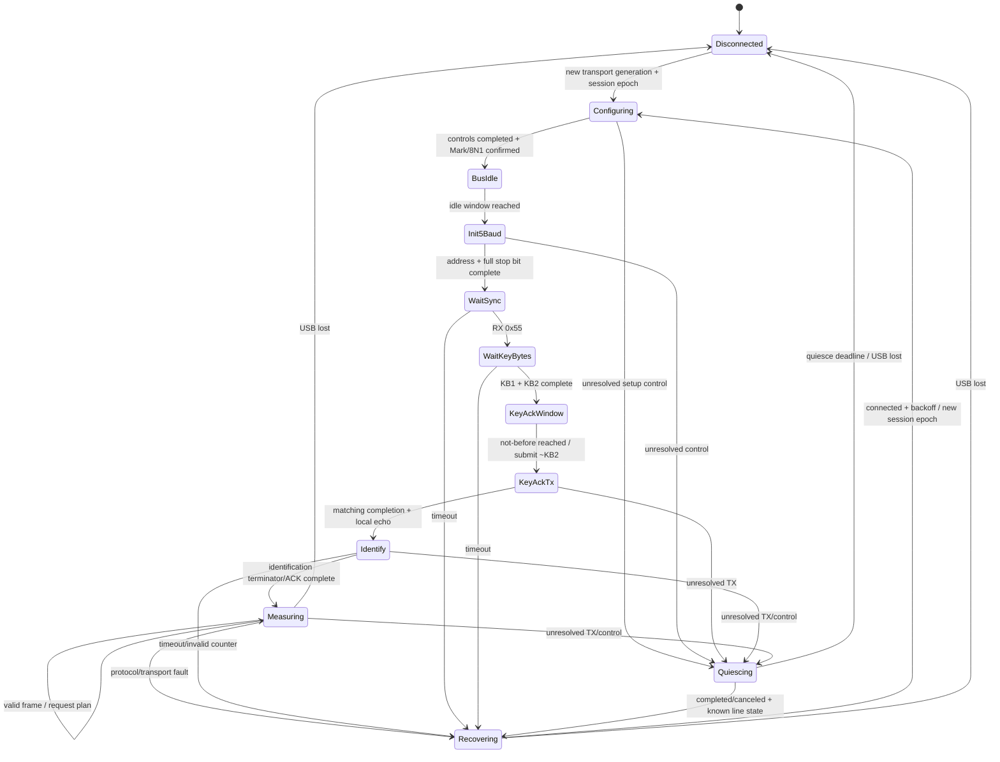

# M5Tab5 AutoDia – Architecture V2

**Status:** implementierbarer Greenfield-Entwurf  
**Zielplattform:** M5Stack Tab5 / ESP32-P4, AutoDia K409 mit FTDI FT232R, Digifant 1.7  
**Geltungsbereich:** komplette Neuimplementierung; der bisherige Quellcode ist nur Hardware-, Protokoll-, Decoder-, Capture- und UI-Referenz.

## Ausgangsbasis: Fakten und Annahmen

### Stichprobenartig verifizierte Fakten

- Der reale Adapter wurde als FTDI FT232R (`VID 0x0403`, `PID 0x6001`) erkannt.
- Die Digifant-Datenphase funktioniert im vorhandenen Projekt mit 1200 Baud.
- Die 5-Baud-Initialisierung verwendet Adresse `0x01`, 200 ms je Bit und FTDI-Break-Steuerung.
- Die funktionierende Referenz hält vor der 5-Baud-Adresse mindestens 2600 ms Busruhe; die normative ECU-Toleranz ist daraus nicht bewiesen.
- KWP1281 verwendet byteweise inverse Quittungen, lokale TX-Echos, Blocklänge, gemeinsamen Blockcounter und Terminator `0x03`.
- Die vorhandenen Captures enthalten ECU-Identifikation, Gruppe 000 sowie Header/Body-Sequenzen der Gruppen 001–004. Beobachtete Titel sind unter anderem `0x02`, `0x09`, `0x0A`, `0xF4` und `0xF6`; Requests verwenden `0x12`, `0x29` und `0x09`.
- EspUsbHost 2.7.8 entfernt im Serial-RX-Pfad die zwei FTDI-Statusbytes, bevor es `EspUsbHostSerialData` an `onSerialData` meldet.
- EspUsbHost ruft Serial-, Transfer- und Lifecycle-Callbacks im Taskkontext seines Client-Event-Pfads auf; Callbacks dürfen daher nicht blockieren.
- In EspUsbHost 2.7.8 wird `onSerialData` aus genau einem `EspUsbHostClient`-Task und seriell aufgerufen. Ein SPSC-Ingress ist deshalb für **diese gepinnte Bibliotheksversion und genau eine Hostinstanz** zulässig; dies ist kein versionsunabhängiger API-Vertrag.
- EspUsbHost 2.7.8 startet zwei Tasks (`EspUsbHost` und `EspUsbHostClient`) mit Default Stack 8192, Priorität 5 und `tskNO_AFFINITY`.
- Der Arduino-ESP32-Core 3.3.10 erzeugt `loopTask` standardmäßig mit Priorität 1. Eine andere UI-Priorität wäre eine explizite V2-Konfiguration, keine Plattformeigenschaft.
- Der Default-CDC-Ring besitzt 512 Slots, effektiv 511 Nutzslots, und verwirft bei Vollstand still das älteste Byte.
- EspUsbHost bietet öffentliche, vorallokierbare Serial-TX-Queue-Operationen. Der normale ungequeute Sendepfad alloziert dagegen pro Transfer dynamisch. Die öffentliche Queue liefert jedoch keine anwendungsseitig korrelierbare Completion pro Transfer, sondern nur Poolzustand und aggregierte Statistik.
- Die FTDI-Konfiguration von EspUsbHost 2.7.8 reicht mehrere asynchrone Vendor-Control-Transfers ein; der öffentliche Callbackvertrag liefert dafür weder einen zusammengesetzten Abschluss noch einen Anwendungstoken.
- Der bisherige Anwendungscode koppelt RX, ACK, Framing, Parsing, Logging und UI in den Arduino-Loop. Diese Struktur wird nicht übernommen.

### Noch zu verifizierende Annahmen

- Die exakten maximal zulässigen Zeiten für `~KB2`, inverse RX-Byte-ACKs, TX-Echo und ECU-ACK sind noch nicht normativ oder mit Logic Analyzer bestimmt.
- Der K409 liefert bei jeder Host-Übertragung genau ein lokales Echo und ordnet dieses vor der nächsten ECU-Antwort. Die Captures stützen das, beweisen es aber nicht für Störfälle.
- Ein kleiner, gepinnter EspUsbHost-Port/Fork oder ein nachweislich begrenzter synchroner Adapter kann TX- und FTDI-Control-Operationen serialisieren, sicher gegen Disconnect abbrechen und exakt korrelierte Terminalereignisse liefern. Die unveränderte öffentliche API von 2.7.8 erfüllt diesen V2-Vertrag nicht.
- FTDI-Break und Latency Timer lassen sich über diesen Adapter mit begrenzter Laufzeit steuern. Die V2 darf dafür kein `#define private public` verwenden.
- Die beobachtete gemeinsame Blockcounter-Sequenz und der erwartete Schritt von zwei gelten für alle benötigten Dialogzustände.
- Eine erfolgreiche USB-Transfer-Completion ist ein ausreichend enger Bezugspunkt für „FTDI-Leitungszustand angewendet“. Der zeitliche Versatz zwischen Control-Completion und tatsächlichem Break/Mark-Pegel ist noch zu messen.
- Es wird angenommen, dass der in der funktionierenden Referenz verwendete Post-Block-Turnaround von ungefähr 30 ms im zulässigen ECU-Fenster liegt; dass die Referenz wartet, ist belegt, nicht jedoch die erforderliche Mindest-/Maximalzeit.

Diese Annahmen sind Teil der Abnahmekriterien, nicht stillschweigende Garantien.

## 1. Ziele und Nicht-Ziele

### Ziele

V2 soll:

- den zeitkritischen KWP1281-Pfad strukturell von Parser, Decoder, UI, Logging und Persistenz isolieren;
- eindeutiges Single-Owner-Ownership und wertbasiertes Message Passing verwenden;
- nach dem Start ohne dynamische Allokation im Critical Path arbeiten;
- alle Wartezeiten begrenzen und als Zustandsautomat mit absoluten `not_before`-/Deadline-Fenstern modellieren;
- Überlast deterministisch behandeln und sichtbar machen;
- dieselbe Protokollimplementierung auf ESP32 und im Host-Test verwenden;
- USB-, Transport-, Protokoll-, Digifant- und Darstellungsfehler typisieren;
- Messdatenqualität durch Sequenzen, Zeitstempel, Gültigkeit und Drop-Zähler nachvollziehbar machen;
- mit wenigen klar begründeten Tasks und ohne Mutex-Netz auskommen.

### Nicht-Ziele

- Kein Refactoring oder schrittweiser Umbau der vorhandenen Klassen.
- Keine binäre oder API-Kompatibilität mit `EcuInitTester`, `UsbCdcLink`, `Console`, `Dashboard` oder `SimulatedLink`.
- Kein generisches Diagnoseframework für beliebige Fahrzeuge oder KWP-Varianten.
- Keine Behauptung harter Echtzeit ohne gemessene ECU-Deadlines und Plattform-Worst-Cases.
- Keine verlustfreie Garantie für unbegrenzt langsame Persistenz. Die garantierte Eigenschaft ist, dass deren Überlast den KWP-Dialog nicht blockiert.
- Keine UI- oder Dateiformatentscheidung im Protokoll-Core.

## 2. Architektur-Invarianten

1. **Exklusiver Protocol Owner:** Nur der KWP Protocol Runner darf K409-Daten senden, RX-Bytes konsumieren und KWP-Sessionzustand verändern.
2. **Critical-Path-Grenze:** RX, Echo, ACK, Framing, Session/Counter und minimale Framevalidierung liegen vollständig vor der `ValidatedFrameQueue`. Parser, Digifant-Decoder, UI, formatierte Logs und Persistenz liegen dahinter.
3. **Kein Warten auf Downstream:** Der Protocol Runner verwendet für alle Downstream-Kanäle ausschließlich `try_send`/Overwrite mit Wartezeit null.
4. **Kein Callback-Fachcode:** USB-Callbacks kopieren Bytes in einen festen Ingress-Ring, setzen atomare/sticky Zustände und wecken den Protocol Runner. Sie parsen, loggen und rendern nicht.
5. **Kein fremder RX-Pointer:** Kein Pointer oder View auf USB-Transferdaten, RX-Ring oder aktuellen Framebuilder überlebt den erzeugenden Aufruf oder überschreitet eine Taskgrenze.
6. **Frames by value:** Ein publiziertes `KwpFrameEnvelope` ist nach Konstruktion unveränderlich und besitzt alle Bytes selbst.
7. **Bounded everything:** Jeder Puffer/Kanal hat Kapazität, Full-Policy und Telemetrie; jede Wartebedingung besitzt ein begrenztes Zeitfenster.
8. **Kritische Ressourcen vorallokiert:** Kein `new`, `malloc`, `String`, formatierendes `printf` oder Dateisystemzugriff im Protocol Runner nach Initialisierung.
9. **Fehler sind Daten:** Jeder relevante Fehler hat einen typisierten Code, Session-Epoch, Timestamp und Zähler. Text entsteht erst im Logger/UI-Consumer.
10. **Optional bleibt optional:** UI-, Scope- und Debugverlust darf weder RX noch Sessionfortschritt beeinflussen.
11. **Transportkorruption ist fatal für die aktuelle Session:** Ein erkannter RX-Overflow wird nie durch heuristisches Weiterparsen verdeckt; die Session wird kontrolliert verworfen und resynchronisiert.
12. **Ein Core, zwei Plattformen:** Realbetrieb, Fake Transport, Emulator und Replay treiben denselben `KwpProtocolCore`.
13. **Genau ein semantischer Ausgangsturn:** Zu jeder Zeit darf höchstens eine semantische KWP-TX- oder FTDI-Control-Operation aktiv sein. Mehrere vorallokierte USB-TX-Slots sind ausschließlich Transportressourcen und erlauben kein Pipelining von KWP-Bytes, Break/Mark-Wechseln oder Sessionschritten.
14. **Korrelierte Asynchronität:** Jede asynchrone TX- und Control-Operation besitzt einen bootweit eindeutigen Token. Nur ein Ereignis mit exakt passendem Transport-Generation-, Session-Epoch-, Turn- und Operationsteil darf den aktiven Zustand verändern.
15. **Timing-Single-Owner:** Nur `KwpProtocolCore` erzeugt, ersetzt und verwirft semantische `not_before`-Zeitpunkte und Protokolldeadlines. Der Runner fragt lediglich `next_wakeup()` ab und benutzt den Wert als Wake-up-Zeitpunkt.
16. **Autonomer Dialog:** Sessionfortschritt, Keep-Alive und aktuelle Messgruppenfolge warten niemals auf Parserresultate, Snapshots oder UI-Kommandos. Externe Commands sind optionale, wertbasierte Konfiguration für einen späteren sicheren Turn.
17. **Quiescence vor Wiederverwendung:** Nach einem ungeklärten TX-/Control-Ausgang darf auf derselben Transportgeneration keine neue Wire-Operation beginnen, bis alle alten Transfers nachweislich completed oder canceled/retired sind und FTDI/USB wieder einen bekannten Zustand besitzen. Ein logischer Abort genügt nicht; andernfalls wird die Generation geschlossen.
18. **Overflow vergiftet den Ingress:** Nach der ersten RX-Lücke werden keine späteren Bytes derselben Ingress-Epoche mehr interpretiert. Der Producer verwirft bis zu einem expliziten Producer/Consumer-Reset-Handshake; eine Notification ist nur ein Wake-Hinweis.
19. **Kein Empty-Ring-Timeout-Race:** Der Runner lässt ein fälliges Core-Fenster erst ablaufen, nachdem eine Producer-Cutoff-Prüfung beweist, dass kein USB-Callback mit möglicherweise rechtzeitigem Ereignistimestamp gerade zwischen Timestamp-Erfassung und Publikation steht.

## 3. Komponentenmodell

```mermaid
flowchart LR
    ECU[Digifant ECU] <--> K409[AutoDia K409 / FT232R]
    K409 <--> USB[EspUsbHost Port]
    USB -->|callback: copy + notify| RING[RX Ingress SPSC Ring]
    USB -->|lifecycle + correlated completion| TER[Critical Transport Event Ring]
    RUNNER[KWP Protocol Runner Task] --> PHY[FTDI/K409 PHY]
    PHY --> USB
    RING --> RUNNER
    TER --> RUNNER
    RUNNER --> BYTE[KWP Byte Engine]
    BYTE <--> SESSION[KWP Session Machine]
    SESSION -->|try_send by value| FQ[Validated Frame Queue]
    FQ --> PROC[Processing Task]
    PROC --> PARSER[KWP Parser]
    PARSER --> DEC[Digifant Decoder]
    DEC --> MODEL[Measurement Model]
    MODEL -->|overwrite snapshot| UIQ[UI Snapshot Mailbox]
    PROC -->|try_send| LQ[Log / Persistence Queue]
    RUNNER -->|overwrite status + counters| TQ[Telemetry Mailboxes]
    TQ --> OBS[Logger / Telemetry Task]
    LQ --> OBS
    UIQ --> UI[UI / Arduino Loop]
```



### 3.1 `EspUsbHostPort`

Plattformspezifischer Adapter für EspUsbHost. Verantwortlich für:

- Hoststart und Geräteenumeration;
- Auswahl und Tracking genau des FTDI-K409-Geräts;
- minimale Connect/Disconnect-/Serial-Callbacks;
- vorallokierte TX-Queue und Transfer-Completion;
- Übersetzung von Bibliotheksresultaten in typisierte Transportereignisse;
- Erfassung von USB-/TX-Statistik.

Der Port enthält keine KWP-Zustände. Er filtert vor dem Ingress auf die ausgewählte Geräteadresse und das ausgewählte FTDI-Interface. Der Serial-Callback kopiert die bereits von FTDI-Statusbytes bereinigten Daten als feste `RxIngressItem`s (Byte, Callback-Timestamp des USB-Batches, Transportgeneration, Ingress-Epoche und bootweit monotone `transport_event_sequence:uint64`) in den anwendungseigenen RX-Ingress-Ring und weckt die Protocol Task **einmal nach Veröffentlichung des gesamten Callback-Batches**. Der Timestamp ist kein physischer Per-Byte-Zeitpunkt; alle Bytes eines USB-Batches dürfen denselben Timestamp tragen.

Im Produktionsprofil sind EspUsbHost-/Port-Hexdumps und formatierte Logs im Serial-, Transfer- und Lifecycle-Callbackpfad compile-time deaktiviert. Fehler werden dort nur als feste Codes/Counter publiziert; kein UART-/Loggerlock ist Teil der Callback-WCET.

Bei vollem Ring wechselt der Producer den Ingress atomar von `Open` nach `Poisoned`, setzt `rx_overflow_sticky`, erhöht die Dropzähler und verwirft auch alle nachfolgenden Bytes, bis der Runner über einen expliziten Reset-Handshake eine neue Ingress-Epoche öffnet. Jeder Serial-Callback snapshottet State/Epoche einmal bei Entry: Ein poisoned gestarteter oder währenddessen poisonender Batch bleibt bis zu seinem Callbackende vollständig drop-only und kann ein zwischenzeitliches Reopen nicht sehen. Der Runner darf `Poisoned → Open` erst bei durch `publication_epoch` bewiesener Producer-Quieszenz linearisieren. Er stoppt bei Poison/Epochenwechsel sofort die Core-Zufuhr, invalidiert Builder und Session und leert den alten Ring, während der Producer nicht schreibt. Dadurch können Restbytes eines beschädigten Batches niemals in die neue Epoche gelangen. Der Callback blockiert nie.

Der SPSC-Vertrag gilt nur für genau eine nach `begin()` unverändert registrierte Serial-Callbackinstanz, genau einen EspUsbHost-Client-Task, genau eine Hostinstanz und ausschließlich den Protocol Runner als Consumer. Lifecycle-Callbacks, Fault-Injection und Reconnect-Code dürfen keine Ringindizes schreiben oder den Ring zurücksetzen. Head/Tail und der Poison-/Reset-Handshake verwenden Release-/Acquire-Semantik; `volatile` allein genügt nicht. Der Callback verwendet die normale Task-Notification-API, nicht eine ISR-Variante. Ein Bibliotheksupdate muss diese Single-Producer-Eigenschaft erneut nachweisen oder der Port muss auf einen geeigneten MPSC-Kanal wechseln.

Alle kritischen Callbacks teilen außerdem eine monotone `publication_epoch`: Der einzige Producer markiert sich **vor** Erfassung des Ereignistimestamps als aktiv und veröffentlicht am Callbackende eine neue quieszente Epoche. Vor einem fälligen `advance(now)` akzeptiert der Runner einen Cutoff nur, wenn der Producer quieszent war und die Epoche über letzten Merge, `now`-Snapshot und Abschlussprüfung unverändert blieb; andernfalls pumpt er erneut. Der Cutoff ist das total geordnete Tupel `(now_us, publication_epoch, last_transport_event_sequence)`. Ein danach beginnender Callback ist selbst bei gleichem quantisiertem Mikrosekundenwert über Epoche/Sequenz später; ein Event gilt nur für `event_time_us < deadline_us` als rechtzeitig, Gleichheit ist abgelaufen. So kann eine cross-core Publication zwischen „Ring leer“ und Timeout kein rechtzeitiges Ereignis in einen False-Timeout verwandeln. Der Active-Zustand selbst ist durch die validierte Callback-WCET begrenzt; eine Überschreitung ist ein Transportfault und keine Erlaubnis zum ungebundenen Spin. Wrap von `publication_epoch` oder Sequenz erzwingt einen kontrollierten Port-Restart.

Connect, Disconnect und asynchrone Transfer-/Control-Completions werden ebenfalls im Port mit `transport_generation`, derselben `transport_event_sequence`, Auftretenszeit und gegebenenfalls Operationstoken versehen. Sie liegen in einem eigenen begrenzten Critical-Transport-Eventring; eine Task-Notification speichert keine Ereignisinformation. Der Core darf keine feste relative Zustellreihenfolge zwischen RX- und Completion-Ring voraussetzen. Der Runner merged die jeweiligen Head-Elemente nach Sequenz; Disconnect, Ingress-Poison und Eventring-Overflow sind ausdrücklich invalidierende Vorrangereignisse. Disconnect sperrt neue RX-Veröffentlichungen der alten Generation sofort. Alte Ringelemente werden vom Consumer anhand ihrer Generation verworfen, nicht durch einen konkurrierenden Ring-Reset. Ein Sequenz-Wrap wird als kontrollierter Port-Restart behandelt, nicht als Neuordnung.

Auch dieser Ring bleibt SPSC: Nur der eine EspUsbHost-Client-Callbackkontext produziert, nur der Runner konsumiert. Wie beim RX-Ring veröffentlicht der Producer Payload und Head mit Release-Semantik, der Consumer lädt Head mit Acquire-Semantik, und jede Seite schreibt ausschließlich ihren eigenen Index. Synchrone Submit-/Controlresultate des Runners werden unmittelbar in den Core zurückgeführt und niemals als zweiter Producer in den Ring geschrieben.

Wird der Critical-Transport-Eventring voll, setzt der Producer einen nicht überschreibbaren `transport_event_overflow_sticky`, schließt die aktuelle Generation für neue Operationen und kehrt sofort zurück. Der Runner darf danach keine eventuell verbliebene Completion erraten, sondern muss quieszieren beziehungsweise die Generation schließen. Damit ist Eventverlust fatal für die aktuelle Verbindung, aber niemals stille Protokollfortsetzung.

Der Bibliotheks-CDC-Ring wird nicht als V2-Datenkanal verwendet. Damit ist sein stilles Drop-oldest-Verhalten nicht Teil des Protokollvertrags. Falls EspUsbHost für TX zwingend ein `EspUsbHostCdcSerial`-Objekt verlangt, muss dessen interner RX-Ring konsequent drainbar/deaktivierbar sein oder eine kleine, klar dokumentierte Bibliotheksanpassung erhalten; ein dauerhaft ungeleerter Schattenring ist nicht akzeptabel.

Die unveränderte öffentliche EspUsbHost-2.7.8-API kann die hier geforderten tokenisierten TX-/Control-Completions nicht liefern. Der versionierte Port/Fork oder bounded-synchrone Adapter ist daher eine Plattformvoraussetzung und muss zusätzlich Pool-Teardown, Completion/Cancel und ein gleichzeitig eintretendes Disconnect gegen Runner-Submissions lebensdauersicher serialisieren. Dabei darf der Callback nie auf den Runner warten: Disconnect schließt die Submission-Gate atomar, Transferressourcen bleiben bis zum Retirement aller bereits erworbenen Referenzen gültig, und erst danach erfolgt der Teardown. Die in 2.7.8 vor dem Lifecycle-Callback stattfindende Poolbereinigung muss für diesen Vertrag verifiziert beziehungsweise im Port angepasst werden. EP0-Descriptor-/Datenpuffer und Composite-State sind vorallokiert; der dynamisch allozierende Standard-Controlpfad wird während Init/Session nicht verwendet. Aggregierte Pending-/Completed-Zähler dürfen nie einen individuellen Abschluss ableiten.

Portobjekt, beide Ringe und Runner-Notification-Handle besitzen statische Boot-Lebensdauer; normaler Geräte-Hotplug zerstört sie nicht. Ein System-Shutdown darf das Handle erst invalidieren, nachdem der Clienttask gestoppt und alle finalen Callbacks gejoint/quieszent sind. Damit existiert kein Callbackziel mit kürzerer Lebensdauer als der Callbackproducer.

### 3.2 `FtdiK409Phy`

Schmale Hardwareabstraktion oberhalb des USB-Ports:

- FTDI-Baudrate und 8N1 konfigurieren;
- Latency Timer konfigurieren;
- DTR/RTS in einen definierten Zustand setzen;
- Break/Mark für 5-Baud-Bitfolge steuern;
- EP0-Control-Transfer und Composite-State vorallokiert halten;
- einzelne KWP-Bytes über vorallokierte TX-Slots einreichen;
- synchrones `TxSubmitResult` sowie asynchrones completed/failed mit Token melden;
- Adapter-Identität und Generation nach Reconnect liefern.

Die Schnittstelle exponiert keine EspUsbHost-Typen. Für Break/Latency und korrelierte Completions ist eine öffentliche Upstream-API, ein kleiner versionierter Port/Fork oder ein nachweislich begrenzter synchroner Adapter Voraussetzung. Private Bibliotheksmember werden nicht per Präprozessor geöffnet.

`FtdiK409Phy` exponiert trotz eines möglicherweise mehrslotigen internen USB-Pools nur **eine serialisierte semantische Lane**. Ein zweites `SendByte`, `SetBreak`, `SetBaud`, `SetLatency`, DTR- oder RTS-Kommando wird nicht eingereiht, solange die aktive Operation nicht entsprechend ihrem Vertrag abgeschlossen oder **nachweislich canceled und quieszent** ist. Ein bloßer semantischer Abort/Timeout gibt die Lane nicht frei. Ein Verstoß ist ein interner Protocol-Fault, kein Anlass zum impliziten Pipelining.

Der `KwpProtocolCore` erzeugt vor jeder Aktion einen `TransportOpToken`; PHY oder USB-Port dürfen ihn weder ableiten noch ersetzen:

```text
TransportOpToken
  transport_generation: uint32
  session_epoch: uint32
  semantic_turn_id: uint64  // monoton innerhalb der Session
  transport_op_id: uint64   // bootweit monoton, keine Wiederverwendung
  operation_kind
```

Accepted-, Completion- und Failure-Ereignisse geben denselben Token unverändert zurück. Der PHY führt dafür genau drei Lifecycle-Zustände:

- `Active`: Ein exakt passendes Ereignis darf die Meilensteine des aktuellen semantischen Turns fortschreiben.
- `Retiring`: Nach Timeout/Abort darf nur die exakt passende Terminalmeldung Resource-Retirement und Quiescence fortschreiben; sie darf niemals alten Counter, alte Deadline oder einen neuen Turn beeinflussen.
- `Retired`: Duplicate/stale Events werden nur gezählt. Gleiches gilt sofort für falsche Generation, Session, Operationsart oder unbekannte Token.

Erst der Übergang nach `Retired` gibt die betreffende Ressource frei. Wraparound eines ID-Zählers wird als kontrollierter Restart behandelt, nicht durch Wiederverwendung.

Das synchrone Submitresultat unterscheidet `Accepted`, `RejectedNoEffect` und `OutcomeUnknown`; nur `Accepted` erzeugt die erwartete asynchrone Terminalmeldung, nur `RejectedNoEffect` erlaubt unmittelbare Recovery. `OutcomeUnknown` gilt wegen möglicher späterer physischer Wirkung als ungeklärte Operation und führt nach `Quiescing`. Das Submitresultat wird dem Core zugeführt, bevor der Runner weitere gepufferte Eingänge verarbeitet. Die asynchrone USB-Completion darf relativ zum RX-Kanal vor oder nach Echo/ECU-Byte sichtbar werden. **Innerhalb des RX-Kanals bleibt die Wire-Reihenfolge dagegen strikt:** Das erwartete lokale Echo muss vor dem ECU-ACK beziehungsweise nächsten ECU-Datenbyte liegen; die umgekehrte Reihenfolge ist ein typisierter Echo-/Order-Fault, kein zulässiges Reordering. Eine FTDI-Konfigurationsaktion wie `SetBaud` kann intern mehrere EP0-Transfers umfassen, ist nach außen aber genau **eine** tokenisierte Composite-Operation: Jede Suboperation wird intern zusätzlich mit Composite-Token und Subsequenz korreliert, keine wird mit einer anderen Wire-Aktion überlappt, und `ControlCompleted` entsteht erst nach erfolgreichem Abschluss aller Suboperationen.

Ein Timeout macht eine Operation nicht physisch unwirksam. Der PHY wechselt deshalb bei ungeklärter TX-/Control-Operation nach `Quiescing`: Er nimmt keine neue Protokollaktion an, bis die konkrete Operation completed/canceled ist und Bulk-OUT, EP0 sowie der FTDI-Leitungszustand quieszent sind. Eine Terminalmeldung des verwaisten Tokens darf dabei nur dessen Ressource pensionieren, niemals den alten Protokollturn wiederbeleben. Erst danach sind serialisierte Recovery-Controls erlaubt, die Mark/8N1/Baud in einen bekannten Zustand bringen. Gelingt dies nicht innerhalb einer begrenzten Recovery-Deadline, wird der Transport geschlossen; ein neuer Versuch benötigt eine neue `transport_generation`.

### 3.3 `KwpProtocolCore`

Reines, FreeRTOS-, Arduino-, USB- und UI-freies C++-Modul. Es besitzt:

- `KwpByteEngine` für Byte-RX/TX, lokales Echo, inverse Quittungen, Framing und Byte-Deadlines;
- `KwpSessionMachine` für Init, Keybytes, Blockcounter, Identifikation, Keep-Alive, Messgruppenplan und Recovery;
- den einzigen veränderlichen `KwpFrameBuilder`;
- Protokoll-Timer als absolute monotone Zeitpunkte;
- einen kleinen Ausgang von Aktionen und Ereignissen.

Der Core ruft Hardware nicht direkt auf. Eingänge sind Ereignisse wie `Connected`, `Disconnected`, `RxByte`, `TxSubmitResult`, `TxCompleted`, `ControlCompleted` und `TimeAdvanced`. Ausgänge sind tokenisierte Aktionen wie `SetBreak`, `SetBaud`, `SendByte`, `PublishFrame` und `RaiseFault`. Der Runner führt jede durch ein Eingangsereignis ausgelöste Aktionsfolge samt synchronem Submitresultat bis zur Quieszenz aus, bevor er das nächste RX-Byte zuführt. **`ArmDeadline` ist keine Runner-Aktion:** Der Core besitzt absolute `not_before`-/Deadline-Fenster und exponiert nur die read-only Abfrage `next_wakeup()`. Ein verspäteter oder alter RTOS-Wake-up ist damit bedeutungslos; erst `advance(now)` wertet das aktuell aktive Fenster aus. Diese Ports-and-Adapters-Form macht den Core deterministisch host-testbar.

### 3.4 `KwpProtocolRunner`

Einziger hochpriorisierter Anwendungstask und exklusiver Owner von PHY und Protocol Core. Er:

- wartet ereignisgetrieben bis RX, Transportereignis oder nächster Core-Wake-up-Zeitpunkt;
- prüft zuerst Disconnect- und Overflow-Sticky-Flags;
- merged Critical-Transport- und RX-Ereignisse nach Quellsequenz; Ereignisse tragen Generation, Token, Auftretenszeit und Quellsequenz;
- speist Bytes mit Empfangstimestamp in den Core;
- führt Core-Aktionen aus;
- kopiert validierte Frames nonblocking in die Framequeue;
- publiziert kompakte Status-/Telemetriesnapshots.

Der Runner enthält keine fachlichen Decoder und keinen formatierten Text.

Vor `advance(now)` verarbeitet der Runner alle bereits publizierten kritischen Transport-/RX-Ereignisse und schließt bei einem fälligen Fenster die oben definierte Producer-Cutoff-Prüfung ab. Ob ein Eingangsereignis rechtzeitig eingetreten ist, wird anhand seines erfassten Auftretenszeitpunkts gegen das Core-Fenster entschieden, nicht anhand der späteren Consumerzeit. Für eine dadurch ausgelöste **neue** Wire-Aktion gilt zusätzlich das aktuelle `now`: Ein rechtzeitig gepuffertes ECU-Byte verhindert keinen alten False-Timeout, darf aber keine inverse Antwort mehr autorisieren, wenn deren Reaktionsdeadline beim tatsächlichen Submit bereits verstrichen ist. `TxCompleted` darf relativ zum lokalen Echo auf dem separaten Kanal in beiden Reihenfolgen sichtbar werden; Echo und nachfolgendes ECU-ACK/-Datenbyte behalten untereinander die RX-Wire-Reihenfolge. Der Byte-Engine-Zustand verfolgt die Bedingungen explizit und nimmt keine Cross-Channel-Callback-Reihenfolge als Protokollbeweis an. Ein neuer semantischer Turn beginnt erst, wenn die für den aktuellen Turn verlangte Transportcompletion **und** die protokollspezifische Evidenz (Echo sowie gegebenenfalls inverses ECU-ACK) vollständig sind.

Trifft nach dem korrekten Echo bereits das nächste ECU-Datenbyte ein, während nur die vorherige TX-Completion noch fehlt, übernimmt der Core genau dieses eine Byte samt Originaltimestamp, Transportgeneration, Ingress-Epoche und Vorgängertoken in `pending_rx_after_echo`. Es löst noch keine zweite Wire-Operation aus. Weil die ECU bis zu dessen inverser ACK kein weiteres Datenbyte senden darf, ist ein zweites pending Byte ein Protocol-Order-Fault. Nach passender Completion wird das Byte nur verarbeitet, wenn Generation/Epoche/Token noch passen und sein ACK-Submit-Fenster bei aktuellem `now` offen ist; andernfalls folgt Recovery.

RX und Transport haben stets Vorrang vor Commands. Der Runner betrachtet höchstens ein Command an einer sicheren Turn-Grenze und nur bei ausreichendem Abstand zum nächsten Core-Zeitfenster; ein Command-Flood erhält kein unbeschränktes Laufzeitbudget. Die aktive Messplanung befindet sich bereits als Core-eigene Wertkopie im Sessionzustand, sodass eine leere oder volle Commandqueue den Dialog nicht anhält.

### 3.5 `KwpFrame` und `KwpFrameEnvelope`

Konzeptioneller Werttyp:

```text
KwpFrame
  size: uint8                     // 4..65, inklusive Längenbyte und 0x03
  bytes: array<uint8, 65>         // eigener Speicher
  counter: uint8
  title: uint8

KwpFrameEnvelope
  frame: KwpFrame
  rx_sequence: uint32             // monoton innerhalb eines Boots
  session_epoch: uint32           // vor jedem neuen KWP-Initversuch vergeben
  first_byte_us: uint64
  completed_us: uint64
  request_id: uint32
  dialog_context: enum + group_hint
```

Nach `build()` gibt es keine mutierende API. `KwpFrameBuilder` bleibt privat im Protocol Core. Das Envelope ist trivially copyable und enthält weder Heapobjekte noch Pointer. `static_assert` prüft Maximalgröße, Trivial-Copy-Eigenschaft und Queue-Kompatibilität.

### 3.6 `KwpApplicationParser`

Nicht zeitkritischer, generischer Parser für valide KWP-Frames. Er:

- erzeugt typisierte KWP-Nachrichten (`Identification`, `Ack`, `GroupHeader`, `GroupBody`, `GroupRefused`, `Unknown`);
- prüft payloadspezifische Mindestlängen erneut;
- verwendet `dialog_context` zur sicheren Request/Response-Korrelation;
- speichert keine Views auf das Queueelement nach dem Verarbeitungsschritt.

### 3.7 `DigifantDecoder`

Fahrzeugspezifisches Modul für:

- Gruppe 000 Rohfelder und belegte RPM-Umrechnung;
- Header-/Tabellenformeln der Gruppen 001–004;
- Formeln `0x8B`, `0x8C`, `0x85`, `0x88`, `0x89`;
- Batterie aus Gruppe 002/Zone 3;
- G69 als relativen Rohwert aus Gruppe 003/Zone 3;
- ECU-Identifikation und Supportstatus der Gruppen.

Nicht belegte Semantik wird als `Unknown`/Raw transportiert. Insbesondere darf G69 ohne validierte Kalibrierung nicht als genauer Winkel ausgegeben werden.

### 3.8 `MeasurementModel`

Nur die Processing Task verändert das Domain-Modell. Es enthält je Signal:

- Wert und Rohwert;
- Einheit bzw. `Raw`;
- monotone Messzeit;
- `rx_sequence` und `session_epoch`;
- Gültigkeitsstatus (`Valid`, `Stale`, `Unsupported`, `Invalid`, `Unknown`);
- Quellgruppe und Zone.

Ein `MeasurementSnapshot` ist ein vollständiger Werttyp. Bei Sessionwechsel werden alte Werte nicht still als aktuell weitergeführt, sondern `Stale/Disconnected` markiert.

### 3.9 Verteilung

- **ValidatedFrameQueue:** Protocol Runner → Processing Task, relevante Frames.
- **CriticalTransportEventRing:** EspUsbHostPort → Protocol Runner, korrelierte Terminal-/Lifecycle-Ereignisse; Overflow invalidiert die Transportgeneration.
- **UiSnapshotMailbox:** Processing Task → UI, Queue der Länge eins mit Overwrite-by-value.
- **ProtocolStatusMailbox:** Protocol Runner → UI/Telemetry, je Consumer eigene Länge-eins-Mailbox.
- **PersistenceQueue:** Processing Task → Logger, strukturierte Mess-/Raw-Frame-Records.
- **DiagnosticEventQueue:** mehrere nichtkritische Producer → Logger, kompakte Eventcodes; niemals alleinige Quelle kritischer Fehlerzähler.
- **ControlCommandQueue:** UI/Application → Protocol Runner, begrenzte Kommandos; Runner nimmt sie nur in sicheren Sessionzuständen an.

Jeder Consumer besitzt einen eigenen Kanal. Es gibt keine Queue mit mehreren konkurrierenden Consumern, bei der unklar wäre, wer ein Element erhält.

### 3.10 `TelemetryRegistry` und `Logger`

Hot-Path-Zähler haben genau einen Writer und werden in festen Strukturen gehalten. Der Protocol Runner publiziert periodisch oder bei Zustandswechsel eine Kopie. Der Logger formatiert diese Werte und schreibt Serial/Datei. Heap-/PSRAM-Minima liest der Logger/Health-Teil maximal einmal pro Sekunde aus der Plattform.

Kein Telemetriezähler erfordert einen Logger-Queue-Erfolg. Geht ein Diagnoseevent verloren, bleiben Faultcode, Statussnapshot und Zähler erhalten.

### 3.11 UI

Die UI konsumiert nur Snapshots und Status. Sie kennt weder USB noch PHY, Byteengine, Framebuilder oder Decoderheader. Touch erzeugt `UiIntent`; ein Application Controller übersetzt nur erlaubte Intents in Control Commands. Rendern, Spriteallokation und Tabwechsel dürfen beliebig langsam sein, ohne Locks oder Ressourcen des Protocol Runners zu halten.

## 4. Task- und Scheduling-Modell

V2 verwendet drei explizite Anwendungstasks plus den Arduino-UI-Loop. Weitere fachliche Tasks bringen keinen Nutzen.

| Kontext | Verantwortung | relative Priorität | Producer → Consumer | erlaubtes Blocking | Ownership |
|---|---|---:|---|---|---|
| EspUsbHost + EspUsbHostClient | Enumeration, USB-Transfers, minimale Callbacks | **7, expliziter Startwert** | USB → RX-Ingress/Transportevents | nur bibliotheksintern; App-Callbacks nie | USB-Geräte/Transfers |
| **KWP Protocol Runner** | PHY, Core, RX/Echo/ACK/Framing/Session | **6, expliziter Startwert** | Ingress/Transport → Framequeue/Status | nur bis nächstes Core-Zeitfenster oder begrenzte Transportcompletion; Downstream immer 0 | PHY, Session, Builder, Hot-Telemetrie |
| Processing Task | Parser, Digifant-Decoder, Domainmodell | 3 | Framequeue → Snapshots/Persistenz | darf unbegrenzt auf leere Framequeue warten; Output nur nonblocking/overwrite | Parsercache und Domainmodell |
| UI / Arduino Loop | M5 Touch und Rendering | **2, explizit gesetzt** | Snapshot/Status → Display; Intent → Commandqueue | Display/Touch darf blockieren; nie Protocol-Ressourcen | Grafik, Sprites, UI-State |
| Logger/Telemetry Task | Serial, Datei, Formatierung, Healthsampling | 1 | Records/Events/Snapshots → Sinks | darf auf eigene I/O mit Sink-Timeout warten; hält keine fremden Locks | Sinkbuffer und Dateizustand |

### Prioritätsbegründung

Die beiden EspUsbHost-Tasks erhalten denselben expliziten Startwert 7, damit ein bereits im USB-Stack anstehendes RX-/Completion-Ereignis nicht hinter einem auf Deadline erwachenden Protocol Runner Priorität 6 liegen bleibt. Ihre Anwendungscallbacks sind streng begrenzt und wecken den Runner; danach kann er RX drainieren und ACK-Aktionen einreichen. Der Runner darf nicht busy-spinnen: Wenn er auf neue USB-Daten oder Completion wartet, blockiert er auf Notification bis zum nächsten vom Core gemeldeten Wake-up-Zeitpunkt.

`TaskBootstrap` setzt diese Werte über die unterstützten Plattform-/EspUsbHost-Konfigurationen und liest **beide** USB-Taskprioritäten, Runner und Arduino-Loop anschließend zurück. Der Core 3.3.10 startet `loopTask` sonst mit 1; „UI 2“ darf deshalb nicht bloß angenommen werden. Vor Freigabe des KWP-Betriebs muss mindestens `EspUsbHost = EspUsbHostClient > Protocol Runner > alle Downstream-Tasks` gelten; Abweichungen sind Startup-Konfigurationsfehler. Die Zahlen bleiben gemessene Startwerte: Prioritäten, Callback-WCET, Stack-High-Watermarks und Schedulingbudget werden auf dem finalen Build validiert.

Eine Notification ist ausschließlich ein coaleszierbarer Wake-Hinweis. Nach jedem Wake pumpt der Runner zuerst invalidierende Sticky-Flags und dann die geordneten Critical-/RX-Kanäle bis zur momentanen Quieszenz. Commands werden anschließend mit dem oben begrenzten Budget berücksichtigt.

Für grobe Restzeiten darf der Runner einen nach unten gerundeten FreeRTOS-Tick-Wait verwenden. Bleibt danach ein positiver Sub-Tick-Rest, armiert er verpflichtend einen beim Startup vorallokierten, wiederverwendbaren High-Resolution-One-Shot und blockiert erneut auf derselben Notification. Dessen Callback setzt nur den Wake-Hinweis und besitzt keine Deadline-Semantik; externe Wakes dürfen ihn canceln/rearmen, ein stale Timer-Wake ist harmlos. Ein wiederholter Null-Tick-Wait oder Busy-Spin bis zur Deadline ist verboten.

### Core-Affinity

Initial wird für keine Anwendungstask eine Core-Affinity gesetzt. Ein Pinning ohne Trace kann USB-Completion und Protocol Runner auf demselben Core verschlechtern oder unnötige Cross-Core-Wakes erzeugen. Pinning ist erst zulässig, wenn SystemView/FreeRTOS-Trace oder Logic-Analyzer-Messungen eine reproduzierbare Verbesserung zeigen. M5GFX bleibt im UI-Kontext.

### Stack

Startbudgets werden durch statische Callgraph-/Objektprüfung festgelegt und in Soak-Tests mit High-Watermarks validiert. Zielwerte sind keine Architekturkonstanten. Der Protocol Runner erhält keinen großen Formatierungs- oder Grafikstack; Frame- und Aktionsspeicher liegen als feste Member, nicht als tiefe lokale Arrays.

## 5. Critical KWP Path

```text
USB Serial Callback
  1. USB-Batch-Timestamp und Generation erfassen
  2. Bytes als epoch-markierte Records in festen SPSC-Ring kopieren
  3. bei voll: Ingress poisonen; bis Reset alle weiteren Bytes droppen
  4. Protocol Runner nach Batch-Publikation benachrichtigen
  5. sofort zurückkehren

Protocol Runner
  1. Disconnect/Eventoverflow/RX-Poison zuerst prüfen
  2. Critical- und RX-Records nach Quellsequenz mergen
  3. ein Ereignis an den Core geben und Aktionen bis Quieszenz ausführen
  4. erforderliches ~b tokenisiert und sofort einreichen
  5. Completion cross-channel verfolgen; Echo und ECU-ACK in RX-Wire-Reihenfolge
  6. Frame in privatem Builder vervollständigen
  7. Länge, Terminator und Counter validieren
  8. Sessionzustand/autonomen Antwortplan fortschreiben
  9. Frame-Sequenz vor try_send vergeben; bei voll zählen und weiterlaufen
```

Nicht im Pfad: Payloadformeln, Hexdump, Strings, `printf`, Display, Touch, SD/Flash, CSV, Netzwerk, UI-Snapshot-Erzeugung.

### Latenzmessung

Für jedes ECU-Byte, das eine inverse Antwort verlangt:

- `rx_ingress_us`: Timestamp des zugehörigen USB-Callback-Batches;
- `rx_core_us`: Zeitpunkt der Core-Verarbeitung;
- `ack_submit_us`: erfolgreiche TX-Einreichung;
- `ack_complete_us` und Echozeitpunkt;
- im Hardwaretest zusätzlich die physischen K-Line-Zeitpunkte von ECU-Byte und inverser Antwort.

`max_ack_submit_latency_us` wird im Protocol Runner ohne Logausgabe aktualisiert. Es misst nur Softwarelatenz und ist allein **kein** Nachweis der ECU-Frist, weil K-Line→USB-Callback und USB-Submit→K-Line fehlen. Die Abnahme verwendet die Logic-Analyzer-Latenz von der im Timingprofil definierten Endflanke des auslösenden ECU-Bytes bis zur Startflanke der inversen Antwort; USB-Ingress, Callback→Submit, Submit→Wire, Jitter und Sicherheitsmarge werden separat ausgewiesen. Histogramme mit festen Buckets sind zulässig. Die Messung selbst darf keine dynamische Allokation oder Queueoperation pro Byte erzwingen.

## 6. Datenfluss

### Kritisch

`USB callback → RX-Ingress-Ring → Protocol Runner → Byte Engine → Session Machine → PHY-TX`.

Dieser Pfad besitzt keinen für seinen Fortschritt erforderlichen Rückkanal von Processing, UI oder Logger. Die einzige Application-→Protocol-Kommunikation ist die Commandqueue; deren Bearbeitung ist optional, laufzeitbegrenzt und nur an sicheren Turn-Grenzen erlaubt. Ausbleibende Commands ändern weder ACK-/Keep-Alive-Fristen noch den aktiven Plan.

### Relevant

`validiertes KwpFrameEnvelope → Framequeue → Parser → DigifantDecoder → MeasurementModel`.

Ein Frame-Drop beeinträchtigt Datenvollständigkeit, nicht das laufende KWP-ACK. Sequenzlücken machen ihn sichtbar. Header-/Body-Korrelation wird nach einer Lücke ungültig gesetzt, bis ein neuer passender Header vorliegt.

### Optional

`MeasurementSnapshot → UI`, `PersistenceRecord → Logger`, `DiagnosticEvent → Textsink`, `ScopeSnapshot → Plot`.

Alle optionalen Kanäle dürfen coalescen oder droppen. Sie dürfen keine Nachricht zurückhalten, die der KWP-Dialog für seinen Fortschritt braucht.

## 7. Ownership-Modell

| Veränderliches Objekt | einziger Owner | Lebensdauer / Übergabe |
|---|---|---|
| USB-RX-Transferpuffer | EspUsbHost | nur während Serial-Callback sichtbar; Daten werden sofort kopiert |
| Transportgeneration/Submission-Gate | EspUsbHostPort | Callback schließt atomar; Runner darf nur für offene Generation erwerben; Ressourcen leben bis zum Retirement |
| RX-Ingress-Speicher | Transport-Adapter; SPSC Producer/Consumer-Vertrag | statisch; Callback schreibt Open-Epoche, Runner liest; Poison/Reset über atomaren Handshake |
| Critical-Transport-Eventring | EspUsbHostPort; SPSC-Vertrag | Callback produziert Terminal-/Lifecycle-Records, Runner konsumiert; Overflow schließt Generation |
| TX-Slots | EspUsbHostPort | vorallokierter Pool; maximal ein Slot gehört der semantischen Lane; Freigabe erst bei korrelierter Completion/Cancel |
| FTDI-EP0-Controlslot/-Composite-State | EspUsbHostPort | nach Startup vorallokiert; genau eine Control-Suboperation aktiv, sequenzielle Wiederverwendung erst nach Completion/Cancel |
| FTDI/K409-Zustand | Protocol Runner via `FtdiK409Phy` | gesamte Laufzeit / neue Adaptergeneration bei Reconnect |
| `KwpFrameBuilder` | `KwpProtocolCore` | eine Session; reset nach Publish/Fehler |
| `pending_sync`, `pending_rx_after_echo` und aktuelles Turn-Evidenzset | `KwpProtocolCore` | je genau ein fester Slot/aktiver Turn; Timestamp, Generation/Epoche und Vorgängertoken bleiben erhalten; reset bei Abschluss, Fault oder Epochenwechsel |
| Session-/Counterzustand | `KwpSessionMachine` | `session_epoch` wird vor jedem Initversuch neu vergeben; nie außerhalb mutiert |
| aktiver `MeasurementPlan` | `KwpSessionMachine` | immutable/versionierte Wertkopie für eine sichere Planperiode; nie Pointer auf UI-/Processing-State |
| Queueelement `KwpFrameEnvelope` | Queue, danach Processing Task | Wertkopie; kein gemeinsamer Pointer |
| Parser Headercache | Processing Task | an Sessionepoch und Gruppe gebunden; invalidiert bei Lücke/Resync |
| `MeasurementModel` | Processing Task | mutable nur dort; Snapshot wird kopiert |
| UI-Snapshot | UI-Mailbox, danach UI | Overwrite-by-value; UI besitzt Empfangskopie |
| Persistence Record | PersistenceQueue, danach Logger | Werttyp oder fester Pool mit explizitem Move; kein RX-Pointer |
| Sprite/UI-State | UI | keine Nutzung aus anderen Tasks |
| Datei-/Serialbuffer | Logger | keine Nutzung aus Protocol/Processing |

### Frame-Lebenszyklus

1. USB-Pointer ist nur Callback-lokal.
2. Bytes werden in den festen Ingress-Ring kopiert.
3. Runner kopiert Bytes in den Core-eigenen Builder.
4. Core konstruiert nach Validierung ein Envelope by value und vergibt `rx_sequence` **vor** dem Publikationsversuch.
5. `try_send` kopiert es in die Framequeue. Auch bei Full/Drop ist die Sequenz verbraucht und macht die Lücke sichtbar; danach darf der Builder sofort wiederverwendet werden.
6. Processing Task empfängt eine eigene Wertkopie und verarbeitet sie synchron.
7. Nach Verarbeitung endet die Frame-Lebensdauer; Logger/UI erhält nur neue, eigene Records/Snapshots.

## 8. Queue- und Buffer-Modell

Die Startkapazitäten sind konkrete Implementierungswerte, müssen aber mit gemessener Peakrate und Stallzeit bestätigt werden.

| Kanal | Startkapazität | Speicher | Full-Policy | High-Watermark |
|---|---:|---|---|---|
| RX Ingress SPSC Ring | 512 `RxIngressItem`-Slots, effektiv 511 | internes RAM, statisch | erster Full-Fall poisont Epoche; alle weiteren Bytes bis Reset droppen; Session verwerfen | Producer aktualisiert Maximum; Warnung ab 50 %, kritisch ab 75 % |
| CriticalTransportEventRing | 32 Records | internes RAM, statisch | nonblocking; bei voll sticky Overflow, keine neue Operation, Generation quieszieren/schließen | Maximum; jeder Full-Fall kritisch |
| FTDI TX Pool | 4 Slots × mindestens Endpoint-Paketgröße | DMA-fähig, vorallokiert | Acquire mit 0 Wartezeit; **höchstens ein** Slot semantisch aktiv; kein Slot = Recovery | freie Minimalzahl und `max_semantic_in_flight` (= 1) |
| FTDI EP0 Control Lane | 1 aktiver, wiederverwendbarer Slot plus fester Composite-State | DMA-/internes RAM, vorallokiert | kein Overlap; Submit/Completiontimeout = Quiescing | `max_control_in_flight` (= 1) |
| ValidatedFrameQueue | 32 Envelopes | internes RAM | `try_send`; drop-newest Frame, `frame_drop_full++`; Session läuft weiter | Producer-owned Maximum |
| ControlCommandQueue | 8 Commands | internes RAM | UI-Befehl ablehnen; UI erhält `Busy/QueueFull` | Maximum |
| UiSnapshotMailbox | 1 Snapshot | RAM/PSRAM nach Messung | overwrite-latest | nicht relevant; Overwritezähler optional |
| ProtocolStatusMailbox je Consumer | 1 Status | RAM | overwrite-latest | nicht relevant |
| PersistenceQueue | 128 Records | PSRAM nur wenn Zugriff deterministisch genug; sonst internes RAM | drop-newest Record, Lücke markieren; nie Processing blockieren | Maximum, Warnung ab 75 % |
| DiagnosticEventQueue | 128 kompakte Events | internes RAM | drop-newest Event; `diagnostic_event_drops++`; Faultcounter bleiben erhalten | Maximum |

### Begründung und Grenzen

- 511 Records entsprechen bei 1200 Baud/8N1 grob 4,3 s kontinuierlichen Nutzbytes. Das ist Burstreserve, keine Erlaubnis für entsprechende ACK-Latenz. Bereits 50 % Füllstand zeigt einen Schedulingfehler. Der konkrete Record-Padding-/RAM-Bedarf wird statisch geprüft.
- Der Critical-Eventring ist kein best-effort Logkanal. Sein Overflow ist ein Transportintegritätsfehler; Notification-Coalescing ist dagegen unschädlich, weil die Records im Ring liegen.
- Die vier TX-Slots begrenzen nur vorallokierte Transportressourcen. KWP nutzt sie niemals als Sendefenster und wechselt bei einer ungeklärten Operation nicht auf einen anderen Slot.
- 32 Frames kosten bei einem Envelope von etwa 88–96 Byte rund 3 KiB und puffern bei angenommenen 20 Frames/s etwa 1,6 s Processing-Stall. Die reale Peakrate ist zu messen.
- Bei dauerhaft langsamem Processing ist Frameverlust unvermeidbar. Drop-newest erhält die bereits geordnete Queue. Die vor `try_send` vergebene `rx_sequence` zeigt die Lücke; der Decoder invalidiert abhängige Header-/Bodyzustände.
- Ein RX-Byte-Overflow wird anders behandelt als ein Framequeue-Drop: Bytes betreffen die Protokollintegrität und erzwingen Resync; ein vollständig validiertes, aber nicht publiziertes Frame betrifft nur Downstream-Daten.
- Queuegrößen dürfen nicht erhöht werden, um ungebundene Consumer-Laufzeiten zu verstecken. High-Watermarks sind DoD-Messwerte.

## 9. KWP1281-State-Machine

Byte Engine und Session Machine sind getrennte Klassen, laufen aber absichtlich im selben Protocol Runner. Eine Taskgrenze zwischen ihnen würde nur Latenz und Ownershipkomplexität erzeugen.

### 9.1 Sessionzustände



Ein Disconnect führt aus jedem verbundenen Zustand unmittelbar nach `Disconnected`. `Recovering` darf nur auf derselben Generation neu beginnen, wenn kein ungeklärter physischer Ausgang mehr existiert; andernfalls ist `Quiescing` zwingend.

`BusIdle` beginnt erst mit einer nach Quiescence neu geöffneten Ingress-Epoche. Jedes dort eintreffende Byte unterbricht die geforderte Leitungsruhe und startet das Idle-Fenster kontrolliert neu beziehungsweise erzeugt nach Policy einen Initfault; es darf nie später als Sync/Keybyte weitergereicht werden.

### 9.2 Byte-/Turn-Unterzustände

- `RxAwaitLength`
- `RxAwaitByte`
- `RxAckSubmit`
- `RxAwaitLocalEcho`
- `RxDeferredUntilTxCompletion`
- `RxAwaitNextByte`
- `ControlAwaitCompletion`
- `TxSubmitByte`
- `TxAwaitLocalEcho`
- `TxAwaitInverseEcuAck`
- `TurnaroundWindow`
- `TxBlockComplete`
- `TransportQuiescing`
- `Faulted`

Der Core akzeptiert in jedem Zustand nur explizit zulässige Ereignisse. Unerwartete Bytes werden nicht still als Echo oder Framebestandteil umgedeutet; Policy und Telemetrie sind zustandsspezifisch.

### 9.3 5-Baud-FTDI-Wellenform

Vor Beginn der Busruhe müssen Baud/Latency, DTR/RTS und FTDI `SIO_SET_DATA` als serialisierte, korrelierte Composite-/Control-Operationen erfolgreich abgeschlossen sein; Mark und 8N1 sind bestätigt. Jeder Break-on- **und** Break-off-Wert erhält die vollständigen 8N1-Bits, insbesondere verliert Break-on nicht versehentlich die Data-Characteristics.

Der Core modelliert Startbit, acht Datenbits LSB-first und Stopbit als absolute logische Wellenform mit zehn Zellen aus `KwpTimingProfile`. Die korrelierte erfolgreiche Umschaltung zum Startbit liefert den vorläufigen beobachtbaren Anker `t0`; weitere Sollgrenzen liegen bei `t0 + n × bit_period`. Aus gemessenen Submit→Completion- und Completion→K-Line-Grenzen leitet das Profil für jede notwendige Flanke getrennte Submission- und Completion-Fenster ab; der Control-Transfer wird also nicht erst blind an der Sollgrenze eingereicht. Benachbarte gleiche Pegel benötigen keinen redundanten Transfer. Jeder Pegelwechsel besitzt genau einen Token und darf sich nicht mit einem anderen EP0- oder Bulk-OUT-Vorgang überlappen. Eine noch offene oder außerhalb ihres Fensters abgeschlossene Umschaltung bricht den Initversuch ab; die absolute Folge wird nicht nachträglich re-anchored, um akkumulierten Control-Jitter als korrekte Bitzeit erscheinen zu lassen.

Der Stop-Mark-Pegel muss korreliert bestätigt werden; `WaitSync` darf konservativ frühestens eine volle Stopbit-Zeit nach dieser Completion beginnen. RX bleibt währenddessen aktiv. Ein im gemessenen Syncfenster eintreffendes frühes `0x55` darf geordnet in genau einem Core-eigenen `pending_sync`-Slot gehalten, aber nicht vor erfüllter Stopbedingung als Zustandsfortschritt verwendet werden; jedes weitere unerwartete Byte ist ein typisierter Initfehler. Einen blinden Post-Init-Flush gibt es nicht. Weil USB-Control-Completion nur ein Proxy für die reale K-Line-Flanke ist, muss ein Logic-Analyzer den Versatz, Jitter und die effektiven Zellbreiten begrenzen. Ist das mit EP0-Control nicht innerhalb der ECU-Toleranz möglich, ist diese FTDI-Ansteuerung für die V2 nicht freigabefähig.

### 9.4 Framevalidierung im Critical Path

Vor Publikation:

- Länge innerhalb konfiguriertem Bereich und Gesamtgröße exakt passend;
- Terminator `0x03` an erwarteter Position;
- Counter entsprechend dem aktuellen Sessionvertrag;
- kein RX-Overflow seit Framebeginn;
- vollständiger Echo-/ACK-Turn ohne Transportfehler;
- Titel vorhanden; Payloadsemantik wird noch nicht decodiert.

### 9.5 Session- und Requestplan

`KwpSessionMachine` besitzt einen deklarativen `MeasurementPlan`: Gruppe 000 über `0x12`, Gruppen 001–004 über `0x29 <group>`, erforderliche `0x09`-Turns und Keep-Alive-Deadline. Der aktive Plan ist eine immutable, versionierte Wertkopie im Core, kein UI-Zustand. Ein `PlanChange` wird nur an einer definierten sicheren Plan-/Turn-Grenze übernommen. Fehlt ein Command oder wurde es wegen voller Commandqueue abgelehnt, läuft der bestehende Plan einschließlich Keep-Alive unverändert weiter.

Die nächste zwingende inverse Quittung, `0x09`-Antwort oder Messanfrage wird ausschließlich aus minimal validierten Frame-Metadaten, Sessionzustand und aktivem Plan abgeleitet. Weder Parser-/Decoderresultat noch ein UI-Acknowledgement ist Eingabe dieser Entscheidung. Jede ausgehende Anfrage erhält `request_id` und `dialog_context`, die dem Antwort-Envelope beigefügt werden.

Timeouts beenden den betroffenen Turn; die Engine sendet nach Echo-/ACK-Timeout nicht blind das nächste Byte. Counter wird nur nach einem nachweislich erfolgreichen Protokollschritt fortgeschrieben.

### 9.6 Zeitmodell

Alle Zeiten stammen aus demselben targetweit und cross-core linearizable-monotonen `IMonotonicClock::now_us()` mit dokumentierter Auflösung. Der Core speichert halb offene absolute Fenster `[not_before_us, deadline_us)` und verwendet wrap-sichere 64-Bit-Mikrosekundenwerte: `now == deadline` ist bereits abgelaufen. Nur der Core ersetzt oder verwirft diese Fenster; es gibt weder `delay()` noch semantische Timeridentitäten im Runner.

Die Anker sind zustandsspezifisch und explizit:

- inverse RX-Byte-ACKs: Callback-Batch-Timestamp des auslösenden ECU-Bytes, mit einem aus gemessenem Ingress-/Egressbudget abgeleiteten Softwarefenster;
- `~KB2`: Callback-Batch-Timestamp von KB2, nicht spätere State-Entry-Zeit;
- TX-Completion und lokales Echo: Zeitpunkt der erfolgreichen synchronen Submission, jeweils mit eigener gemessener Deadline;
- inverses ECU-ACK auf ein Hostbyte: Auftretenszeit des dazu passenden lokalen Echos; falls das Hardwareprofil stattdessen einen Submit-Anker verlangt, ist dies explizit Teil des versionierten Profils, nie implizit `now` beim Consumer;
- Post-Block-Turnaround: Timestamp des empfangenen Terminators. Der in der Referenz beobachtete Wert von etwa 30 ms wird als `TurnaroundWindow` mit zu messendem Minimum **und** Maximum modelliert, nicht als blockierender Sleep.

Alle normativen physischen ECU-Fenster werden im `KwpTimingProfile` konservativ über gemessene Minimum-/Maximumgrenzen für K-Line→Callback und Submit→K-Line in **Software-Submitfenster** übersetzt. Das gilt insbesondere für `~KB2`, inverse ACKs und Turnaround: Ein physisches Minimum wie 30 ms darf nicht unbesehen auf einen bereits verspäteten Callback-Timestamp addiert werden; gleichzeitig muss das physische Maximum trotz Egress-Jitter eingehalten bleiben. Ist das resultierende garantierte Fenster leer, ist das Plattformprofil nicht freigabefähig.

Der erste Identifikationsblock darf erst als solcher fortgeschrieben werden, wenn die tokenisierte `~KB2`-Operation und ihr lokales Echo aufgelöst sind. Die relative Zustellreihenfolge zwischen USB-Completion und bereits strikt geordneter RX-Evidenz bleibt beliebig; RX-Evidenz wird weder als Completion umgedeutet noch verloren.

Der Runner blockiert höchstens bis `next_wakeup()`. Die grobe Umrechnung in FreeRTOS-Ticks rundet zum früheren Tick ab; den verbleibenden Sub-Tick-Rest deckt der vorallokierte High-Resolution-One-Shot ohne Spin ab. Beide Mechanismen sind reine Wake-Hilfen und dürfen nie hinter das Core-Fenster planen. Jedes `handle(event, now)` erhält Ereigniszeit und aktuelle Ausführungszeit; nach dem Pumpen bereits publizierter kritischer Ereignisse ruft der Runner zusätzlich `advance(now)` auf. Allein der Core entscheidet damit über „zu früh“, „rechtzeitig“, „Reaktion noch zulässig“ oder „abgelaufen“.

## 10. Fehlerarchitektur

### 10.1 Typen

```text
FaultDomain
  Usb, K409, Transport, ByteProtocol, Session, Pipeline, Storage, Ui

FaultCode (Auszug)
  UsbDisconnected
  UsbEnumerationFailed
  RxIngressOverflow
  TransportEventOverflow
  CallbackWcetExceeded
  TxResourceExhausted
  TxSubmitFailed
  TxCompletionTimeout
  TransportQuiesceTimeout
  StaleTransportEvent
  FtdiControlFailed
  EchoTimeout
  EchoMismatch
  EcuAckTimeout
  InvalidLength
  InvalidTerminator
  CounterMismatch
  FrameQueueFull
  SessionTimeout
  KeepAliveMissed
  ParserRejected
  UnsupportedGroup
  PersistenceQueueFull
  StorageUnavailable
```

Ein `FaultRecord` enthält Code, Domain, Severity, Timestamp, `transport_generation`, `session_epoch`, gegebenenfalls `semantic_turn_id`/`transport_op_id`, `rx_sequence`, aktuellen Session-/Bytezustand und zwei numerische Kontextfelder. Keine Strings oder Pointer im Critical Path.

### 10.2 Reaktionstabelle

| Fehler | unmittelbare Aktion | Publikation/Recovery |
|---|---|---|
| USB disconnect | neue Submissions sperren, Ring/Builder invalidieren, Generation schließen | sticky Status + Counter; Pool-Lifetime sicher beenden; auf neues passendes Gerät warten |
| RX overflow | Ingress-Epoche poisonen; keine weiteren Bytes interpretieren; Session/Builder verwerfen | `RxIngressOverflow`; Producer/Consumer-Reset; Bus-Idle/Neuinit nach Backoff |
| Critical-Eventring voll | neue Operationen sperren; keine Completion rekonstruieren | `TransportEventOverflow`; quieszieren oder Generation schließen |
| Callback-WCET überschritten | keine Deadlineentscheidung auf unvollständigem Cutoff; neue Operationen sperren | typisierter Transportfault; Generation schließen/Watchdogdiagnose |
| TX submit `RejectedNoEffect` | aktuellen Turn abbrechen, Counter nicht fortschreiben | sofortige Recovery, da garantiert keine Operation aussteht |
| TX submit `OutcomeUnknown` | aktuellen Turn abbrechen, keine neue Wire-Aktion | wie Completiontimeout nach `Quiescing` |
| TX-/Control-Terminalfehler | Turn abbrechen; partielle Wire-/Line-Wirkung nicht ausschließen | `Quiescing`, bekannten FTDI-Zustand wiederherstellen oder Generation schließen |
| TX-/Control-Completiontimeout | aktuellen Turn abbrechen, keine neue Wire-Aktion | `Quiescing`; nach Cancel/Completion Recovery, sonst Generation schließen |
| stale/duplicate Completion | aktuellen State, Counter und Fenster unverändert lassen | Zähler/Faultrecord; bei generationweitem Health-Fault konservativ quieszieren |
| Echo timeout/mismatch | Turn abbrechen; Restbytes nicht heuristisch zuordnen | Echozähler; kontrollierte Resynchronisation/Neuinit |
| ECU-ACK timeout | keine weiteren Blockbytes senden | ACK-Zähler; Session Recovery |
| ungültige Länge/Terminator | Frame nicht publizieren | Invalid-Counter; je nach Zustand sofort Recovery statt unbounded Scan |
| Counter mismatch | Frame nicht publizieren, Counter nicht still anpassen | Counter-Fault; neue Sessionepoch nach Resync |
| Framequeue voll | Frame nicht publizieren; KWP-Turn normal abschließen | `frame_drop_full++`; Status meldet Downstream-Overload |
| Session-/Keep-Alive-Timeout | laufenden Turn abbrechen | Session Recovery und Backoff |
| Persistencequeue voll | Record verwerfen | Dropzähler/Lückenrecord sobald Sink wieder frei; Protocol unbeeinflusst |
| Logger/Storage defekt | Sink deaktivieren oder mit begrenztem Backoff neu öffnen | UI-Telemetrie; Protocol/Processing laufen weiter |

### 10.3 Reconnect/Resync

- Jede akzeptierte USB-Gerätehandle-Inkarnation erhält genau eine bootweit monotone `transport_generation`. Disconnect schließt sie; USB-Adresse, Slotnummer und spätere Wiederverwendung derselben Adresse sind keine Identität.
- Vor **jedem** KWP-Initialisierungsversuch beziehungsweise Protocol-Reset wird eine neue bootweit monotone `session_epoch` vergeben. Fehlgeschlagene Versuche verbrauchen ihre Epoch; eine erfolgreiche Session behält sie.
- Alte Transportevents werden nur bei vollständig passendem Generation-/Session-/Turn-/Operationstoken akzeptiert; falsche oder doppelte Events werden gezählt und verändern keinen aktuellen Zustand.
- Disconnect löscht keine historischen Telemetriezähler, aber invalidiert Live-Messwerte.
- Recovery besitzt begrenzten exponentiellen oder festen Backoff mit Obergrenze; keine enge Reconnect-Schleife.
- Ein bloßer Tokenfilter neutralisiert nicht die spätere **physische** Wirkung eines alten Transfers. Vor Neuinit auf derselben Generation bestätigt eine Quiescence-Barriere korreliert, dass alle TX-/Control-Operationen completed/canceled, Pool/EP0 quieszent und Break/Baud/Line-Coding bekannt sind. Kann sie das nicht innerhalb ihrer Deadline, wird das Gerät geschlossen; Fortsetzung ist erst mit neuer Transportgeneration zulässig.
- Während Quiescence bleibt RX-Ingress geschlossen/poisoned; alte IN-Batches und Records werden pensioniert. Erst danach öffnet der Reset-Handshake unmittelbar vor `BusIdle` eine neue Epoche. Bytes während Busruhe invalidieren deren Timer und können nie als spätere Keybytes überleben.
- Pool-Teardown und Runner-Submission müssen im EspUsbHostPort auch bei Hot-Unplug lebensdauersicher gegeneinander ausgeschlossen sein.
- Fehlerursache bleibt bis zum nächsten erfolgreichen Zustand sichtbar.

## 11. Telemetry und Logging

### 11.1 Pflichtmetriken

`ProtocolTelemetry` umfasst mindestens:

- RX-/TX-Nutzbytes;
- USB-Serial-Callbacks, RX-Bursts und maximale Callback-Laufzeit;
- RX-Overflow-Ereignisse und verworfene Bytes;
- vergiftete Ingress-Epochen und Critical-Transport-Event-Overflows;
- gültige Frames;
- ungültige Frames nach Ursache;
- Framequeue-Drops;
- Echo-Timeouts/Mismatches;
- ECU-ACK-Timeouts;
- TX-Submit-/Completionfehler;
- stale/duplicate Transportevents, Quiesce-Versuche und Quiesce-Timeouts;
- Counter-Mismatches;
- Session-Timeouts, Resyncs und Reconnects;
- aktuelle und maximale Queue-/Ring-High-Watermarks;
- maximale `callback → ack submit`-, `core → ack submit`-, Completion- und Echo-Latenz; end-to-end K-Line-Latenzen als Hardwaretestartefakt;
- letzte Faultdomain/-code und Sessionzustand;
- minimale interne Heap-, DMA-Heap- und PSRAM-Reserve;
- Task-Stack-High-Watermarks;
- Persistence-/Diagnostic-Drops.

### 11.2 Aktualisierung

- Protocol-Task-eigene Zähler sind normale feste Integer mit Single Writer.
- Callback-eigene Zähler/Sticky-Flags verwenden nur atomare primitive Operationen oder einen bewiesenen SPSC-Vertrag.
- Maxima werden producerlokal aktualisiert.
- `rx_sequence` wird für jeden validierten Frame vor `try_send` erhöht, auch wenn die Framequeue den Frame verwirft.
- Ein Telemetriesnapshot wird bei Zustandswechsel und sonst höchstens alle 250 ms per Overwrite publiziert.
- Heap-/PSRAM-Werte werden außerhalb des Critical Path einmal pro Sekunde gesampelt.

### 11.3 Logging

Logger-Eingaben sind strukturierte Records. Text-/CSV-/Hexformatierung erfolgt ausschließlich in der Logger Task. Sinks besitzen individuelle Zustände und Timeouts:

- Debug Serial: best effort, darf alle Debugrecords droppen;
- persistente Messdatei: relevante Records, Sequenzlücken explizit;
- UI-Log: nur letzte kompakte Ereignisse, kein Rohbyte-Hexdump als Default.

Ein Logger-Stall füllt nur seine Queue. Er erzeugt keinen Mutex, den Processing oder Protocol halten muss.

## 12. UI- und Snapshot-Modell

### 12.1 Snapshot

`MeasurementSnapshot` enthält alle gemeinsam darzustellenden Werte konsistent in einer Kopie:

- RPM, Temperaturen, Batterie, G69 Raw, Lambda/Last/Einspritz-Rohwerte;
- Motor-/Sessionstatus;
- Signal-Gültigkeit und Alter;
- Snapshotgeneration, Sessionepoch, letzte RX-Sequenz und Messzeit;
- relevante Drop-/Faultindikatoren.

Die Processing Task publiziert mit Overwrite in eine Queue der Länge eins. Die UI erhält eine vollständige Kopie; sie liest nie während eines fremden Schreibzugriffs.

### 12.2 Scope

Scope-Daten werden aus Messereignissen mit originalem Timestamp erzeugt, nicht durch zufälliges UI-Sampling. Für die Anzeige darf die UI lokal downsamplen und einen begrenzten Ring überschreiben. Persistente Roh-/Messrecords bleiben davon unabhängig.

### 12.3 UI-Interaktion

- Tabwechsel und Touch bleiben UI-lokal.
- Start/Stop/Planwechsel werden als typisierte Commands mit Request-ID gesendet.
- Volle Commandqueue blockiert die UI nicht; der Befehl wird sichtbar abgelehnt.
- Planwechsel enthalten eine vollständige immutable Wertkopie beziehungsweise eine ID auf eine vorab im Protocol Runner vorhandene Konfiguration, niemals einen Pointer oder Callback in UI/Processing.
- Protocol Status bestätigt angenommene Kommandos. UI nimmt nie anhand eines lokalen Buttons an, dass die Session bereits umgeschaltet ist.

## 13. Testarchitektur

### 13.1 Host-testbarer Core

`KwpProtocolCore`, Parser, DigifantDecoder, MeasurementModel und Queue-Policies bauen als Standard-C++-Bibliotheken ohne Arduino, FreeRTOS, M5Unified oder EspUsbHost. Plattformdetails liegen hinter:

- `IMonotonicClock`;
- tokenisierte Runner-Inputevents mit Auftretenszeit und Core-Actions;
- `IFrameSink::try_publish` bzw. einer kleinen bounded-channel-Abstraktion;
- plattformspezifischem Action Executor.

### 13.2 Test Doubles

- **FakeClock:** Zeit springt deterministisch; keine realen Sleeps.
- **FakeTransport/ActionExecutor:** zeichnet SetBreak/SetBaud/SendByte samt Token auf und liefert Acceptance, Completion, Cancel und physische Quieszenz kontrolliert und unabhängig voneinander.
- **EcuEmulator:** zustandsbehafteter KWP-Partner, der Echos, inverse ACKs, Counter und Messgruppen erzeugt.
- **ByteReplay:** spielt Captures byte- und zeitgenau ein; nicht nur komplette Frames.
- **FaultScript:** beschreibt Drop, Delay, Duplicate, Reorder, Corrupt, Disconnect und Queue-Saturation an definierten Sequenzpunkten.
- **BoundedFakeSink:** erzwingt volle Frame-/Log-/Snapshotkanäle.

### 13.3 Teststufen

1. **Unit:** Byte Engine, Session Machine, Framebuilder, Parserformeln, Domain-Gültigkeit, Queuepolicy.
2. **Property/Fuzz:** beliebige Bytefolgen dürfen keinen Bufferoverflow, Hang oder ungültigen Actionzustand erzeugen; Framegröße bleibt begrenzt.
3. **Deterministische Szenarien:** erfolgreiche Init und Gruppenzyklen gegen ECU-Emulator.
4. **Capture Golden Tests:** vorhandene Fahrzeugcaptures ergeben erwartete Frames/Messwerte; unbekannte Felder bleiben Raw.
5. **Fault Injection:** fehlende/verspätete Echos und ACKs, falsche Counter, beschädigte Längen/Terminatoren, stale/duplizierte/vertauschte Completions und Disconnect in jedem Bytezustand.
6. **Adapter/Concurrency:** Host-TSAN soweit möglich sowie Targettests für SPSC-Acquire/Release, Poison-/Reset-Handshake, Publication-Cutoff am Deadline-Rand, Sub-Tick-One-Shot, Notification-Lost-Wakeup, Eventring-Overflow, Pool-Teardown und tatsächliche Prioritäten. Host-Core-Tests allein beweisen diese FreeRTOS-/EspUsbHost-Eigenschaften nicht.
7. **Soak:** beschleunigte Hostsimulation und mehrstündiger Hardwarelauf mit Telemetrie.

### 13.4 Pflichtszenarien

- Disconnect während 5-Baud-Bit, Keybytes, RX-Frame, RX-ACK, TX-Echo und TX-ACK;
- kein Echo, doppeltes Echo, verspätetes Echo, Echo nach echtem ECU-Byte;
- fehlendes/verspätetes/falsches ECU-ACK;
- Completion vor/nach Echo und ECU-ACK; duplicate Completion; Completion nach Timeout aus altem Turn, alter Sessionepoch und alter Transportgeneration;
- verspätetes Echo/IN-Batch aus der alten Ingress-Epoche nach Recovery; es wird vor neuer Busruhe pensioniert und nie als neues Syncbyte akzeptiert;
- nächstes ECU-Byte vor Zustellung der vorherigen TX-Completion, jeweils mit Completion knapp vor und nach der nächsten ACK-Deadline;
- zweites ECU-Datenbyte bei bereits belegtem `pending_rx_after_echo`: typisierter Order-Fault, kein Überschreiben des ersten Bytes;
- kein falscher Token darf State, Counter oder aktives Zeitfenster verändern;
- ungeklärter Transfer bleibt nach Timeout physisch ausstehend: während `Quiescing` entsteht keine neue Wire-Aktion; ohne begrenzten Cancel/Drain wird die Generation geschlossen;
- Submitresultat `OutcomeUnknown` mit später physisch wirksamem Transfer wird wie ein ungeklärter Timeout quiesziert, nie wie `RejectedNoEffect` fortgesetzt;
- 5-Baud-Control früh/spät/fehlgeschlagen, Completion-/Flankenjitter, identische aufeinanderfolgende Pegel und vollständiger Stop-Mark-Hold;
- Aktionen vor `not_before`, am Fensterrand und nach Deadline; frühe/späte RTOS-Wakes sowie ein rechtzeitig erfasstes Ereignis, das erst vor `advance()` konsumiert wird;
- rechtzeitig erfasstes ECU-Byte, aber künstlich bis hinter seine ACK-Submit-Deadline verzögerte Verarbeitung: keine verspätete Wire-Aktion, sondern typisierte Recovery;
- Cross-Core-Callback beginnt genau zwischen letztem Empty-Check und fälligem `advance(now)`: Publication-Epoch erzwingt erneutes Pumpen und verhindert False-Timeout;
- Callback und Deadline besitzen denselben Mikrosekundenwert: die halb offene Fensterrandregel und Sequenz/Cutoff-Totalordnung liefern deterministisch „abgelaufen“;
- fehlendes/verspätetes/abgelehntes `PlanChange` und Command-Flood dürfen weder aktuellen Plan noch ACK/Keep-Alive anhalten;
- Frame 3/64 Grenzlänge, Länge 0/2/65/255, falsches Endbyte;
- Counter Wraparound, Duplicate, Skip und Reset;
- RX-Ingress exakt voll und Overflow mitten im Frame; alle Post-Gap-Bytes bleiben bis zum Reset verworfen;
- Reopen-Versuch mitten in einem alten poisonenden Serial-Callback: der gesamte alte Batch bleibt drop-only, erst ein späterer Callback sieht die neue Epoche;
- coalesced Notification ohne Ringoverflow: alle publizierten Records werden dennoch verarbeitet;
- Critical-Transport-Eventring exakt voll und überlaufend: sticky Integritätsfehler, keine Completion-Rekonstruktion, Quiescence/Generation-Close;
- Framequeue 100 % voll für mindestens 60 s bei weiterlaufendem Emulator;
- UI-Renderstall von mindestens 500 ms und dauerhaft blockierter Logger;
- TX-Pool erschöpft und Transportcompletion verloren;
- 100 aufeinanderfolgende Disconnect/Reconnect-Zyklen;
- mehrere Stunden ohne Heapwachstum oder sinkende Stackreserve.

Der entscheidende Test lautet: Bei blockiertem Parser, UI und Logger bleiben ACK-Latenz und Sessionfortschritt bis auf explizit gezählte **Framequeue-Drops** unverändert. Ein Downstream-Stall darf keinen RX-Overflow erzeugen.

## 14. Vorgeschlagene Verzeichnis- und Modulstruktur

```text
autodia_v2/
  CMakeLists.txt / platform build files
  src/
    core/
      time/                  # Clock contracts, durations, deadlines
      messaging/             # BoundedChannel, LatestMailbox contracts
      result/                # typed Result/Error primitives
    protocol/
      kwp1281/
        KwpTypes.*
        KwpFrame.*
        KwpFrameBuilder.*
        KwpByteEngine.*
        KwpSessionMachine.*
        KwpProtocolCore.*
        MeasurementPlan.*
    domain/
      digifant/
        KwpApplicationParser.*
        DigifantDecoder.*
        DigifantTables.*
        MeasurementModel.*
        MeasurementSnapshot.*
    application/
      ProtocolRunner.*
      ProcessingService.*
      ApplicationController.*
      Messages.*
      QueueConfig.*
    observability/
      Fault.*
      ProtocolTelemetry.*
      DiagnosticEvent.*
      LoggerService.*
      PersistenceRecord.*
    platform/
      esp32/
        EspMonotonicClock.*
        EspUsbHostPort.*
        FtdiK409Phy.*
        FreeRtosChannels.*
        TaskBootstrap.*
        StorageSink.*
      host/
        HostClock.*
        FakeTransport.*
    ui/
      M5UiApp.*
      DashboardView.*
      ScopeView.*
      UiState.*
  tests/
    unit/
    protocol/
    decoder/
    integration/
    fuzz/
    soak/
    support/
      FakeClock.*
      EcuEmulator.*
      FaultScript.*
  testdata/
    captures/                # immutable original and normalized byte replay
    golden/
  docs/
    protocol_assumptions.md
    timing_budget.md
    telemetry_dictionary.md
```

Abhängigkeitsrichtung: `platform/ui → application → protocol/domain/core`. Protocol und Domain kennen weder Platform noch UI. `DigifantDecoder` hängt von generischen KWP-Nachrichtentypen ab, nicht umgekehrt.

## 15. Offene Hardware- und Timing-Annahmen

Vor Festschreibung der Produktionsparameter sind zu messen:

1. maximale Zeit von ECU-Byte am K-Line-/FTDI-Eingang bis zum zugehörigen USB-Callback-Batch;
2. maximal zulässige end-to-end Zeit von ECU-Byte auf K-Line bis inverser Antwort auf K-Line;
3. Minimum und Maximum des `~KB2`-Fensters relativ zum physischen KB2;
4. erforderliche Mindestbusruhe vor 5-Baud-Init und Reaktion auf Leitungsaktivität; 2600 ms sind ein Referenzwert;
5. Echo-Latenz, exakte Echoanzahl und physische Ordnung gegen ECU-Daten;
6. ECU-ACK-Timeout bei Host-TX und zulässige Interbytezeit;
7. Minimum/Maximum des Post-Block-Turnarounds; der Referenzwert von etwa 30 ms ist noch keine ECU-Spezifikation;
8. Keep-Alive-Anforderung in Ident-, Mess- und Ruhephasen;
9. FTDI-Latency-Timer-Wirkung bei 1 ms sowie Verhalten nach Reconnect;
10. Control-Completion→K-Line-Flankenversatz und Jitter für die gesamte 5-Baud-Wellenform;
11. Semantik und maximale Verzögerung von TX-Submission, Bulk-OUT-Completion und physischem UART-/K-Line-Sendezeitpunkt;
12. maximale Completion-Zustelllatenz relativ zu Echo/ECU-Folgebyte; sie muss vor der Deadline der nächsten semantischen Wire-Aktion liegen, weil V2 keinen zweiten Slot als Ausweichfenster nutzt;
13. Verhalten des korrelierten EspUsbHost-Ports mit FT232R, einschließlich Cancel/Drain und Hot-Unplug während Queue-/EP0-Nutzung;
14. tatsächliche Prioritäten, Callback-WCET, Core-Verteilung, cross-core Clock-Linearizability sowie High-Resolution-/Tick-Wake-Jitter im finalen Core-/Library-Build;
15. maximaler RX-Burst pro USB-Transfer und die Eignung eines Batch-Timestamps für das abgeleitete Softwarebudget;
16. RAM-/DMA-/PSRAM-Budget nach Display-Spriteallokation;
17. SD-/Flash-Sink-Latenzen, falls Persistenz Teil des Releases wird;
18. Blockcounterregeln bei Identifikation, verweigerter Gruppe, Keep-Alive und Wraparound.

Die Timingkonfiguration liegt zentral in `KwpTimingProfile`, wird versioniert und in Telemetrie/Logheader aufgenommen. Keine Magic Numbers in Engine oder UI.

## 16. Risiken und Trade-offs

### Eigener RX-Ingress statt CDC-Ring

Vorteil: bekanntes Overflow-Verhalten, Timestamp am Callback, High-Watermarks und klarer SPSC-Owner. Nachteil: zusätzliche Kopie und möglicherweise eine kleine EspUsbHost-Anpassung, um einen ungenutzten CDC-Schattenring zu vermeiden. Bei 1200 Baud ist die Kopie vernachlässigbar; Observability und Korrektheit wiegen schwerer.

### Protocol Runner Priorität 6

Vorteil: schnelle Reaktion nach den höher priorisierten, kurz gehaltenen USB-Callbacks. Risiko: Ein nicht blockierender Runner könnte weiterhin Downstream ausblenden, während unbeschränkte USB-Callbacks den Runner aushungern könnten. Deshalb sind USB 7/Runner 6 explizite, zurückgelesene Startwerte; eventgetriebenes Blockieren und Callback-WCET werden per Trace und Latenzmessung validiert.

### Frames by value

Vorteil: eindeutige Lifetime, keine Pool-Rückgabe- oder UAF-Fehler, einfache Hosttests. Nachteil: Kopie von rund 65–96 Byte pro Frame. Bei der beobachteten Rate ist das klar günstiger als referenzgezählte Pools oder Pointerprotokolle.

### Drop-newest bei voller Framequeue

Vorteil: Protocol blockiert nie und bestehende Reihenfolge bleibt erhalten. Nachteil: relevante Messdaten gehen verloren und Header/Body-Paare können unvollständig werden. Sequenzlücken und Kontextinvalidierung machen das deterministisch. Falls lückenlose Aufzeichnung zwingend wird, muss die dimensionierte Queue/Persistenzleistung steigen; das Protocol darf trotzdem nicht blockieren.

### Parser und Decoder in einer Task

Vorteil: kein zusätzlicher Queue-/Ownershipübergang für kleine CPU-Arbeit. Nachteil: ein teurer Decoder verzögert den Parser. Beides liegt bereits hinter der kritischen Grenze und wird gemessen; erst bei belegtem Bedarf wird getrennt.

### Logger als eigene Task

Zusätzliche Task ist gerechtfertigt, weil Serial und Storage ungebundene I/O-Latenzen haben. Sie besitzt keinerlei kritische Ressource. Ein weiterer reiner Telemetry-Task wäre unnötig; Healthsampling gehört in den Logger.

### Bibliotheksfork

Ein kleiner gepinnter Port/Fork oder bounded-synchroner Adapter ist für per-Operation-TX-/Control-Completions, Composite-Control-Serialisierung, Cancel/Quiescence und sicheren Hot-Unplug erforderlich; die öffentliche 2.7.8-API erfüllt diesen Vertrag nicht. CDC-Deaktivierung kann ebenfalls eine kleine Anpassung verlangen. Das erhöht Wartungsaufwand, ist aber sicherer als Polling aggregierter Statistik oder private API-Manipulation. Der Fork muss minimal, versioniert, mit Upstream-Diff und Hardwaretests gehalten werden.

### Keine wörtliche „unter allen Umständen“-Garantie

USB, FreeRTOS und endlicher Speicher können Hardwarefehler oder unbegrenzte Schedulerausfälle nicht ausschließen. V2 garantiert architektonisch, dass **Downstream-Arbeit** keine KWP-Backpressure erzeugt. Hardware-/Transportüberlast wird erkannt, typisiert und durch kontrollierten Sessionverlust statt stiller Korruption behandelt.

## 17. Definition of Done

### Architektur und Codequalität

- [ ] Neuer Quellbaum ohne Abhängigkeit von alten Anwendungsklassen; Altcode nur in Testreferenzen/Dokumentation genannt.
- [ ] Protocol Core baut und testet ohne Arduino, FreeRTOS, EspUsbHost und M5Stack.
- [ ] Abhängigkeitsprüfung verhindert Imports von UI/Logger/Platform in `protocol/` und von UI in `domain/`.
- [ ] Kein globaler mutable Fachsingleton.
- [ ] Kein dynamischer Speicher, `String`, formatierter Text oder Storagezugriff im Protocol Runner nach Startup.
- [ ] Auch TX-/EP0-Control-Submission, Completion und USB-Callbacks verwenden nach Startup nur vorallokierte Ressourcen.
- [ ] EspUsbHost-/Adapter-Logging und Hexdumps sind im RX/TX/Control-Callbackpfad deaktiviert oder nachweislich nicht synchron; Fehlertelemetrie bleibt strukturiert.
- [ ] Jeder Cross-Task-Typ ist wertbasiert oder besitzt dokumentierten exklusiven Move/Pool-Owner.
- [ ] Jeder Ring/jede Queue hat Kapazität, Full-/Drop-/Invalidierungs-Policy, High-Watermark und Test; Notifications enthalten keine alleinige Ereignisinformation.
- [ ] Alle Protokollwartezeiten sind Core-eigene `not_before`-/Deadline-Fenster; kein unbounded wait, `delay()` oder `ArmDeadline` im Core/Runner-Vertrag.
- [ ] Zu jedem Zeitpunkt ist höchstens eine semantische KWP-Wire-/FTDI-Control-Operation aktiv; TX-Pooltiefe wird nie als Protokollfenster genutzt.
- [ ] Die Plattform liefert für jede TX-/Control-Operation eine exakt tokenisierte Terminalmeldung. Aggregierte EspUsbHost-Statistiken werden nie zur Zustandsfortschreibung verwendet.

### Funktion und Fehlerbehandlung

- [ ] 5-Baud-Init, 1200-Baud-Keybyte-Handshake, Identifikation und Gruppen 000–004 funktionieren mit K409 und realer ECU.
- [ ] TX-/Control-Returnwerte und Completions werden ausgewertet; Counter wird nach Fehler nicht fortgeschrieben.
- [ ] Jeder neue Initversuch erhält eine neue Sessionepoch; stale/duplicate Events aller Tokenfelder verändern weder State, Counter noch Zeitfenster.
- [ ] Nach ungeklärtem TX-/Control-Ausgang beginnt ohne bestätigte Quieszenz oder neue Transportgeneration keine Wire-Aktion.
- [ ] Alle Fehler aus Abschnitt 10 erzeugen korrekte Zustandsübergänge und Pflichttelemetrie.
- [ ] RX-Overflow ist auf Target injizierbar; der Ingress bleibt bis zum Reset poisoned und führt deterministisch zu Recovery.
- [ ] Critical-Transport-Event-Overflow ist injizierbar und führt ohne Completion-Rekonstruktion zu Quiescence/Generation-Close.
- [ ] Disconnect in jedem Byte-/Sessionzustand führt ohne Hang/UAF zu `Disconnected` und sauberem Reconnect.
- [ ] Unsupported/Raw-Digifantwerte suggerieren keine unbelegte physikalische Genauigkeit.

### Entkopplungsnachweis

- [ ] Processing Task kann 60 s angehalten werden: Protocol bleibt verbunden, solange der Transport selbst gesund ist; volle Framequeue erzeugt nur gezählte Frame-Drops.
- [ ] UI kann wiederholt mindestens 500 ms blockieren und Tabs rendern, ohne Änderung der ACK-Latenzverteilung oder Sessioncounter.
- [ ] Logger/Storage kann dauerhaft blockieren/ausfallen, ohne RX-Overflow, ACK-Timeout oder Protocol-Task-Blockade.
- [ ] Protocol Runner führt keine Downstream-Queueoperation mit Wartezeit ungleich null aus.
- [ ] Command-Flood, volle Commandqueue und fehlender Planwechsel beeinflussen laufende ACKs, Turnaround oder Keep-Alive nicht.
- [ ] Ein automatischer Test oder Instrumentierungsassert prüft, dass im Hot Path keine Heapallokation erfolgt.

### Timing und Last

- [ ] ECU-Deadlines sind mit Logic Analyzer dokumentiert und in `KwpTimingProfile` versioniert.
- [ ] Maximale end-to-end Latenz von der definierten Endflanke des ECU-Bytes bis zur Startflanke der inversen ACK liegt unter der ECU-Deadline mit vereinbarter Sicherheitsmarge; Ingress-, Software- und Egressanteil sind separat ausgewiesen.
- [ ] FTDI-Control-Completion→K-Line-Flanke, effektive 5-Baud-Zellbreiten, voller Stop-Mark-Hold und Post-Block-Turnaround liegen in den gemessenen Fenstern.
- [ ] Clock ist cross-core linearizable; `[not_before, deadline)` und Gleichheit-am-Rand sind getestet. Tick-Wait plus vorallokierter High-Resolution-One-Shot wecken ohne Null-Tick-Spin und nie geplant nach `next_wakeup()`.
- [ ] RX-Ingress bleibt im Normal-/Stressprofil unter 50 % High-Water; kein Overflow im definierten Lastprofil.
- [ ] Critical-Transport-Eventring läuft im definierten Lastprofil nie voll; `max_semantic_in_flight` bleibt exakt 1.
- [ ] Maximale korrelierte TX-Completion-Zustelllatenz lässt trotz `max_semantic_in_flight = 1` die gemessene Deadline der nächsten erforderlichen Wire-Aktion einhalten.
- [ ] Frame-/Persistencequeue-Kapazitäten sind aus gemessener Peakrate und zulässiger Stallzeit hergeleitet.
- [ ] Task-Stack-High-Watermarks und minimale interne/DMA-/PSRAM-Reserven erfüllen dokumentierte Margen.

### Tests und Betrieb

- [ ] Alle Pflichtszenarien aus Abschnitt 13 laufen automatisiert.
- [ ] Vorhandene Captures bestehen bytegenaue Golden-/Decoder-Tests.
- [ ] Fuzzing erzeugt keinen Bufferoverflow, Hang oder ungültigen Zustandsübergang.
- [ ] Target-/Adaptertests belegen SPSC-Memory-Ordering beider Ringe, Poison-/Reset-Handshake einschließlich Mid-Callback-Reopen, Deadline-Publication-Cutoff, Sub-Tick-Wake, Notification-Verhalten, tokenisierte Completion und Pool-Teardown bei Hot-Unplug/Shutdown.
- [ ] Mindestens 24 h beschleunigter Host-Soak und 8 h Hardware-/ECU-Soak ohne unerklärten Resync, Heaptrend oder Counterverlust.
- [ ] 100 Hot-Unplug/Reconnect-Zyklen bestehen.
- [ ] Telemetriedictionary, Timingprofil, Queuekonfiguration und bekannte Hardwareannahmen sind Releaseartefakte.

## Abschlussprüfung des Entwurfs

- **Greenfield statt Refactoring:** Ja. Kein alter Anwendungstyp ist Bestandteil des Komponentenmodells; nur bestätigte Hardware-/Protokollkenntnisse und Testdaten werden übernommen.
- **Kann Parser/UI/Logger RX indirekt blockieren?** Architektonisch nein: Es existiert kein Anwendungsmutex, Callback oder wartender Downstream-Sendepfad zum Protocol Runner. FreeRTOS-Kanäle besitzen lediglich begrenzte interne Critical Sections und Wertkopierkosten, die zur ACK-WCET gehören; Consumerarbeit hält diese nie über Parsing, Logging oder Rendering hinweg.
- **Cross-Task-Ownership eindeutig?** Ja. RX wird einmal in epoch-markierte Records kopiert; Transportevents sind tokenisierte Wertrecords; Frames, Snapshots und Records gehen by value über jeweils genau benannte Kanäle.
- **Jede Queue mit Überlaststrategie?** Ja; Kapazität, Full-Policy und Telemetrie stehen in Abschnitt 8.
- **Core host-testbar?** Ja. Uhr, Transportereignisse, Action Executor und Sinks sind Ports; FreeRTOS/USB liegen außerhalb.
- **Fakten und Annahmen getrennt?** Ja. Verifizierte Fakten und offene Hardware-/Timingannahmen stehen am Dokumentanfang und in Abschnitt 15.

Die zentrale V2-Garantie lautet damit präzise: Parser, Decoder, UI, Logger und Persistenz können beliebig langsam oder ausgefallen sein, ohne durch Anwendungssynchronisation oder Backpressure den KWP1281-RX-/Echo-/ACK-/Sessionpfad zu blockieren. Begrenzte gemeinsame Plattformressourcen bleiben Bestandteil der gemessenen WCET. Der unvermeidbare Verlust bei endlichen Puffern wird je Schicht unterschiedlich, deterministisch und telemetrisch sichtbar behandelt.

## Architecture Review Record

### Issues found

- Mehrslotiger TX-Pool ohne explizite semantische Serialisierung; fehlende eindeutige Korrelation und Quiescence-Barriere für asynchrone TX-/Control-Operationen.
- Die öffentliche EspUsbHost-2.7.8-Queue liefert weder per-Transfer-Token/Completion noch den benötigten Composite-Control-/Hot-Unplug-Vertrag.
- Unbestimmte Zustellreihenfolge von Completion, Echo, RX und alten Generationen; `session_epoch` wurde zu spät vergeben.
- Doppelte Deadline-Ownership durch das frühere `ArmDeadline`-Modell sowie fehlende `not_before`-/Turnaround-, Fensterrand- und Sub-Tick-Wake-Verträge.
- False-Timeout-Race zwischen letztem Empty-Check und gleichzeitigem Cross-Core-Callback.
- Unvollständig definierte 5-Baud-Control-Completion-/Flankenreferenz.
- Nur bedingt gültiger SPSC-Vertrag, nicht vergiftender RX-Overflow und fehlende Full-Policy für kritische Transportevents.
- Angenommene statt kontrollierte USB-/Arduino-Taskprioritäten sowie ein potenziell unbeschränkter Command-Rückpfad.

### Corrections made

- Genau eine semantische Wire-Lane, bootweit eindeutige Operationstoken, generation-/epoch-sichere Eventannahme und `Quiescing` wurden verbindlich gemacht.
- Cross-Channel-Completion-Reordering wurde von der strikten RX-Wire-Reihenfolge getrennt; ein fester Deferred-RX-Slot schließt die Completion-vor-Folgebyte-Lücke.
- Core-eigene halb offene Zeitfenster, geordneter Critical/RX-Pump mit Producer-Cutoff, spinfreier High-Resolution-Wake, End-to-End-Latenznachweis und FTDI-5-Baud-Wellenform wurden präzisiert.
- SPSC-Versionierungs-/Memory-Ordering-Vertrag, poisoned Ingress, Critical-Eventring, explizite Schedulingrelation und autonomer MeasurementPlan wurden ergänzt.
- Host-Core-Tests wurden um stale/reordered Events und Zeitfenster ergänzt; adapter- und FreeRTOS-spezifische Beweise bleiben ausdrücklich Targettests.

### Remaining hardware assumptions

- ECU-Grenzen für ACK, `~KB2`, Echo/ECU-ACK, Turnaround und Keep-Alive.
- FTDI-Control-Completion↔physische K-Line-Flanke sowie Bulk-OUT-Completion↔physisches Byte.
- Begrenztes Cancel/Drain und lebensdauersicheres Hot-Unplug des erforderlichen EspUsbHost-Ports sowie finale Wake-/Scheduling-Worst-Cases.

### Freeze assessment

**Ja, auf Komponenten- und Concurrency-Ebene ist die Architektur nach diesen Korrekturen für die Implementierungsplanung einfrierbar.** Die unveränderte öffentliche EspUsbHost-2.7.8-API erfüllt den festgeschriebenen Completion-/Quiescence-Vertrag nicht; der korrelierte Adapter und die genannten Logic-Analyzer-/Targetnachweise sind daher verpflichtende Plattform-Abnahmegates, keine stillschweigenden Garantien.
