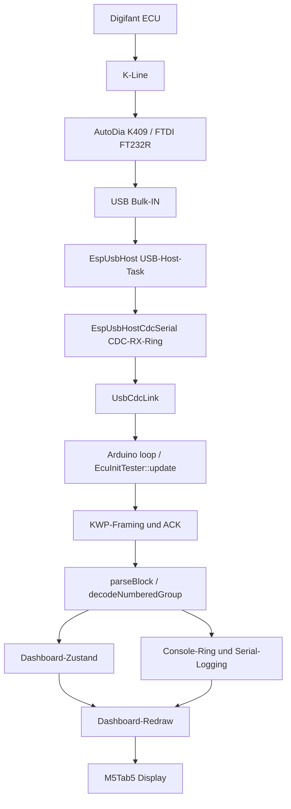

# M5Tab5 Architecture Analysis – GPT 5.6 Luna

**Projekt:** `M5Tab5_AutoDia`  
**Analyseumfang:** gesamter Workspace einschließlich Firmware, Test-Sketch, Replay-Daten, Dokumentation, Build-Metadaten und der lokal installierten `EspUsbHost`-Bibliothek, soweit sie für den Empfangspfad relevant ist.  
**Analysedatum:** 2026-08-19  
**Änderungsumfang:** Diese Datei ist die einzige im Rahmen dieser Analyse neu erzeugte Datei. Bestehender Quellcode wurde nicht verändert.

## 1. Executive Summary

### 1.1 Gesamturteil

Das Projekt ist aktuell ein Arduino-basierter Firmware-Prototyp mit einer **kooperativ arbeitenden Hauptschleife**. Die Anwendung selbst erzeugt keine FreeRTOS-Tasks, Queues, Semaphoren, Event Groups, Task Notifications, Timer oder ISRs. Der USB-Host wird jedoch von der installierten `EspUsbHost`-Bibliothek in eigenen FreeRTOS-Tasks betrieben. Dadurch existieren zwei für die Anwendung relevante Ausführungskontexte:

1. die Arduino-Hauptschleife mit `setup()`/`loop()`;
2. Bibliotheks-Tasks des USB-Hosts, die USB-Ereignisse und CDC-RX-Daten verarbeiten und Verbindungs-Callbacks ausführen.

Die Anwendung besitzt derzeit **keine echte Entkopplung zwischen zeitkritischem Digifant-Empfang und nachgelagerter Verarbeitung**. Der externe USB-Task legt Bytes zwar in einen geschützten CDC-Ringbuffer, aber die eigentliche KWP1281-Rahmung, Quittierung, Echo-Behandlung, Parser-Verarbeitung, Logging und Zustandssteuerung erfolgen anschließend im Arduino-Loop-Task. Ein langsamer Consumer blockiert den USB-Host-Task nicht unmittelbar, kann aber den Ringbuffer füllen und dadurch Bytes verlieren. Bei KWP1281 ist das besonders kritisch, weil der Empfänger nicht nur Daten sammeln, sondern jedes relevante Byte zeitnah quittieren muss.

### 1.2 Wichtigste Befunde

| Priorität | Befund | Einstufung |
|---|---|---|
| **CRITICAL** | Es existiert kein unabhängiger, priorisierter Digifant-Empfangs-/Protokollpfad. Empfang und Verarbeitung laufen im selben Arduino-Loop-Kontext. | Nachgewiesene Architekturgrenze |
| **CRITICAL** | Der externe CDC-Ringbuffer ist endlich und überschreibt bei Überlauf die ältesten Bytes. Die Anwendung erkennt oder zählt diesen Verlust nicht. | Nachgewiesenes Datenverlust-Risiko bei Überlast |
| **HIGH** | `isBusyReceiving()` erlaubt ein Dashboard-Redraw, obwohl `RECEIVE_BLOCK` aktiv, aber noch kein Byte im Blockpuffer ist. Dadurch kann eine teure Display-Operation das nächste Empfangs-/ACK-Fenster verzögern. | Nachgewiesenes Scheduling-Problem |
| **HIGH** | `sendBlockWithHandshake()` protokolliert fehlende Echos/ACKs nur als Warnung, sendet weiter und liefert anschließend weiterhin `true`. | Nachgewiesenes Protokoll-/Synchronisationsproblem |
| **HIGH** | Empfangs- und Verarbeitungslogik erzeugt sehr viele synchrone Debug-Ausgaben. Dadurch ist die Worst-Case-Laufzeit des Loop-Aufrufs nicht konstant. | Nachgewiesenes Echtzeitrisiko |
| **HIGH** | `Console` wird aus USB-Callbacks und aus der Hauptschleife ohne Anwendungssynchronisation benutzt. | Nachgewiesene Race-Condition, sofern die Callback-Ausführung im Bibliotheks-Task erfolgt |
| **HIGH** | `RECEIVE_BLOCK` liest alle aktuell verfügbaren Bytes ohne Per-Iteration-Limit und verarbeitet/loggt sie direkt. | Nachgewiesenes unbeschränktes Consumer-Verhalten |
| **MEDIUM** | Lokale TX-Echos werden in `sendBlockWithHandshake()` wertbasiert gesucht; fremde Bytes werden beim Warten verworfen. | Wahrscheinliches Protokollrisiko |
| **MEDIUM** | `pendingRxEcho` verwirft deterministisch das nächste RX-Byte. Das behebt den früheren Komplementärbyte-Fehler, setzt aber ein Echo-Invariant voraus. | Potenzielles Adapter-/Timing-Risiko |
| **MEDIUM** | Returnwerte von Baudraten-, Break-, Latenz- und Schreiboperationen werden im kritischen Pfad weitgehend ignoriert. | Wahrscheinliches Fehlerbehandlungsproblem |
| **MEDIUM** | Es gibt keinen unabhängigen Keep-Alive-Scheduler; der 4-s-Session-Timeout ersetzt keinen dokumentierten ACK-Zeitplan. | Wahrscheinliches Protokollrisiko |
| **LOW** | Simulation und Live-Pfad sind architektonisch nicht gleichwertig: `SimulatedLink` testet den Live-KWP-Empfangszustandsautomaten nicht. | Nachgewiesene Testlücke |

### 1.3 Antwort auf die zentrale Sicherheitsfrage

> Kann der Digifant-Empfang auch unter maximaler Belastung zuverlässig weiterlaufen?

**Mit der aktuellen Anwendungsarchitektur ist das nicht nachgewiesen und für Überlast nicht garantiert.**

Der USB-Host kann Empfangsbytes zunächst unabhängig vom Arduino-Loop in den CDC-Ring schreiben. Das ist eine begrenzte Pufferung, aber keine verlustfreie Entkopplung. Sobald der Arduino-Loop durch KWP-TX-Wartezeiten, Display-Rendering, Logging, Touch-Verarbeitung oder sonstige Arbeit nicht schnell genug liest, wird der CDC-Ring bei ausreichender Last überschrieben. Zusätzlich muss der KWP-Consumer zeitnah ACKs senden; diese Aufgabe ist derzeit mit dem Parser, Logging und der Zustandsmaschine in einem Kontext vermischt.

Die aktuelle Implementierung kann unter den bisher beobachteten Fahrzeugbedingungen funktionieren. Aus dem Code folgt jedoch keine Garantie für maximale Last, beliebige Bursts, USB-Jitter, langsame Verbraucher, Hot-Unplug oder verlängerte Display-/Logging-Laufzeiten.

## 2. Verstandene Gesamtarchitektur

### 2.1 Workspace und Ausführungsvarianten

Der Workspace enthält:

- die Hauptfirmware in `M5Tab5_Digifant_Proto/`;
- den separaten USB-Test-Sketch `M5Tab5_USB_Check/M5Tab5_USB_Check.ino`;
- KWP-/Architektur-Dokumentation in `project.md` und `CODE_REVIEW_KWP1281.md`;
- UI-Konzepte in `UI_UX_KONZEPT.md` und `UI_UX_KONZEPT_MINIMAL.md`;
- Fahrzeug-Captures und den Replay-Datensatz unter `captures/`;
- das Offline-Konvertierungsskript `tools/make_replay_dataset.py`;
- generierte Arduino-Build-Artefakte unter `build/`, `build_hw/`, `build_sim/` und `build_usb_check/`.

Die Build-Artefakte wurden nicht als Quellcode behandelt. `build/compile_commands.json` bestätigt die verwendeten Komponenten und Pfade, insbesondere `M5Unified`, `M5GFX`, `EspUsbHost` und den ESP32-Arduino-Core.

Der Hauptcode wird per Compiler-/Quellkonfiguration in drei Modi ausgewählt:

| Modus | Transport | Tester | Zweck |
|---|---|---|---|
| `MODE_SIMULATION_REPLAY` | `SimulatedLink` | `ConnectivityTester` | Replay-/UI-Trockentest |
| `MODE_RAW_LOOPBACK_TEST` | `UsbCdcLink` | `ConnectivityTester` | Rohdaten-/USB-K-Line-Test |
| `MODE_KWP1281_LIVE_DIAG` | `UsbCdcLink` | `EcuInitTester` | echte Digifant-Kommunikation |

Der Default in `M5Tab5_Digifant_Proto/M5Tab5_Digifant_Proto.ino:29-30` ist `MODE_KWP1281_LIVE_DIAG`.

### 2.2 Komponentenmodell



### 2.3 Lebenszyklus und Kontrollfluss

`M5Tab5_Digifant_Proto.ino:110-139` führt in `setup()` folgende Schritte aus:

1. Debug-Serial mit 115200 Baud starten;
2. 1 s Boot-Verzögerung;
3. `M5.begin()`;
4. globale `Console` initialisieren;
5. `Console`-eigenes Display-Redraw mit `setDisplayEnabled(false)` deaktivieren;
6. globales `Dashboard` initialisieren;
7. Banner ausgeben;
8. `serialLink.begin()` ausführen;
9. `g_linkReady` setzen.

`loop()` in `M5Tab5_Digifant_Proto.ino:157-200` arbeitet anschließend in dieser Reihenfolge:

1. `M5.update()`;
2. Debug-Serial-Kommandos lesen;
3. bei fehlender Link-Initialisierung früh zurückkehren;
4. in Simulation `SimulatedLink::update()` aufrufen oder Hardware-Wartehinweis loggen;
5. `tester.update()` aufrufen;
6. Console/Dashboard aktualisieren, im Live-Modus abhängig von `isBusyReceiving()`;
7. `delay(2)`.

Die Anwendung nutzt damit kooperative Polling-Semantik. Der Wert `kLoopDelayMs=2` begrenzt nur den Leerlaufanteil. Er begrenzt nicht die Laufzeit eines einzelnen `tester.update()`-Aufrufs, weil dieser synchron mehrere Millisekunden bis Sekunden blockieren kann.

### 2.4 Globale bzw. singleton-artige Zustände

- `Console console` in `Console.cpp:7-10`;
- `Dashboard dashboard` in `Dashboard.cpp:6`;
- globales `serialLink` und globales `tester` in `M5Tab5_Digifant_Proto.ino:47-58`;
- `g_linkReady` im anonymen Namespace in `M5Tab5_Digifant_Proto.ino:79`;
- externe globale Objekte `M5` und `Serial` aus den verwendeten Frameworks.

Diese globalen Objekte vereinfachen die Prototypstruktur, schaffen aber implizite Abhängigkeiten: Transport, Protokollparser, UI und Logging greifen direkt auf dieselben globalen Zustände zu.

### 2.5 Tasks, Interrupts und Timer

Im Projektquellcode wurden keine Aufrufe oder Definitionen für folgende Mechanismen gefunden:

- `xTaskCreate` / `xTaskCreatePinnedToCore`;
- FreeRTOS-Queues, Semaphoren, Event Groups oder Task Notifications;
- `attachInterrupt`, `IRAM_ATTR` oder eigene ISRs;
- `esp_timer`, Hardware-Timer oder `Ticker`;
- projektseitige FreeRTOS-Task-Synchronisation.

Timerähnliche Abläufe verwenden `millis()`-Differenzen:

- `ConnectivityTester`: 100-ms-Sendeintervall und 80-ms-Timeout;
- `SimulatedLink`: 25-ms-Antwortverzögerung;
- `Dashboard`: 100-ms-Scope-Sampling und 150-ms-Redraw-Intervall;
- `Console`: 100-ms-Minimalabstand zwischen Redraws;
- `EcuInitTester`: 2,6-s-K-Line-Ruhephase, 3-s-Antwort-Timeout, 6-s-Wiederholintervall, 4-s-Session-Timeout.

Die lokal installierte `EspUsbHost`-Bibliothek erzeugt dagegen zwei Tasks mit der Standardkonfiguration aus `EspUsbHost.h:248-256`: Stackgröße 8192 und Priorität 5. Die Tasks werden in der Bibliothek in `EspUsbHost.cpp` über `xTaskCreate` erzeugt. Der genaue Arduino-Loop-Task-Prioritätswert ist aus diesem Workspace nicht verifiziert.

## 3. Kritischer Digifant-Empfangspfad

### 3.1 Empfang bis zum CDC-Ringbuffer

Die lokal installierte Bibliothek `EspUsbHost` enthält in `EspUsbHostCdcSerial`:

- einen dynamisch allokierten CDC-RX-Ringbuffer;
- standardmäßig `ESP_USB_HOST_CDC_RX_BUFFER_SIZE=512` Bytes;
- `portMUX_TYPE rxMux_` für den Bibliotheks-internen Schutz;
- `available()`, `read()` und `pushData()` mit Critical Sections.

`pushData()` in der installierten Bibliothek überschreibt bei vollem Ringbuffer den ältesten Eintrag, indem `rxTail_` vorgerückt wird. Es gibt in `UsbCdcLink` keinen Zugriff auf einen Overflow-Zähler und keine Anwendungsmeldung, wenn Bytes verworfen wurden.

Das ist eine wichtige Unterscheidung:

- **Bibliotheksintern:** USB-Task und Hauptloop greifen auf den CDC-Ring grundsätzlich geschützt zu.
- **Anwendungsseitig:** Der Ringbuffer ist klein und verlustbehaftet; der Verlust wird nicht sichtbar gemacht.
- **Architektonisch:** Der Ringbuffer entkoppelt USB-Datenübernahme zeitlich begrenzt, nicht dauerhaft und nicht verlustfrei.

### 3.2 KWP-Byteverarbeitung

`UsbCdcLink.cpp:31-37` delegiert `isConnected()`, `available()`, `read()` und `write()` direkt an `EspUsbHostCdcSerial`.

`EcuInitTester::update()` verarbeitet diese Bytes in der Hauptschleife:

- `WAIT_SYNC_KEYBYTES` sucht `0x55`, KB1 und KB2 (`EcuInitTester.cpp:383-420`);
- `SEND_INVERTED_KEYWORD` sendet `~KB2` nach 35 ms (`EcuInitTester.cpp:422-449`);
- `RECEIVE_BLOCK` liest das Längenbyte und die folgenden Bytes (`EcuInitTester.cpp:453-606`);
- jedes relevante ECU-Byte wird mit `~byte` quittiert;
- das vollständige Frame wird anschließend in `parseBlock()` verarbeitet.

Der kritische Pfad ist somit nicht nur ein passives Lesen. Er enthält zeitabhängige Rückübertragung:

```text
RX-Byte -> Framing -> inverse ACK senden -> lokales Echo berücksichtigen -> nächstes RX-Byte
```

Eine spätere Verarbeitung darf diese Sequenz nicht beliebig verzögern, ohne den KWP-Vertrag zu verletzen.

### 3.3 Empfang und Verarbeitung sind nicht vollständig entkoppelt

Die eigentliche Empfangsfunktion ist mit mehreren nachgelagerten Aufgaben vermischt:

- Protokollframing;
- ACK-Übertragung;
- Echoverarbeitung;
- Blockvalidierung;
- Counterprüfung;
- Parsing und Decodierung;
- Dashboard-Setter;
- pro Byte bzw. pro Block `console.printf()`;
- nach Blockabschluss `delay(30)`;
- teilweise direkte Folgeanfragen über `sendBlockWithHandshake()`.

Es gibt keine Übergabe eines vollständig empfangenen Frames an eine zweite Verarbeitungsqueue. `parseBlock()` wird innerhalb desselben `RECEIVE_BLOCK`-Aufrufs direkt auf `_rxBlockBuf` ausgeführt.

**Bewertung:** Das erfüllt eine einfache synchrone Prototyplogik, aber nicht die geforderte robuste Producer-/Consumer-Entkopplung. Insbesondere ist nicht bewiesen, dass ein langsamer Parser, Logger oder UI-Consumer den Empfang nicht beeinflussen kann.

### 3.4 Der kritische Übergabepunkt nach einem Frame

In `EcuInitTester.cpp:549-590` passiert nach dem vollständigen Block in einem Aufruf:

1. `parseBlock(_rxBlockBuf, _rxBlockPos)`;
2. Counter-/State-Updates;
3. `_rxBlockPos` wird zurückgesetzt;
4. `delay(30)`;
5. je nach Blocktitel Folge-ACK oder neue Messgruppenanfrage;
6. teilweise `sendBlockWithHandshake()` mit synchronen Echo-/ACK-Wartezeiten.

Der Empfangspuffer gehört vollständig `EcuInitTester`. Er wird nicht per Pointer an einen anderen Task übergeben. Dadurch gibt es kein klassisches Use-after-free zwischen Parser und Consumer. Gleichzeitig besteht aber eine starke synchrone Kopplung: Der Puffer kann erst für neue Daten verwendet werden, nachdem Parsing und Folgeaktionen beendet wurden.

## 4. Datenfluss und Producer/Consumer-Modell

### 4.1 Übersicht

| Stufe | Producer | Consumer | Speicher/Ownership | Blocking | Überlastverhalten |
|---|---|---|---|---|---|
| USB-Bulk-IN | USB-Hardware/Host-Stack | `EspUsbHost`-Task | Bibliotheksinterne USB-Transferobjekte | durch USB-Stack | Bibliotheks-/Treiberverhalten, nicht im Projekt kontrolliert |
| CDC-RX | `EspUsbHost`-Client-Task | `UsbCdcLink`/`EcuInitTester` | Bibliotheks-Ringbuffer, 512 B Standard | `pushData()` kurz geschützt | älteste Bytes werden überschrieben, kein App-Zähler |
| Link-Abstraktion | `UsbCdcLink` | `EcuInitTester` | Rückgabewerte einzelner Bytes | `available/read` nicht blockierend | keine zusätzliche Queue |
| Blockframing | `EcuInitTester::update` | derselbe `EcuInitTester` | `_rxBlockBuf[128]` | synchron | ungültige Bytes werden verworfen/resynchronisiert |
| Blockparser | `parseBlock` | derselbe Aufruf | Pointer auf `_rxBlockBuf` | synchron | keine Entlastungsqueue |
| Gruppendecoder | `decodeNumberedGroup` | derselbe Aufruf | Headercache `[5][64]`, Bodypointer | synchron | ungültige Header werden geloggt/abgebrochen |
| Logging | Parser/USB-Callback | `Console`/Debug-Serial | `char[40][96]` plus Serial-Ausgabe | Serial-Ausgabe kann langsam sein | älteste Logzeilen werden überschrieben |
| Dashboard-Zustand | Parser/Simulation/Touch | Dashboard-Redraw | globale Felder/String/History | synchron im Loop | dirty-Flag, keine Queue |
| Dashboard-UI | Hauptloop | Display | PSRAM-Sprites und M5GFX | potenziell >20 ms | Empfang wartet im selben Loop |
| Scope-History | `Dashboard::update` | `drawScope` | `[240]` Samples | synchron | älteste Samples werden zyklisch überschrieben |

### 4.2 Queue- und Buffer-Ownership

Es gibt keine projektseitige FreeRTOS-Queue. Die verwendeten Puffer sind:

- `EspUsbHostCdcSerial`-RX-Ringbuffer: Besitz bei der Bibliothek;
- `_rxBlockBuf[128]`: Besitz bei `EcuInitTester`;
- `_groupHeader[5][64]`: Besitz bei `EcuInitTester`;
- `Console::_lines[40][96]`: Besitz bei `Console`;
- `Dashboard::_history[240]`: Besitz bei `Dashboard`;
- `_rxBuffer[65]` von `SimulatedLink`: Besitz bei `SimulatedLink`;
- `ReplayData.h`: statische Firmwaredaten.

Die Zeigerübergaben im Live-Pfad sind kurzfristig und synchron. `parseBlock()` erhält einen Pointer auf `_rxBlockBuf`, und `decodeNumberedGroup()` erhält einen Pointer auf den aktuellen Body. In der aktuellen Implementierung wird dieser Pointer nicht asynchron gespeichert. Ein unmittelbares Pointer-Lifetime-Problem ist deshalb für diesen Pfad nicht nachgewiesen.

Das eigentliche Problem ist die **fehlende Ownership-Grenze zwischen Empfang und Verarbeitung**: Der Empfänger muss auf demselben Speicher weiterarbeiten, bis alle nachgelagerten Operationen beendet sind.

### 4.3 Verhalten bei langsamen Consumern

Wenn `Dashboard::drawInfo()`, `drawScope()`, `Console` oder Parserarbeit langsam sind:

1. `EcuInitTester` liest währenddessen keine neuen CDC-Daten;
2. der externe CDC-Ringbuffer nimmt weitere Bytes begrenzt auf;
3. bei 512 Bytes Füllstand überschreibt `pushData()` die ältesten Bytes;
4. der KWP-Parser erhält danach möglicherweise eine beschädigte Sequenz;
5. Längenbyte, Counter, Titel oder Endbyte können fehlen;
6. der Parser verwirft/resynchronisiert oder startet die Session neu.

Ein langsam nachgelagerter Consumer führt also nicht zwingend sofort zu einem Blockieren des USB-Tasks, kann aber zu **stillen Datenverlusten und anschließendem Protokollverlust** führen.

### 4.4 Mehrfachverarbeitung und Überschreiben

- Eine vollständige KWP-Blockverarbeitung wird nicht mehrfach aus einer Queue entnommen; sie wird einmal synchron aus `_rxBlockBuf` verarbeitet.
- Ein alter CDC-Bytewert kann bei Ringüberlauf überschrieben werden; das ist kein Mehrfachverarbeitungs-, sondern ein Verlust-/Framingproblem.
- Ein alter Replay-Frame in `SimulatedLink` wird bei einem neuen `write()` verworfen (`SimulatedLink.cpp:41-48`).
- Ein alter Console-Eintrag wird bei vollem `Console`-Ring überschrieben.
- Scope-Samples werden bei voller Historie zyklisch überschrieben; das ist für eine Anzeige bewusst, aber kein persistentes Logging.

## 5. FreeRTOS-Analyse

### 5.1 Projektseitige FreeRTOS-Nutzung

Die Anwendung nutzt FreeRTOS nur indirekt über Arduino/ESP-IDF und `EspUsbHost`. Es gibt keine selbst erzeugte Anwendungstask mit deklarierter Priorität. Daher existieren für den Digifant-Consumer keine explizit dokumentierten Scheduling-Parameter.

### 5.2 Bibliotheks-Tasks

Die installierte `EspUsbHost`-Bibliothek verwendet laut lokalem Header:

- Task-Stack: 8192;
- Task-Priorität: 5;
- keine feste Core-Zuordnung (`tskNO_AFFINITY`).

Sowohl Host-Task als auch Client-Task verwenden diese Konfiguration. Der Client-Task schreibt CDC-Daten in den geschützten Ringbuffer und ruft die Device-Callbacks auf.

Diese Priorität ist für USB-Verarbeitung grundsätzlich plausibel. Sie garantiert jedoch nicht, dass die Anwendung bei einem überlasteten Hauptloop verlustfrei bleibt, weil der Ringbuffer endlich ist und die ACK-Logik im Hauptloop verbleibt.

### 5.3 Blocking Calls

Nachgewiesene synchrone/blockierende Abschnitte:

- `send5BaudAddress()` mit zehn `delay(200)` in `EcuInitTester.cpp:86-108`, etwa 2 s;
- `sendBlockWithHandshake()` mit bis zu 150 ms Echo-Wartezeit und 350 ms ACK-Wartezeit pro Byte in `EcuInitTester.cpp:111-169`;
- `delay(1)` in den TX-Warteschleifen;
- `delay(50)` nach 5-Baud-Senden in `EcuInitTester.cpp:368`;
- `delay(35)` für wiederholte Keybyte-Antwort in `EcuInitTester.cpp:472-475`;
- `delay(30)` nach vollständigem RX-Block in `EcuInitTester.cpp:557`;
- potenziell lange Display-Renderings in `Dashboard::draw()`;
- synchrone Debug-Serial-Ausgaben in sehr vielen Parserpfaden.

`delay()` ermöglicht normalerweise Scheduler-Fortschritt und reduziert die Gefahr eines unmittelbaren Watchdog-Problems. Es macht den Arduino-Loop aber nicht verfügbar für `M5.update()`, Dashboard-Logik, Kommandos oder KWP-Anwendungslogik. Die Aussage aus älteren Dokumenten, dass `delay()` jegliches Task-Switching stoppe, ist daher zu pauschal; korrekt ist: Es blockiert die Anwendungsschleife, während der RTOS-/USB-Unterbau weiterlaufen kann.

### 5.4 Queue-Größen und Backpressure

Es existiert keine projektseitige Queue-Größe für Digifant-Frames. Relevant ist ausschließlich der externe CDC-Ring mit 512 Bytes Standardgröße. Die Bibliothek bietet:

- `setRxBufferSize()`;
- `rxBufferSize()`;
- eine optionale serial OUT queue;
- `serialWriteAsync()` und Status-/Pending-Abfragen.

Der Projektcode verwendet keine dieser Kapazitäts-/Statistikfunktionen. Die TX-Queue wird nicht aktiviert. `EspUsbHostCdcSerial::write()` reicht an `sendSerial()` weiter. Es gibt damit keine projektseitig überwachte TX-Backpressure-Strategie.

Die KWP-Bytequittierung wirkt zwar als implizite Flusskontrolle, aber die Anwendung prüft nicht konsequent, ob eine Übertragung tatsächlich physisch erfolgreich war.

### 5.5 Priority Inversion, Deadlocks, Starvation

**Nicht nachgewiesen:**

- Es gibt keine projektseitigen Mutexketten, deshalb ist keine klassische Priority Inversion aus dem Anwendungscode ableitbar.
- Es gibt keine Anwendungsmutexe, aus denen ein Deadlock entstehen könnte.

**Mögliche Starvation-/Scheduling-Probleme:**

- Ein langer `tester.update()`-Aufruf verhindert die reguläre Ausführung von `M5.update()`, UI und anderen Loop-Aktivitäten.
- Ein unbeschränktes `while (_link.available() > 0)` kann den Loop bei dauerhaft eintreffenden Daten lange im RX-Pfad halten.
- Eine volle CDC-RX-Ringstruktur führt nicht zu einer Blockierung, sondern zu Datenverlust.
- Ein voller optionaler TX-Pfad ist nicht als anwendungsseitig kontrollierter Zustand modelliert.

### 5.6 Timer und Keep-Alive

Der Code hat nur Zeitstempelprüfungen. Ein unabhängiger Timer-Task oder Hardware-Timer für KWP-Keep-Alive existiert nicht. Die Dokumentation in `project.md:74-76` nennt ein ACK-/Keep-Alive-Fenster von ungefähr 500–1500 ms. Der Code prüft in `RECEIVE_BLOCK` erst nach 4000 ms ohne letzte TX-Aktivität auf Session-Timeout (`EcuInitTester.cpp:603-606`). Dieser Timeout dient der Fehlererkennung und ist kein Keep-Alive-Scheduler.

## 6. Race Conditions

### 6.1 `Console` aus USB-Callback und Hauptloop

Die installierte Bibliothek führt die Device-Callbacks im USB-Client-Task aus. `UsbCdcLink::begin()` registriert in `UsbCdcLink.cpp:8-16` Callbacks, die direkt `console.printf()` aufrufen.

Parallel kann die Hauptschleife:

- `Console::println()`/`printf()` ausführen;
- `Console::getLine()` über `Dashboard::drawInfo()` lesen;
- `Console::update()` aufrufen.

`Console` schützt `_head`, `_count`, `_dirty` und `_lines` nicht mit Mutex oder Critical Section. Bei einem Callback während des Schreibens bzw. Lesens sind folgende Effekte möglich:

- ein Logeintrag wird teilweise kopiert gelesen;
- `_head`/`_count` werden zwischen zwei Operationen inkonsistent beobachtet;
- die Anzeige verwendet eine alte bzw. neue Ringposition uneinheitlich;
- konkurrierende Debug-Serial-Ausgaben werden vermischt, soweit der Arduino-Core dies nicht intern serialisiert.

**Einstufung:** **HIGH, nachgewiesenes Race-Risiko** auf Basis der verifizierten Bibliotheks-Callback-Ausführung. Der normale Parser-Loggingpfad allein wäre single-threaded; die USB-Callbacks machen die Annahme falsch.

### 6.2 `Dashboard`-Zustand

`Dashboard` wird aus der Hauptschleife, aus `SimulatedLink::generateReplayFrame()` und aus dem Parser aufgerufen. Diese Aufrufe sind im normalen aktuellen Modus überwiegend loop-synchron. USB-Callbacks greifen nicht direkt auf `Dashboard` zu.

Ein direkter Dashboard-Race zwischen USB-Callback und UI ist daher nicht nachgewiesen. Die Architektur bleibt aber fragil, weil die globale Singleton-Schnittstelle keinen Ausführungskontext festlegt und spätere Callback-Erweiterungen leicht denselben Fehler erzeugen könnten.

### 6.3 USB-Disconnect zwischen Einzeloperationen

`EcuInitTester` führt getrennte Aufrufe aus:

```text
isConnected() -> available() -> read()/write()
```

Ein Hot-Unplug kann zwischen diesen Operationen durch den USB-Client-Task verarbeitet werden. `UsbCdcLink` bietet keinen atomaren Transportabschnitt oder stabilen Device-Lifetime-Handle. Die Bibliothek besitzt zwar interne Disconnect-Bereinigung; der Anwendungscode behandelt den Gerätebesitz aber nicht transaktional.

**Einstufung:** **MEDIUM, potenzielles Race-/Lifetime-Risiko.** Ein konkreter Use-after-free im Projektcode ist nicht bewiesen, weil die Bibliothek ihre internen Zustände schützt. Der Anwendungscode kann jedoch zwischen Statusprüfung und Übertragung veraltete Annahmen verwenden.

### 6.4 RX-Ringbuffer-Synchronisation

Die Synchronisation von `EspUsbHostCdcSerial::pushData()` zu `available()`/`read()` ist in der installierten Bibliothek mit `rxMux_` implementiert. Ein Race innerhalb dieses Ringbuffers ist deshalb nicht als Projektfehler nachgewiesen.

Das schützt nur die Ringstruktur. Es schützt nicht die logische Folge mehrerer Aufrufe im Anwendungscode und verhindert keinen Überlauf.

## 7. Ownership- und Lifetime-Probleme

### 7.1 Empfangspuffer

`_rxBlockBuf[128]` bleibt Eigentum von `EcuInitTester`. `parseBlock()` und `decodeNumberedGroup()` verwenden Pointer nur synchron. Ein klassischer Pointer-Lifetime-Fehler ist nicht nachgewiesen.

Die Lifetime-Grenze ist trotzdem zu lang gekoppelt: Während `parseBlock()`, Logging, Decodierung, Display-State-Updates und Folge-TX läuft, kann derselbe Empfangspuffer nicht als unabhängiger Producer-/Consumer-Puffer wiederverwendet werden.

### 7.2 Lokale TX-Bytes

`sendBlockWithHandshake()` verwendet lokale Bytes bzw. `txBuf`. Nach Prüfung der installierten Bibliotheksimplementierung kopiert `EspUsbHostCdcSerial::write()` die Daten über `sendSerial()` in einen USB-Transferpfad, bevor die Methode zurückkehrt. Daher ist für die lokalen Einbyte-Puffer kein unmittelbares Use-after-return nachgewiesen.

Die Beständigkeit der Hardwareübertragung ist aber nicht identisch mit physischer Übertragungsbestätigung. `write()` meldet die Annahme/Submission, nicht die erfolgreiche K-Line-Kommunikation.

### 7.3 `_pendingRxEcho`

Die aktuelle deterministische Echo-Logik setzt nach einem Host-ACK `_pendingRxEcho=true` und verwirft das nächste eingehende Byte (`EcuInitTester.cpp:488-503`). Das beseitigt den früheren value-basierten Komplementärbyte-Fehler, der bei langen Headern ein echtes ECU-Byte verwerfen konnte.

Die Lifetime des Flags ist intern klar und wird bei Reset-/Resync-Pfaden zurückgesetzt. Die Semantik setzt jedoch voraus, dass tatsächlich genau ein lokales Echo als nächstes relevantes Byte eintrifft. Fehlt das Echo oder kommt es verspätet, wird das nächste echte ECU-Byte verworfen. Das ist ein potenzielles Adapter-/Timing-Risiko, kein aus dem Capture sicher nachgewiesener Fehler für jede Situation.

### 7.4 String- und Heap-Lifetime

Der aktuelle `Console`-Ring ist statisch (`char[40][96]`) und nicht die in `CODE_REVIEW_KWP1281.md` beschriebene dynamische `String[40]`-Variante. Das dort beschriebene konkrete Scroll-Reallocationsproblem ist im aktuellen `Console`-Quellcode nicht mehr vorhanden.

Dynamische `String`-Nutzung besteht jedoch weiterhin:

- `SimulatedLink::write()` erstellt eine zusammengesetzte Logzeile;
- Dashboard speichert `_ecuInfo`, `_mode` und `_state` als `String`;
- Dashboard erstellt in `drawInfo()` temporäre Strings für ECU-ID und Logzeilen;
- Parser übergibt `String(asciiStr)` an `Dashboard`.

Dies ist außerhalb des unmittelbaren Byte-ACK-Warteabschnitts, kann aber bei langen Laufzeiten Heap-Fragmentierung und variable Ausführungszeiten erzeugen. Ein konkreter Out-of-memory-Fehler ist nicht nachgewiesen.

### 7.5 Fehlerpfad-Lifetime

Wenn `_host.begin()` erfolgreich ist, `_serial.begin()` aber fehlschlägt, gibt `UsbCdcLink::begin()` in `UsbCdcLink.cpp:18-28` `false` zurück, ohne im Projekt eine explizite Host-/Serial-Bereinigung oder Wiederanlaufstrategie auszuführen. `g_linkReady` bleibt false, und die Hauptschleife tut danach nur noch Console-Update und Delay.

**Einstufung:** **MEDIUM, potenzielles Ressourcen-/Recovery-Problem.**

## 8. Echtzeit- und Blocking-Risiken

### 8.1 Zeitkritische Kategorien

#### Hart bzw. protokollkritisch

- 5-Baud-Bitfolge mit 200 ms pro Bit;
- Antwortfenster für `~KB2` nach KB2;
- KWP-Byte-ACK-/Echo-Reihenfolge;
- Blockcounter-Sequenz;
- ECU-Keep-Alive-/Session-Zeitfenster.

#### Zeitkritisch

- schnelle Entleerung des USB-CDC-RX-Rings;
- begrenzte Loop-Latenz zwischen zwei KWP-RX-Bytes;
- Übertragungs-/Control-Transfer-Bestätigung;
- Erkennen von Disconnect und Fehlerzuständen.

#### Nicht zeitkritisch

- Dashboard-Redraw;
- Touch-Tabwechsel;
- formatierte Debugausgabe;
- Replay-Darstellung;
- Scope-Rendering;
- historische Loganzeige;
- Offline-CSV-Verarbeitung.

Diese Klassen sind im aktuellen Code nicht sauber getrennt. Zeitkritische und nicht zeitkritische Arbeit teilen sich denselben Anwendungskontext.

### 8.2 5-Baud-Übertragung

`send5BaudAddress()` blockiert ungefähr 2 s in `delay(200)`-Schritten. RTOS-Tasks können währenddessen weiterlaufen, aber:

- `M5.update()` läuft nicht;
- Touch wird nicht verarbeitet;
- Dashboard wird nicht aktualisiert;
- serielle Steuerkommandos werden nicht verarbeitet;
- die Anwendung kann ihren eigenen Empfangs-/Recovery-Pfad nicht ausführen.

Für die 5-Baud-Phase ist die Blockierung teilweise durch die Protokollphysik erklärbar. Sie sollte trotzdem nicht als Nachweis eines robusten Empfangspfads interpretiert werden.

### 8.3 TX-Handshake

`sendBlockWithHandshake()` arbeitet Byte für Byte und wartet nach jedem Schreiben zunächst bis zu 150 ms auf das Echo und anschließend bis zu 350 ms auf den invertierten ACK. Bei einem längeren Block oder einem fehlenden Echo/ACK kann ein einzelner `tester.update()`-Aufruf sehr lange dauern.

Währenddessen werden neu eintreffende Bytes zwar eventuell vom externen USB-Task gepuffert, aber nicht von der Anwendung verarbeitet. Die Logik ist damit nicht nur TX, sondern indirekt auch ein möglicher RX-Backlog-Erzeuger.

### 8.4 Dashboard-Redraw-Hole

Die Hauptschleife überspringt Dashboard-Updates nur, wenn `tester.isBusyReceiving()` true liefert (`M5Tab5_Digifant_Proto.ino:191-195`). Die Funktion in `EcuInitTester.h:27-34` berücksichtigt `State::RECEIVE_BLOCK` jedoch nur dann, wenn `_rxBlockPos > 0` ist.

Problemsequenz:

1. `RECEIVE_BLOCK` ist aktiv;
2. aktuell ist `_rxBlockPos == 0`;
3. `tester.update()` findet in diesem Moment kein Byte;
4. `isBusyReceiving()` liefert false;
5. `dashboard.update()` kann rendern;
6. die ECU sendet während dieses Renderings ein Byte;
7. ACK/Parser-Reaktion wartet bis das Rendern beendet ist.

`Dashboard::draw()` misst und loggt Laufzeiten über 20 ms (`Dashboard.cpp:227-250`). Damit liegt die mögliche Verzögerung in derselben Größenordnung wie die protokollkritischen Antwortfenster.

**Einstufung:** **HIGH, nachgewiesen.** Der konkrete Fahrzeuglauf kann trotzdem erfolgreich sein, wenn USB-Buffer, ECU-Timing und Displaydauer genügend Reserve bieten.

### 8.5 Unbegrenztes RX-Drain

`RECEIVE_BLOCK` verwendet `while (_link.available() > 0)` ohne maximale Zahl von Bytes pro `update()` (`EcuInitTester.cpp:461`). `ConnectivityTester` begrenzt dagegen bewusst auf 64 Bytes (`ConnectivityTester.cpp:10,39-48`).

Bei konstantem Datenstrom, USB-Burst, Rauschen oder bereits aufgelaufenem Backlog kann der KWP-Pfad lange oder theoretisch unbegrenzt im Drain verbleiben. Zusätzlich wird für viele Bytes synchron geloggt. Dadurch sind Loop-Latenz und CPU-Zeit datenabhängig.

### 8.6 Logging als zeitkritischer Pfad

`Console::println()` schreibt jedes Ereignis zuerst auf `Serial` und kopiert es anschließend in den Ring (`Console.cpp:35-63`). `Console::printf()` verwendet `vsnprintf()` auf einem Stackpuffer und ruft danach `println()` auf.

Die teure Console-Anzeige ist derzeit durch `console.setDisplayEnabled(false)` deaktiviert. Das reduziert das frühere unmittelbare Fullscreen-Redraw-Problem. Es beseitigt aber nicht:

- die synchrone Debug-Serial-Ausgabe;
- Formatierungsaufwand;
- Ringbuffer-Schreibzugriffe;
- konkurrierende Callback-Zugriffe;
- Dashboard-Log-Rendering, wenn Tab 2 aktiv ist.

Der historische Befund in `CODE_REVIEW_KWP1281.md`, dass `println()` immer direkt ein Fullscreen-Redraw auslöst, beschreibt nicht mehr die aktuelle Hauptkonfiguration. Der aktuelle effektive UI-Logpfad läuft über `Dashboard::drawInfo()`.

### 8.7 Speicherallokationen und Kopien

Positiv:

- `Console` verwendet einen festen Ringbuffer;
- `_rxBlockBuf`, Headercache und Scope-History sind statisch im Objekt;
- keine SD-/Flash-Dateioperationen liegen im Empfangspfad;
- der lokale TX-Puffer ist begrenzt.

Risiken:

- temporäre Arduino-`String`-Objekte in UI/Simulation;
- `String`-Kopien beim Log-Rendering;
- `vsnprintf()` und viele formatierte Ausgaben;
- keine Messung der Heap-Reserve oder Fragmentierung im Laufbetrieb.

## 9. Architekturprobleme

### 9.1 Vermischung von Empfang und Verarbeitung

Der wichtigste Strukturfehler ist die fehlende Schichtengrenze:

```text
USB-RX -> KWP-ACK -> Framebildung -> Parsing -> Decoding -> Dashboard/Logging -> Folgeanfrage
```

Diese Schritte sind in `EcuInitTester::update()` und direkt aufgerufenen Funktionen miteinander verkettet. Es existiert keine unabhängige Eingangs- oder Frame-Queue, die vollständige Frames mit klarer Ownership vom Protokoll-Empfänger an Parser/Logger/UI übergibt.

### 9.2 Fehlende Backpressure-Strategie

Das Projekt hat keine explizite Antwort auf folgende Überlastfälle:

- CDC-RX-Ring fast voll;
- Bytes gehen wegen Ringüberlauf verloren;
- Parser kommt nicht nach;
- Logging ist langsamer als der RX-Strom;
- Dashboard ist langsam;
- TX-Submission wird abgelehnt;
- USB-Gerät verschwindet während einer Übertragung.

Aktuell wird entweder gewartet, verworfen, weitergesendet oder neu synchronisiert. Eine zentrale, messbare Überlaststrategie mit Zählern und Prioritäten fehlt.

### 9.3 Globale Nebenwirkungen

Parserfunktionen ändern direkt:

- Dashboard-Zustände;
- Connection-Stage;
- Console-Ring;
- TX-/Counter-Zustand;
- Gruppenzustand.

Damit ist die Frage „ist ein Frame empfangen?“ untrennbar mit „wurde er visualisiert, geloggt und die nächste Gruppe angefordert?“ verbunden. Das erschwert Worst-Case-Analyse, Tests und spätere Task-Aufteilung.

### 9.4 UI- und Hardwarelogik in höheren Schichten

`EcuInitTester` kennt konkrete KWP-Digifant-Formeln, Dashboard-Felder und Logtexte. `UsbCdcLink` greift über `#define private public` auf Bibliotheksinternas und FTDI-spezifische Control Requests zu. Die Schichten sind für einen Prototyp verständlich, aber nicht sauber isoliert:

- Transportdetails reichen bis in den Tester;
- Protokollparser schreibt direkt in die UI;
- UI-Objekte sind globale Singletons;
- Logging ist kein unabhängiger, zeitunkritischer Kanal.

### 9.5 Testarchitektur ist nicht protokolltreu

Die Simulation nutzt standardmäßig `ConnectivityTester`, nicht `EcuInitTester`. `SimulatedLink::write()` verwirft alte Antworten und stellt nach 25 ms den nächsten Replay-Frame bereit. Es modelliert nicht:

- 5-Baud-Init;
- lokale TX-Echos;
- inverse ACKs pro Byte;
- Countersequenzen;
- Keep-Alive;
- verzögerte oder fehlende Bytes;
- RX-Overflow;
- beschädigte Frames im echten Parserpfad.

Die Simulation validiert daher UI-/Datenmapping und einen einfachen Request/Response-Fluss, aber nicht die kritische Concurrency- und Timingarchitektur.

### 9.6 Mess- und Diagnosefähigkeit fehlt

Nicht vorhanden bzw. nicht systematisch verfügbar sind:

- CDC-RX-Overflow-Zähler;
- verlorene Bytes/Frames;
- maximale und aktuelle RX-Ringbelegung;
- ACK-/Echo-Timeoutzähler;
- maximale Loop-Laufzeit;
- maximale Parserlaufzeit;
- Queue-High-Watermarks;
- Heap-/PSRAM-Reserve;
- USB-TX-Submission-/Completion-Statistik;
- Ursache einer Resynchronisierung.

Ohne diese Messgrößen kann ein erfolgreicher Capture nicht belegen, dass unter Last keine versteckten Verluste auftraten.

### 9.7 Fachliche Inkonsistenzen mit Architekturwirkung

- `project.md` beschreibt die Zustandsmaschine als nichtblockierend; der aktuelle Code enthält lange synchrone Abschnitte.
- `CODE_REVIEW_KWP1281.md` beschreibt den früheren dynamischen Console-Ring; aktuell wird ein statischer `char`-Ring verwendet.
- Parser und Dokumentation behandeln G69 als Rohwert, Dashboard zeigt über `rawToG69Deg()` dennoch eine abgeleitete Gradzahl (`Dashboard.cpp:65-69`, Verwendung `Dashboard.cpp:536`).
- `_baud5Supported`, mehrere Baudkonstanten und der Zustand `SWITCH_9600` wirken im aktuellen verifizierten Pfad unvollständig bzw. ungenutzt.

Diese Punkte sind nicht alle Concurrency-Bugs, erschweren aber die sichere Interpretation des Systems.

## 10. Priorisierte Befunde

### CRITICAL

#### C-01 – Keine echte Entkopplung des zeitkritischen Empfangs

- **Datei/Bereich:** `M5Tab5_Digifant_Proto/M5Tab5_Digifant_Proto.ino:157-200`, `M5Tab5_Digifant_Proto/EcuInitTester.cpp:453-606`
- **Funktion/Klasse:** `loop()`, `EcuInitTester::update()`, `parseBlock()`
- **Problem:** Der Arduino-Loop ist gleichzeitig RX-Consumer, KWP-ACK-Engine, Parser, Logger, Zustandsmaschine und Auslöser der Folgeanfragen.
- **Technische Begründung:** Es existiert keine App-Task mit höherer Priorität, keine Frame-Queue und kein separater Empfangs-/ACK-Kontext.
- **Auswirkung:** Jede lange Verarbeitung erhöht die RX-Latenz; bei ausreichendem Backlog kann der externe CDC-Ring Bytes überschreiben.
- **Priorität:** CRITICAL
- **Datenfluss:** Digifant → CDC-Ring → `EcuInitTester` → Parser/UI/Logging.

#### C-02 – CDC-Ringbuffer ist verlustbehaftet und Overflow unsichtbar

- **Datei/Bereich:** lokal installierte Bibliothek `EspUsbHost/src/EspUsbHost.cpp:14423-14439`, Konfiguration `EspUsbHost.h:188-203`; Projektdelegation `M5Tab5_Digifant_Proto/UsbCdcLink.cpp:31-37`
- **Funktion/Klasse:** `EspUsbHostCdcSerial::pushData`, `UsbCdcLink`
- **Problem:** Bei vollem 512-B-Ring wird `rxTail_` vorgerückt und der älteste Bytewert überschrieben.
- **Technische Begründung:** Kein Projektcode setzt eine größere RX-Kapazität, fragt die Kapazität ab oder zählt Überläufe.
- **Auswirkung:** Stille Protokollbeschädigung, falsche Längen/Counter/Endbytes, Sessionverlust.
- **Priorität:** CRITICAL
- **Datenfluss:** USB-Task → CDC-Ring → Loop.

### HIGH

#### H-01 – UI-Redraw kann am Beginn eines RX-Blocks wieder in den kritischen Pfad gelangen

- **Datei/Bereich:** `M5Tab5_Digifant_Proto/EcuInitTester.h:27-34`, `M5Tab5_Digifant_Proto/M5Tab5_Digifant_Proto.ino:191-195`, `M5Tab5_Digifant_Proto/Dashboard.cpp:227-250`
- **Funktion/Klasse:** `isBusyReceiving()`, `loop()`, `Dashboard::draw()`
- **Problem:** `RECEIVE_BLOCK` gilt nur bei `_rxBlockPos > 0` als busy.
- **Technische Begründung:** Bei leerem Blockpuffer kann der Loop rendern; das Rendering kann laut eigener Messlogik länger als 20 ms dauern.
- **Auswirkung:** Verzögertes Längenbyte-ACK oder verzögerte Verarbeitung des nächsten Bytes.
- **Priorität:** HIGH
- **Datenfluss:** ECU RX → CDC-Ring → verzögertes `EcuInitTester`.

#### H-02 – Fehlende Echos/ACKs führen nicht zum Abbruch der TX-Transaktion

- **Datei/Bereich:** `M5Tab5_Digifant_Proto/EcuInitTester.cpp:111-169`, Aufrufe `:172-192`
- **Funktion/Klasse:** `sendBlockWithHandshake()`
- **Problem:** Timeout wird nur geloggt; die Schleife sendet weiter, `_blockCounter` wird erhöht und die Funktion gibt `true` zurück.
- **Technische Begründung:** Aufrufer prüfen keinen Fehlerstatus.
- **Auswirkung:** Der Host kann nach verlorener Synchronisation weitere Bytes senden und Counter-/Frame-Zustände verschärfen.
- **Priorität:** HIGH
- **Datenfluss:** KWP-TX → Echo/ACK → nächstes TX-Byte.

#### H-03 – RX-Loop und Logging haben keine Obergrenze pro Update

- **Datei/Bereich:** `M5Tab5_Digifant_Proto/EcuInitTester.cpp:461-606`
- **Funktion/Klasse:** `EcuInitTester::update()` im Zustand `RECEIVE_BLOCK`
- **Problem:** `while (_link.available() > 0)` verarbeitet den gesamten verfügbaren Backlog.
- **Technische Begründung:** Anders als `ConnectivityTester` gibt es kein `kMaxReadsPerUpdate`; zusätzlich erfolgt pro Byte `console.printf()`.
- **Auswirkung:** Unvorhersehbare Loop-Laufzeit und potenzieller Starvation-Effekt gegenüber UI/Kommandos/anderen Loop-Aufgaben.
- **Priorität:** HIGH
- **Datenfluss:** CDC-Ring → RX-Drain → Parser/Logging.

#### H-04 – Console-Ring wird aus unterschiedlichen Kontexten ungeschützt benutzt

- **Datei/Bereich:** `M5Tab5_Digifant_Proto/UsbCdcLink.cpp:8-16`, `M5Tab5_Digifant_Proto/Console.cpp:35-63,73-80`, `M5Tab5_Digifant_Proto/Dashboard.cpp:940-954`
- **Funktion/Klasse:** USB Device Callbacks, `Console`, `Dashboard::drawInfo`
- **Problem:** Bibliotheks-Callback kann `Console` schreiben, während Hauptloop/UI liest oder schreibt.
- **Technische Begründung:** Kein Mutex/Critical Section im Projekt für `_lines`, `_head`, `_count`, `_dirty`.
- **Auswirkung:** Torn Logzeilen, inkonsistente Ringindices oder vermischte Ausgaben.
- **Priorität:** HIGH
- **Hinweis:** Die Callback-Ausführung im USB-Client-Task wurde anhand der lokal installierten Bibliothek verifiziert; sie ist nicht im Workspace vendort.

#### H-05 – Viele synchrone Debug-Ausgaben liegen im KWP-RX-Pfad

- **Datei/Bereich:** `M5Tab5_Digifant_Proto/EcuInitTester.cpp:197-249,254-317,491-521`
- **Funktion/Klasse:** `decodeNumberedGroup()`, `parseBlock()`, RX-Loop
- **Problem:** Byte-, Block-, Header- und Messwertinformationen werden direkt formatiert und auf `Serial` ausgegeben.
- **Technische Begründung:** `Console::println()` führt unabhängig vom Display einen `Serial.println()` aus; `vsnprintf()` und viele einzelne Logzeilen liegen zwischen RX und Folgeaktion.
- **Auswirkung:** Variable Laufzeit, zusätzliche Scheduling-Jitter und potenzielle RX-Ringfüllung.
- **Priorität:** HIGH

### MEDIUM

#### M-01 – Wertbasierte Echo-Suche kann fremde Bytes verwerfen

- **Datei/Bereich:** `M5Tab5_Digifant_Proto/EcuInitTester.cpp:130-160`
- **Funktion/Klasse:** `sendBlockWithHandshake()`
- **Problem:** Während des Echo-Wartens werden alle Bytes gelesen und verworfen, bis ein Byte mit dem TX-Wert übereinstimmt.
- **Technische Begründung:** Ein ECU-ACK oder anderes relevantes Byte kann vor, statt nach dem erwarteten Echo eintreffen oder das Echo kann fehlen.
- **Auswirkung:** Der nachfolgende ACK-Warteschritt sieht das bereits konsumierte Byte nicht mehr; Protokollverlust.
- **Priorität:** MEDIUM
- **Einstufung:** wahrscheinliches Problem, nicht durch jeden Capture-Lauf bewiesen.

#### M-02 – `_pendingRxEcho` setzt ein genaues Echo-Invariant voraus

- **Datei/Bereich:** `M5Tab5_Digifant_Proto/EcuInitTester.cpp:488-503`, `EcuInitTester.h:84-90`
- **Funktion/Klasse:** RX-Block-Echo-Behandlung
- **Problem:** Nach jedem Host-ACK wird das nächste RX-Byte unabhängig vom Wert verworfen.
- **Technische Begründung:** Das ist deterministisch und behebt den früheren Komplementärbytefehler, aber ein fehlendes/verspätetes Echo würde ein echtes ECU-Byte verwerfen.
- **Auswirkung:** Verschobener Frame, falsches Endbyte, Resynchronisierung oder Session-Neustart.
- **Priorität:** MEDIUM
- **Einstufung:** potenzielles Hardware-/Adapterrisiko.

#### M-03 – Returnwerte kritischer USB-Operationen werden ignoriert

- **Datei/Bereich:** `M5Tab5_Digifant_Proto/EcuInitTester.cpp:327-370,425-435,482-490`; `M5Tab5_Digifant_Proto/UsbCdcLink.cpp:43-59`
- **Funktion/Klasse:** `setRts`, `setDtr`, `setBaudRate`, `setLatencyTimer`, `setBreak`, `write`
- **Problem:** Submission-/Konfigurationsfehler führen nicht automatisch zu einem kontrollierten Fehlerzustand.
- **Technische Begründung:** Der Code setzt die gewünschte Hardwareaktion voraus, prüft aber meist nur nicht oder loggt nicht ausreichend.
- **Auswirkung:** Bit-Banging oder ACK kann logisch als erfolgreich gelten, obwohl die USB-Operation abgelehnt wurde.
- **Priorität:** MEDIUM

#### M-04 – Kein unabhängiger Keep-Alive-Mechanismus

- **Datei/Bereich:** `M5Tab5_Digifant_Proto/EcuInitTester.cpp:549-606`, `project.md:74-76`
- **Funktion/Klasse:** `RECEIVE_BLOCK` und Session-Timing
- **Problem:** 4-s-Timeout ist Fehler-Recovery, kein ACK-Scheduler im dokumentierten 0,5–1,5-s-Fenster.
- **Auswirkung:** Ein ruhiger oder verzögerter Dialog kann die ECU-Session verlieren, obwohl der Recovery-Timeout noch nicht abgelaufen ist.
- **Priorität:** MEDIUM
- **Einstufung:** wahrscheinliches Protokollrisiko; der kontinuierliche aktuelle Gruppenzyklus kann es verdecken.

#### M-05 – Disconnect ist nicht als atomarer Transportzustand modelliert

- **Datei/Bereich:** `M5Tab5_Digifant_Proto/EcuInitTester.cpp:325-339`, `UsbCdcLink.cpp:31-37`
- **Funktion/Klasse:** Verbindungsprüfung und Einzeloperationen
- **Problem:** `isConnected()`, `available()`, `read()` und `write()` sind getrennte Annahmen.
- **Auswirkung:** Hot-Unplug kann mitten in eine Sequenz fallen; Fehlerbehandlung ist nicht transaktional.
- **Priorität:** MEDIUM
- **Einstufung:** potenzielles Race-/Lifetime-Problem.

#### M-06 – Display-/Parser-Status ist global und implizit gekoppelt

- **Datei/Bereich:** `Dashboard.h:50-111`, `Dashboard.cpp:170-224`, `EcuInitTester.cpp:257-317`
- **Problem:** Parser schreibt direkt in globale UI-Felder und setzt `_dirty`; die UI-Verarbeitung ist keine getrennte Consumer-Stufe.
- **Auswirkung:** Tests, Timing-Messung und spätere Task-Aufteilung werden erschwert.
- **Priorität:** MEDIUM
- **Einstufung:** Architekturproblem, nicht zwingend aktueller Laufzeitbug.

### LOW

#### L-01 – Simulation testet den kritischen Live-Pfad nicht

- **Datei/Bereich:** `M5Tab5_Digifant_Proto/M5Tab5_Digifant_Proto.ino:34-58`, `SimulatedLink.cpp:30-84`
- **Problem:** Simulation verwendet `ConnectivityTester`; Replay-Frames werden nicht durch `EcuInitTester` verarbeitet.
- **Auswirkung:** Keine Aussage über KWP-ACKs, Echos, Counterfehler, RX-Overflow oder Empfangsentkopplung.
- **Priorität:** LOW

#### L-02 – Kein persistentes Firmware-Logging

- **Datei/Bereich:** gesamter Quellbaum; Dokumentation `project.md`
- **Problem:** CSV ist Offline-Replayquelle; Firmware schreibt keine SD-/Flash-/CSV-Daten.
- **Auswirkung:** Langzeitüberlast und seltene Empfangsverluste können nicht nachträglich ausgewertet werden.
- **Priorität:** LOW für den aktuellen Empfangspfad, HIGH als Betriebs-/Validierungslücke.

#### L-03 – G69-Anzeige ist fachlich nicht eindeutig

- **Datei/Bereich:** `EcuInitTester.cpp:242-244`, `Dashboard.cpp:65-69,536`
- **Problem:** Parser dokumentiert G69 als relativen Rohwert; UI zeigt eine abgeleitete Gradzahl.
- **Auswirkung:** Messwertinterpretation kann falsche Genauigkeit suggerieren.
- **Priorität:** LOW

## 11. Empfohlene Zielarchitektur

Dieser Abschnitt beschreibt ausschließlich Zielprinzipien, keinen Implementierungscode.

### 11.1 Harte Priorität des Empfangspfads

Der Empfangspfad sollte als eigenständige, priorisierte Pipeline behandelt werden:

```text
USB/CDC RX
  -> priorisierter RX-/KWP-Task oder hardware-/treibernaher Callback
  -> minimaler Frame-/Byte-Ring
  -> zeitkritische ACK-/Echo-Engine
  -> validierte Frame-Queue
  -> nachgelagerter Parser/Decoder
  -> UI-/Logging-/Persistenz-Queues
```

Die harte Regel sollte lauten:

> Empfang, Framing und zwingende Protokollquittierung dürfen niemals auf UI, Debug-Logging, Decodierung, String-Verarbeitung oder Persistenz warten.

### 11.2 Klare Datenhoheit

Für jeden Puffer sollte eine eindeutige Ownership gelten:

- RX-Task besitzt den Rohbyte-Ring;
- Protokolltask besitzt die aktuelle KWP-Session und ACK-Zustände;
- nach vollständiger Validierung wird ein Frame per Kopie, Pool-Objekt oder Ownership-Transfer an die Parserqueue übergeben;
- Parser besitzt das Frame nur bis zur Übergabe an Decoder/Datensenke;
- UI und Logger erhalten Snapshots oder Events, niemals Pointer auf veränderliche RX-Puffer.

Die Lebensdauer eines Frames muss explizit sein. Ein Pointer auf einen Ringbuffer darf nicht asynchron an UI oder Logger weitergegeben werden.

### 11.3 Begrenzte und messbare Puffer

Die Zielarchitektur sollte mindestens folgende Kapazitäten und Messwerte besitzen:

- Rohbyte-Ring mit definierter Burstreserve;
- validierte Framequeue mit High-Watermark;
- separate Event-/Logqueue mit Drop-Policy;
- Zähler für RX-Overflow, Frame-Drop, Echo-Timeout, ACK-Timeout und Resync;
- Status des zuletzt verworfenen Bytes/Frames;
- beobachtbare maximale Queueauslastung.

Für jeden vollen Puffer muss eine definierte Strategie gelten:

- zeitkritische RX-Bytes: möglichst niemals verwerfen; bei unvermeidbarem Overflow sofort Fehler-/Sessionstatus setzen;
- nichtkritische Logs: älteste oder niedrigpriorisierte Logs verwerfen, aber niemals den RX-Pfad blockieren;
- UI-Updates: coalescen, nur den neuesten Snapshot anzeigen;
- Offline-Persistenz: blockierungsfrei puffern oder kontrolliert herunterpriorisieren.

### 11.4 Zeitkritische ACKs von Parsing trennen

Bei KWP1281 sollte der Empfangs-/ACK-Teil nur die unbedingt erforderlichen Operationen ausführen:

1. Byte übernehmen;
2. Framingzustand aktualisieren;
3. erforderliches inverse ACK senden;
4. lokales Echo gemäß einem klar verifizierten Transportvertrag behandeln;
5. vollständigen validierten Frame in eine Queue legen.

Das Decodieren von Formeln, Erzeugen formatierter Logs, Setzen von Dashboard-Strings und Zeichnen des Displays sollte erst nach dieser Übergabe stattfinden.

### 11.5 UI-Task und Logger-Task

UI und Logger sollten eigene, niedrigere Prioritäten oder zumindest getrennte Zustands-/Eventkanäle besitzen. Die UI darf:

- niemals auf das Eintreffen eines ECU-Bytes warten;
- niemals den RX-Puffer direkt lesen;
- nur atomare Messwert-Snapshots verwenden;
- bei Überlast auf Zwischenwerte verzichten und den letzten konsistenten Snapshot anzeigen.

Der Logger sollte strukturierte Ereignisse statt synchroner `printf()`-Ketten verwenden. Debugausgabe muss eine eigene Kapazitäts- und Drop-Policy besitzen.

### 11.6 Transportvertrag

`UsbCdcLink` sollte in einer Zielarchitektur einen expliziten Vertrag für folgende Zustände liefern:

- Device connected/ready;
- RX bytes available;
- RX overflow;
- TX accepted;
- TX physically completed oder zumindest transfer-completed;
- control-transfer completed/failed;
- disconnect während einer Operation.

Die Zielarchitektur sollte nicht nur die Rückgabe „Anzahl angenommener Bytes“ als physische Busgarantie interpretieren.

### 11.7 Keep-Alive und Session-Task

KWP-Sessionverwaltung sollte einen unabhängigen, zeitlich überprüfbaren Mechanismus für:

- Keep-Alive;
- Antworttimeouts;
- Retries;
- Counter-Synchronisation;
- kontrollierten Sessionabbruch;
- Reinitialisierung nach Disconnect oder Overflow

besitzen. Ein allgemeiner langer Timeout darf nicht die Funktion eines kurzen Protokolltimers ersetzen.

### 11.8 Deterministische Überlast

Bei einer Überlast des nachgelagerten Parsers sollte der Empfangspfad weiterlaufen können. Dafür muss die Protokollschicht unterscheiden zwischen:

- **transport-/protokollkritisch:** Bytes, Echo, ACK, Framing, Counter;
- **verarbeitungsrelevant:** validiertes Frame und Rohpayload;
- **optional:** formatierter Logtext, UI-Symbolik, Scope-History, Diagnosekomfort.

Wenn die Verarbeitung nicht nachkommt, sollte die Architektur Rohframes priorisieren und optionale Darstellungen reduzieren oder verwerfen, statt den Empfang zu blockieren.

## 12. Offene Fragen und Unsicherheiten

1. **Exakte Laufzeitmessung der Display- und Serial-Ausgaben:** Der Quellcode loggt nur Redraws über 20 ms. Eine vollständige Worst-Case-Messung unter realer USB-/Fahrzeuglast liegt nicht im Workspace.
2. **Arduino-Loop-Task-Priorität und Core-Zuordnung:** Die `EspUsbHost`-Defaults sind verifiziert; die genaue Priorität des Arduino-Loop-Tasks wurde nicht aus dem Projekt bzw. Build eindeutig bestimmt.
3. **USB-Transfer-Completion und physischer TX-Zeitpunkt:** `write()` akzeptiert Daten über den Bibliothekspfad. Der aktuelle Anwendungscode besitzt keine Completion-Messung für jede K-Line-Übertragung.
4. **Echo-Invariante:** Fahrzeug-Captures zeigen lokale Echos in der verwendeten FTDI/K409-Konfiguration. Nicht bewiesen ist, dass genau ein Echo für jede ACK-/Control-Sequenz unter allen Adapterzuständen garantiert ist.
5. **CDC-Ringbuffer-Überlauf im realen Fahrzeuglauf:** Es gibt keinen Anwendungszähler und keine aufgezeichnete High-Watermark. Die bisherigen erfolgreichen Captures beweisen daher keinen Überlauffreiheitsnachweis unter maximaler Last.
6. **Exakte Callback-Kontextgarantie für alle Bibliotheksversionen:** Die lokal installierte Version führt die USB-Callbacks im Client-Task aus. Da die Bibliothek nicht im Repository vendort ist, gilt dieser Befund für die verifizierte lokale Version, nicht automatisch für jede zukünftige Version.
7. **KWP-Keep-Alive-Spezifikation:** `project.md` nennt ein Zeitfenster von etwa 500–1500 ms; aus dem Workspace ist nicht vollständig ersichtlich, ob Digifant in jedem Dialogzustand denselben Grenzwert verlangt.
8. **Fehlerverhalten bei Hot-Unplug:** Die Bibliothek besitzt Disconnect-Cleanup, aber es fehlt ein belastbarer Fahrzeug-/Stress-Test genau während RX, ACK, `setBreak()` und `sendBlockWithHandshake()`.
9. **Heap-/PSRAM-Langzeitverhalten:** Es existieren dynamische Strings und PSRAM-Sprites, aber keine Langzeitmessung von Fragmentierung, Mindestheap oder Allokationsfehlern.
10. **Scope des separaten USB-Test-Sketches:** `M5Tab5_USB_Check.ino` ist ein eigenständiges Diagnoseprogramm und nicht derselbe Laufzeitpfad wie `M5Tab5_Digifant_Proto`. Seine langen Delays dürfen nicht als Beweis für das Verhalten der Hauptfirmware gewertet werden.
11. **Bestehende Arbeitskopieänderungen:** Vor Erstellung dieser Analyse waren im Repository bereits Änderungen an `M5Tab5_Digifant_Proto/Dashboard.cpp` sowie hinzugefügte UI-Dateien im Git-Status sichtbar. Diese Analyse hat diese Dateien nicht verändert und bewertet den zum Analysezeitpunkt vorliegenden Inhalt.

### Schlussfolgerung

Die aktuelle Firmware besitzt eine funktionierende, empirisch verifizierte synchrone KWP1281-Prototypstrecke. Sie besitzt jedoch noch keine Architektur, die die geforderte Aussage formal stützt, dass ein langsamer nachgelagerter Consumer den Digifant-Empfang unter maximaler Belastung niemals beeinflussen kann. Der entscheidende nächste Architekturmaßstab ist daher nicht ein weiterer UI- oder Parserkomfort, sondern eine strikt priorisierte und messbare Trennung von Empfang/ACK/Framing einerseits und Parsing/Logging/UI/Persistenz andererseits.
