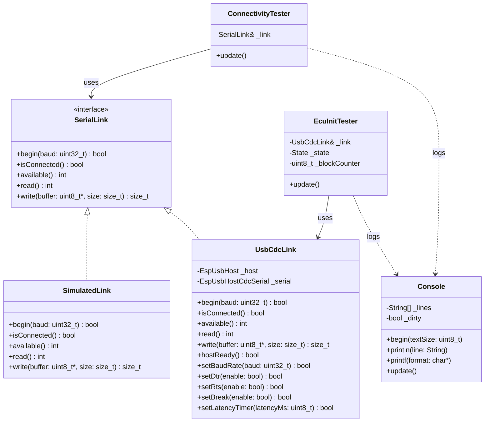

# Projekt: KWP1281-Datenlogger für VW 2E (Digifant 1.7) auf M5Stack Tab5

## 1. Ziel des Projekts

Der Auftrag ist der Aufbau eines autonomen Diagnose-Datenloggers auf Basis des M5Stack Tab5 mit ESP32-P4, der über den AutoDia K409 USB-KKL-Adapter mit dem Digifant-Steuergerät 037 906 024 (VW 2E, Motor 2.0L 8V) kommuniziert und ausgewählte Messwerteblöcke live ausliest, anzeigt und protokolliert.

Die primäre Anwendungsfrage ist die Ursachenklärung eines Fahrverhaltens im Schiebebetrieb: Spritz-/Sprotz-Verhalten bei bergab eingelegtem Gang, das bei kurzen Gasantipps verschwindet. Der Schwerpunkt liegt auf der Korrelation zwischen:

- Drosselklappenstellung / Geber G69
- Schubabschaltungs-/Leerlaufzustand
- Fahrzustand / Gang / Bergabfahrt

Das Ziel ist nicht nur das Auslesen eines einzelnen Werts, sondern die Erstellung einer verlässlichen Messbasis, um die Alternativhypothese eines Ansaug-/Vakuumlecks sauber von einem Signal-/Algorithmusproblem am Steuergerät zu trennen.

## 2. Scope und Erfolgskriterien

### Erfolgsdefinition

Das Projekt gilt als erfolgreich, wenn:

- die Verbindung zum Motorsteuergerät über KWP1281 zuverlässig aufgebaut werden kann,
- die 5-Baud-Initialisierung reproduzierbar funktioniert,
- mindestens ein relevanter Messwerteblock für G69 / Schubabschaltung ausgelesen werden kann,
- die Daten im Fahrzeug in Echtzeit sichtbar sind,
- die Messdaten lokal als CSV oder ähnliches gespeichert werden,
- eine Korrelation mit dem beobachteten Fahrverhalten möglich ist.

### Nicht im Scope

- vollständige ECU-Reverse-Engineering-Analyse des gesamten Steuergeräts,
- generische Unterstützung aller VAG-ECUs,
- Produktreife für den kommerziellen Einsatz,
- grafische Analyse-UI mit Historien- und Triggerfunktionen als Erstziel.

## 3. Hardware-Stack

| Komponente | Details | Relevanz |
|---|---|---|
| Zielsystem | M5Stack Tab5 mit ESP32-P4 | Hauptplattform |
| USB-Adapter | AutoDia K409 Profi USB-KKL | Fahrzeugseitige Diagnose-Schnittstelle |
| Fahrzeugseite | 2x2-Pin-Trapezstecker, VAG-K-Line-Format | KWP1281-Transport |
| Steuergerät | VW 037 906 024, Digifant 1.7, 2E-Motor | Ziel-ECU |
| Diagnosehintergrund | Fehlercode 00518, G69 / Drosselklappenpotentiometer | bekannter relevanter Messwert |

### Verifizierte Hardware

Der K409 wurde am M5Stack Tab5 erfolgreich erkannt: FTDI FT232R USB UART,
VID `0x0403`, PID `0x6001`. Die USB-Host- und Schreibstrecke über
`EspUsbHostCdcSerial` ist damit bestätigt. Nach einem Ab-/Anstecken kann der
USB-Host gelegentlich einen fehlgeschlagenen Root-Port-Reset melden; eine
erneute Enumeration war im Test trotzdem erfolgreich.

## 4. Protokollbasis: KWP1281

Das Steuergerät spricht kein generisches OBD-II ISO 9141-2 / Mode 01 an. Es verwendet das VAG-proprietäre KWP1281-Protokoll.

### Technische Charakteristika

- Verbindung über K-Line mit 5-Baud-Initialisierung und Adressbyte `0x01`
- Verifizierte Kommunikationsgeschwindigkeit des Digifant-1.7-Steuergeräts: **1200 Baud**
- 5-Baud-Adressbyte wird per FTDI-Bit-Banging mit 200 ms pro Bit gesendet
- Schlüsselbyte-Antwort `~KB2` wird innerhalb des engen Antwortfensters gesendet
- Kommunikationsmodell: Blöcke mit Länge, Blockzähler, Titel, Nutzdaten und Endbyte `0x03`
- Der Blockzähler wird in beiden Richtungen fortlaufend erhöht
- ACK-/Keep-Alive-Block `[0x03, counter, 0x09, 0x03]` muss regelmäßig gesendet werden
- Messwerte kommen in Gruppen / Blöcken, nicht als einzelne OBD-PIDs

### Architektur-Entscheidung

Die Lösung muss als robustes Embedded-Design behandelt werden. Die 5-Baud-Phase
und das Antwortfenster nach den Schlüsselbytes bestimmen die gesamte
Kommunikation. Display-Redraws sind deshalb aus dem zeitkritischen Pfad
entkoppelt; `Console::update()` wird separat aus `loop()` aufgerufen.

## Aktueller Implementierungsstand

Der aktuelle Arduino-Prototyp liegt in `kwp1281_logger/` und besteht aus:

- `SerialLink`: gemeinsames Interface für byteorientierte Verbindungen
- `SimulatedLink`: autonomer Testtransport ohne Fahrzeughardware
- `UsbCdcLink`: USB-Host-Adapter für den FTDI-K409 inklusive Baudrate-, DTR-, RTS-, Break- und Latenzsteuerung
- `ConnectivityTester`: periodischer Rohdaten-/Verbindungstest
- `EcuInitTester`: nichtblockierende Zustandsmaschine für 5-Baud-Init, Keybytes, KWP1281-Handshake und Blockempfang
- `Console`: Ausgabe auf Serial und Tab5-Display mit verzögertem, gedrosseltem Redraw
- `kwp1281_logger.ino`: Auswahl des Transport- und Testmodus sowie Hauptschleife

Die Live-Verifikation am Fahrzeug hat M1 bis M3 technisch bestätigt:

- K409-Erkennung und FTDI-Chipidentität sind bestätigt.
- Die USB-Schreibstrecke wurde mit Testbytes bestätigt.
- 5-Baud-Init, 1200-Baud-Umschaltung, Keybyte-Antwort und Blockzähler-Handshake funktionieren am Digifant-1.7-Steuergerät.
- Messwertformate für Gruppe 000 sowie Gruppen 001 bis 004 sind dokumentiert; ein Decoder ist im geklonten `digidash`-Repository vorhanden.

### M4-Firmwareabschluss

Die Firmware implementiert jetzt den vollständigen M4-Ablauf für die Messgruppen
000 bis 004:

- Gruppe 000 wird über `0x12` angefragt.
- Gruppen 001 bis 004 werden über `0x29 <gruppe>` sequenziell gelesen.
- Ein `0x02`-Header wird pro Gruppe zwischengespeichert; die direkt folgende
        `0xF4`-Antwort wird als Body derselben Gruppe dekodiert.
- Blocklänge, `0x03`-Endbyte und RX-Counter werden vor dem Parsing validiert.
- Ungültige Counter führen zu einem kontrollierten Session-Neustart; ungültige
        Endbytes werden verworfen und resynchronisiert.
- Die Formeln `0x8B`, `0x8C`, `0x85`, `0x88` und `0x89` werden mit Rohwert und
        dekodiertem Wert ausgegeben. Nicht unterstützte Formeln bleiben als Raw sichtbar.
- Die Batteriespannung wird aus Gruppe 002, Zone 3 (`0x85`, NWb `0x18`) mit
        `MWb * 24 / 256` berechnet; Gruppe-000-Rohfelder werden nicht mehr als
        Batterie oder absolute G69-Gradzahl interpretiert.
- G69 wird in Gruppe 003, Zone 3 als Rohwert ausgegeben. Die Werkstattreferenz
        bestätigt eine gleichmässige Änderung über den gesamten Bereich, aber
        keine absolute Grad-Skalierung.
- Verweigerte Gruppen (`0x0A`) werden protokolliert und übersprungen.
- Lokale TX-Echos werden mit `_pendingRxEcho` deterministisch und nicht mehr
        wertbasiert erkannt. Dadurch bleiben komplementäre ECU-Datenbytes in langen
        Headern erhalten und das echte `0x03`-Endbyte wird korrekt erkannt.

Der M4-Build wurde mit dem Hardware-FQBN kompiliert und auf den Tab5 geflasht.
Die abschliessende Fahrzeugmessung wurde mit eingeschalteter Zündung durchgeführt:
In einem 180-Sekunden-Lauf wurden Gruppe 000 sowie Gruppen 001 bis 004 mehrfach
vollständig gelesen und dekodiert. Der lange Gruppe-1-Header wurde mit 46 Bytes
inklusive `0x03` erkannt. Es traten keine Counterfehler, ungültigen Endbytes,
fehlenden ACKs oder Session-Timeouts auf. M4 ist damit live verifiziert.

Zusätzlich wurde ein 180-Sekunden-Lauf mit laufendem Motor durchgeführt. Gruppe
000 lieferte dabei dynamische Drehzahlen von etwa 1260 bis 1470 RPM; der Status
wechselte während des Anlaufs von `0x7F` auf `0x00` und wurde anschließend als
`RUNNING` erkannt. Auch unter Motorlauf wurden alle Gruppenzyklen ohne
Protokollfehler, Session-Neustart oder Brownout verarbeitet.

Ein korrigierter 120-Sekunden-Capture mit laufendem Motor bestätigt zusätzlich
die Messwertzuordnung: Im Leerlauf wurden etwa 910 RPM, 13,88 V und `G69 raw=0`
erfasst. Beim kurzen Gasstoß stieg die Drehzahl auf etwa 2310 RPM und G69 auf
`raw=15`, danach auf `raw=16`; beim Schließen der Drossel fiel G69 wieder auf
`raw=0`. Die ECU-Batteriespannung lag dabei bei etwa 13,69 bis 13,88 V. Der
Capture liegt unter `captures/engine_running_corrected.txt`; es wurden keine
Protokollfehler gefunden.

### Replay-Datensatz für die Weiterentwicklung

Aus diesem Capture wurde der maschinenlesbare Datensatz
`captures/engine_running_corrected_replay.csv` erzeugt. Er enthält 108
vollständige ECU-RX-Blöcke in der ursprünglichen Reihenfolge. Jede Zeile enthält
den Sequenzindex, den zuletzt erkannten Gruppenkontext, den KWP-Titel, die
validierte Blocklänge, den vollständigen Frame und die Payload als Hexwerte.
Unvollständige Blöcke werden nicht übernommen.

Die CSV ist zunächst ein unveränderlicher Referenzdatensatz für Parser-,
Decoder- und Logging-Tests. Die weitere Verwendung erfolgt in drei Schritten:

1. `tools/make_replay_dataset.py` erneut auf einen neuen Roh-Capture anwenden,
        wenn ein weiterer Fahrzeugzustand aufgezeichnet wurde.
2. Die CSV als Quelle für eine deterministische Replay-Implementierung von
        `SimulatedLink` verwenden. Antworten werden in derselben Reihenfolge wie im
        Fahrzeug-Capture ausgegeben; Requests und ACKs des Testers bleiben dabei der
        Auslöser für die nächste Antwort.
3. Für Fehler- und Grenzfalltests einzelne CSV-Zeilen duplizieren, entfernen
        oder gezielt Länge, Counter, Payload oder Endbyte verändern. Der originale
        Capture bleibt unverändert und dient als Vergleichsbasis.

Die Replay-Integration ist umgesetzt: `SimulatedLink` verwendet jetzt ein
Firmware-Profil aus `kwp1281_logger/ReplayData.h`. Das Profil basiert auf
`captures/engine_running_corrected_replay.csv`, wird request-getrieben nach
der simulierten Antwortverzögerung ausgegeben und nach dem letzten Block
zyklisch wieder ab dem ersten Block verwendet. Damit werden sowohl die
Gruppenstruktur als auch dynamische Messwerte des Motor-Captures wiederholt.
Weitere Captures werden weiterhin mit `tools/make_replay_dataset.py` erzeugt;
bei mehreren Profilen wird das gewünschte Profil künftig in `ReplayData.h`
ausgewählt, statt die Transportlogik zu duplizieren.

Für den nächsten Schritt enthält das Replay zusätzlich reale Gruppe-003-
Messpunkte mit G69-Rohwerten `0x0F` und `0x10`. Die Simulation gibt diese
Rohwerte sowie die Batteriespannung und den Gruppe-000-Status mit einer
`[SIM M5]`-Markierung aus. Damit lässt sich die Plausibilität des M5-Mappings
ohne Fahrzeug prüfen. Eine endgültige Schubabschaltungssemantik wird bewusst
nicht behauptet, da der vorhandene Capture dafür noch keinen ausreichenden
Zustandsvergleich mit Motor aus/Zündung ein enthält.

### Touch-Dashboard (Querformat, 1280×720)

Die Live-Anzeige (`kwp1281_logger/Dashboard.h/.cpp`) läuft explizit im
Querformat und verwendet nun eine vollwertige Instrumenten-Darstellung:

1. **Drehzahl:** Großes Rundinstrument (Radius 108 px, 0–5000 U/min) mit Analogzeiger, Farbzonen mit einheitlichem `TFT_GREEN`, Skalenbeschriftung (0..5k) und Digitalwert.
2. **Motorstatus:** Bereinigte Zustandsmatrix (`STOPP`, `START`, `LEERLAUF`, `TEILLAST`, `VOLLE LAST`, `SCHUB`) mit dynamischer Farbmarkierung des aktiven Zustands.
3. **Batteriespannung:** Rundinstrument im praxisgerechten Bereich **10–16 Volt** (Radius 108 px) mit Analogzeiger und Farbbereichen (Rot/Gelb/Grün).
4. **Drosselklappe (G69):** Schematische Stauklappe im horizontalen Ansaugrohr mit aktuellem Öffnungswinkel und grafischem Grad-Symbol (ohne Textüberlauf).
5. **Kühlmitteltemperatur:** Großes Thermometer (nach unten gerückt) mit lesbarer Skalenbeschriftung (0, 50, 90, 120) und sauberem Gradkreis-Symbol `°C`.
6. **Ansauglufttemperatur (IAT):** Großes Thermometer mit Skala (0, 30, 60, 90) und sauberem Gradkreis-Symbol `°C`.

**Flackerfreier Bildaufbau durch Sprite-Double-Buffering:**
Das Dashboard nutzt nun ein `LGFX_Sprite` im PSRAM pro Kachel auf Tab 1, ein `_statusSprite` für die Statusleiste sowie zusätzlich `_tab2CardSprite` und `_logSprite` auf Tab 2. Sowohl alle 6 Werte-Kacheln, die Statusleiste als auch die beiden oberen ECU-Kacheln und das gesamte Live-Log-Terminal auf Tab 2 werden vollständig im Offscreen-Puffer gerendert und per schnellem `pushSprite()` atomar auf das Display geblittet. Dadurch flackert weder auf Tab 1 noch auf Tab 2 irgendein Element (auch nicht die Live-Konsole).

**Bildaufbau & Tab-Wechsel:**
- Beim Wechsel zwischen den Tabs wird der Bildschirm per `fillScreen(TFT_BLACK)` vollständig neu initialisiert, um Artefakte restlos zu tilgen.
- Die Abfragerate und Simulation laufen mit **10 Hz** (100 ms Intervall) für flüssige Live-Aktualisierung.

**Tab 2 (ECU & Live-Log):**
Oben Steuergeräteidentifikation und Verbindungsstatistik in angepassten Kacheln (ohne Textüberlauf), darunter das scrollende Konsolen-Log im integrierten Terminalbereich mit 10 Hz Aktualisierung.

**Status-Pipeline:**
Fünf Stufen (1. BEREIT, 2. 5-BAUD, 3. HANDSHAKE, 4. IDENT, 5. VERBUNDEN) werden in der Statusleiste dauerhaft visualisiert. Der Replay-Datensatz enthält alle 108 Blöcke aus dem Fahrzeug-Capture inklusive Leerlauf, Gasstoß (bis 2310 RPM) und Abtouren.

## UML-Klassendiagramm



## 5. Zielarchitektur

```text
[Digifant-Steuergerät]
        |
        | K-Line
        v
[AutoDia K409]
        |
        | USB
        v
[M5Stack Tab5 / ESP32-P4]
        |
        | USB-Host CDC-ACM / Serial-Abstraction
        v
+-------------------------------------------+
| USB-Host-Treiber / Geräteerkennung         |
| - FTDI / CP210x / CH34x / USB-CDC         |
+-------------------------------------------+
        |
        v
+-------------------------------------------+
| KWP1281-Protokollschicht                   |
| - 5-Baud-Init                             |
| - Frame-/Checksum-Validierung             |
| - Block-Abfrage / Antwort-Handling         |
+-------------------------------------------+
        |
        v
+-------------------------------------------+
| Anwendungsschicht                         |
| - Live-Anzeige (Display)                  |
| - Logging auf SD / Flash (CSV)            |
| - Filterung / Umrechnung relevanter Werte |
| - spätere WLAN-Übertragung                |
+-------------------------------------------+
```

## 6. Bausteine

### 6.1 USB-Host-Treiber

Empfohlene Referenzimplementierungen:

- ESP-IDF Beispiel `peripherals/usb/host/cdc/cdc_acm_vcp`
- Arduino-Library `EspUsbHost` mit `EspUsbHostCdcSerial`

Beide Ansätze sind sinnvoll; die Entscheidung hängt von der Entwicklungsgeschwindigkeit und der Robustheit des 5-Baud-Workflows ab.

### 6.2 KWP1281-Protokollschicht

Diese Schicht übernimmt:

- Initialisierung des K-Line-Protokolls,
- serielle Empfangs-/Sende-Logik,
- Frame-Erkennung und Prüfsummenprüfung,
- Blockanfragen und Antwortverarbeitung,
- Auswahl und Validierung der relevanten Messwertblöcke.

Wichtig: Die Implementierung muss auf den USB-CDC- bzw. Serial-Adapter auf dem ESP32-P4 abgestimmt werden, nicht auf eine normale PC-UART-Umgebung.

### 6.3 Messwerteblock-Mapping

Die genaue Struktur der Messwertblöcke für 037 906 024 ist nicht offiziell bekannt. Das Projekt hat zwei mögliche Wege:

1. Referenz-Label-Datei oder Dokumentation auffinden
2. Eine empirische Ermittlung über bekannte Referenzwerte

Als Plausibilisierung dienen unter anderem:

- Drehzahl
- Kühlmitteltemperatur
- Drosselklappenstellung / Potentiometerwert
- Leerlauf-/Schubabschaltungszustand

### 6.4 Anwendungsschicht

Beinhaltet:

- Live-Anzeige auf dem Tab5-Display
- CSV-Logging mit Zeitstempel und Rohwerten
- optional spätere Umrechnung in physikalische Einheiten
- optional Export oder WLAN-Übertragung für Analyse am PC

## 7. Meilensteine

- [x] M1 – Hardware-Grundverifikation: K409 an Tab5-USB-A anschließen, Geräteeigenschaften prüfen und Chip-Typ identifizieren (FTDI FT232R, VID `0x0403`, PID `0x6001`)
- [x] M2 – Rohkommunikation: einfache Byte-/Serial-Verbindung validieren; Schreibstrecke über FTDI bestätigt
- [x] M3 – 5-Baud-Init: Verbindung zum Steuergerät mit Adressbyte `0x01` erfolgreich aufbauen; Sync-Byte `0x55`, Schlüsselbytes und `~KB2` bestätigt
- [x] M4 – Blockkommunikation: Messwerteblöcke anfragen und Antworttelegramme verifizieren (Firmware sowie 180-Sekunden-Läufe mit Zündung und laufendem Motor abgeschlossen)
- [ ] M5 – Block-Mapping für G69 / Schubabschaltung: relevanten Messwertblock identifizieren
- [ ] M6 – Fahrzeugmessung: Live-Logging und Korrelation während einer Testfahrt

## 8. Risiken und offene Fragen

1. USB-Host-Reset/Enumeration kann nach dem An- oder Abstecken gelegentlich fehlschlagen; erneute Enumeration war im Test erfolgreich.
2. 5-Baud-Initialisierung über USB-CDC bleibt timingkritisch und muss bei weiteren Fahrzeugtests beobachtet werden.
3. Kein bestätigtes Label-File für Steuergerät 037 906 024 vorhanden; Block-Layoutermittlung muss empirisch erfolgen.
4. Timing und Jitter können durch RTOS-Scheduling und Blockantwortfenster beeinflusst werden.
5. Die interne G69-Beschaltung kann je nach Digifant-Variante variieren; Messwerte müssen nicht vorschnell interpretiert werden.
6. Die Eignung des Tab5 als USB-Host und des verwendeten USB-Serial-Stacks ist für den aktuellen K409/M4-Pfad live verifiziert; weitere Adapter bleiben außerhalb des Nachweises.

## 9. Diagnosehintergrund am Fahrzeug

- Rasseln im Motorraum bei 2000–2300 RPM, wahrscheinlich mechanischer Natur
- leichtes Ruckeln bei Vollast auf Bergauffahrten
- hochfrequentes Zischen bei stärkerem Beschleunigen, Verdacht auf Ansaug-/Vakuumleck
- Sprotz-/Spritz-Verhalten im Schiebebetrieb bei eingelegtem Gang bergab, verschwindet bei kurzem Gasantippen

Der Logger ist explizit darauf ausgelegt, genau dieses Verhalten im realen Fahrzeugbetrieb zu erfassen und mit Signalen am Steuergerät zu korrelieren.

## 10. Referenzen

- ESP-IDF USB-Host-Doku (ESP32-P4), Beispiel `cdc_acm_vcp`
- Arduino-Library `EspUsbHost` mit `EspUsbHostCdcSerial`
- ESPHome-Komponente `usb_uart`
- Blogpost „Alexander's car diagnostic software (OBD KW1281)“
- `wbh-diag`, `monoscan`
- NefMoto-Forum / Reverse-Engineering-Community

## 11. TODO-Liste

### P0 – Blocker / Grundvoraussetzungen

- [x] K409 hardwareseitig am Tab5 anschließen und Gerätetyp verifizieren
- [x] USB-Host-Stack auf dem Tab5 mit dem Adapter erfolgreich testen
- [x] CDC-/Serial-Pfad auf der ESP32-Seite validieren
- [x] 5-Baud-Initialisierung für KWP1281 implementieren und messtechnisch verifizieren
- [x] Mindest-Handshake mit dem Steuergerät 0x01 reproduzierbar nachweisen

### P1 – Protokoll und Datenfluss

- [x] KWP1281-Frame-Handling implementieren (Start, ID, Länge, Daten und Endbyte)
- [x] Blockanfrage-/Antwort-Logik umsetzen
- [x] Fehlerbehandlung und Timeout-Logik ergänzen
- [ ] Rohdaten-Logging auf SD/Flash anlegen
- [x] Sequenznummern und Antwortfenster überwachen

### P2 – Messwertanalyse

- [x] Messwertblöcke für 037 906 024 systematisch erfassen
- [x] bekannte Werte (Drehzahl, Temperatur, Drosselklappenstellung) als Plausibilitätsprüfung verwenden
- [x] G69-Block identifizieren und validieren
- [ ] Schubabschaltungsstatus / Leerlaufzustand zuordnen
- [ ] Rohwerte in realistische physikalische Einheiten umrechnen

### P3 – Fahrzeugmessung und UI

- [ ] Live-Display für Messwerte auf Tab5 entwickeln
- [ ] CSV-Logging mit Zeitstempel und Blocknummern
- [ ] Testfahrtplanung für Bergabfahrt mit eingelegtem Gang durchführen
- [ ] Messdaten während einer Testfahrt erfassen und analysieren
- [ ] Korrelation G69 vs. Fahrzustand / Schubabschaltung dokumentieren

### P4 – Stabilisierung und Erweiterung

- [ ] Fehler-/Resilience-Test bei Spannungsschwankungen und Serienunterbrechungen
- [ ] Robustheitsoptimierung für RTOS-/Timing-Szenarien
- [ ] optional WLAN- oder USB-Export für spätere Analyse
- [ ] Dokumentation und Wiederholungsanleitung für Nachbau und Debugging

### Nächste Schritte

1. **M5 abschließen:** Den Rohwert für Schubabschaltung/Leerlaufzustand in den
        Gruppen 000 bis 004 gegen Motor aus, Zündung ein, Leerlauf und kurze
        Gasantipps abgleichen. Den Statuswert erst danach als semantisches Signal
        benennen; `0x7F` und `0x00` sind derzeit beobachtete Rohwerte, aber noch
        keine abschließende Statusdefinition.
2. **Logging ergänzen:** Rohblöcke und dekodierte Werte mit Zeitstempel auf
        SD oder Flash als CSV speichern. Das ist die wichtigste technische
        Voraussetzung für eine belastbare Auswertung während der Fahrt.
3. **M6 durchführen:** Eine sichere Testfahrt mit eingelegtem Gang bergab,
        Schubphasen und kurzen Gasantipps planen und die Messdaten erfassen.
4. **Auswertung dokumentieren:** G69, Drehzahl, Drosselklappe und den
        zugeordneten Schub-/Leerlaufstatus mit dem beobachteten Ruckeln/Sprotzverhalten
        korrelieren.

## 12. Konkrete Entwicklungsreihenfolge (ESP32-Implementierung)

Die Reihenfolge der Implementierung sollte strikt durch die technische Abhängigkeit bestimmt werden. Die Implementierung muss in dieser Reihenfolge erfolgen, damit spätere Fehler nicht am falschen Layer entstehen.

### 12.1 Phase 1 – Grundgerüst und Debug-Ausgabe

- [x] Projektstruktur für ESP-IDF oder Arduino anlegen
- [x] Log-Ausgabe über den seriellen Monitor definieren
- [x] Konfigurationsmechanismus für Simulation vs. Hardware einbauen
- [x] minimale State-Machine für Idle / Init / Request / Receive / Error definieren

### 12.2 Phase 2 – USB-/Serial-Abstraktion

- [x] USB-Host- oder Serial-Pfad für K409 anlegen
- [x] Basisfunktionen für `read()`, `write()`, `available()` und Fehlerzustände kapseln
- [x] einfache Dummy-Transceiver-Klasse für die Simulation definieren
- [x] Device-Abstraction, damit Hardware- und Simulationsmodus denselben Codepfad nutzen

### 12.3 Phase 3 – KWP1281-Initialisierung

- [x] 5-Baud-Init als eigenständige Funktion modellieren
- [x] Startbit / Bit-Pattern / Antwort-Parsing definieren
- [x] Prüfungslogik für Sync-Byte und Schlüsselbytes hinzufügen
- [x] Timeouts und Fehlerzustände definieren

### 12.4 Phase 4 – Blockkommunikation

- [x] Anfrage-/Antwort-Frame-Struktur implementieren
- [x] Blockzähler und Sequenzvalidierung ergänzen
- [x] Antwort-Parsing für Messdatensätze vorbereiten
- [x] Transaktion-Timeout und Wiederholungsstrategie definieren

### 12.5 Phase 5 – Datenanalyse

- [x] Mapping einzelner Messwerteblöcke auf bekannte Größen
- [ ] G69- und Schubabschaltungs-States als semantische Einheiten modellieren
- [x] plausibilitätsbasierte Validierung und Grenzwertprüfung ergänzen
- [ ] Logformat für Roh- und berechnete Daten festlegen

### 12.6 Phase 6 – Fahrzeugbetrieb und UI

- [ ] Display-Integration für Live-Werte
- [ ] CSV-/SD-Logging
- [ ] Fahrzeugtest und Diagnosedokumentation

## 13. Benötigte Bibliotheken und Module

Die konkreten Abhängigkeiten hängen davon ab, ob das Projekt mit ESP-IDF oder Arduino entwickelt wird. Das Ziel ist eine möglichst saubere Abstraktion zwischen Hardware-IO und KWP1281-Logik.

### 13.1 ESP-IDF-Variante (empfohlen für maximale Kontrolle)

- `esp_log` – für konsistente Debug-Ausgaben
- `driver/uart.h` – falls Hardware-UART für Fallback benötigt wird
- `driver/gpio.h` – für Bit-Banging-Init und K-Line-Projektion
- `esp_timer.h` – präzise Timing für 5-Baud- und Antwortfenster
- `freertos/FreeRTOS.h` – Aufgaben-/Task-Management
- `usb/usb_host.h` / `usb/usb_types_ch9.h` – falls USB-Host-Stack verwendet wird
- `tinyusb` oder ESP-IDF USB CDC-Host-Stack – je nach gewähltem USB-Ansatz
- `sdmmc_host.h` / `sdmmc_cmd.h` – für SD-Logging
- `fatfs_vfs` – für Dateisystemzugriff auf SD-Karten

### 13.2 Arduino-Variante (falls schnellerer Prototyping-Workflow bevorzugt wird)

- `M5Unified` oder `M5Tab5`-spezifische Bibliotheken für Display, Takt und Peripherie
- `EspUsbHost` / `EspUsbHostCdcSerial` – wenn USB-CDC als Transportpfad genutzt werden soll
- `Arduino.h` / `HardwareSerial` – für serielle Schnittstellen
- `SPI.h` / `SD.h` – für SD-Karten-Logging
- `TimeLib` oder eigenes Zeit-Handling – für Zeitstempel

### 13.3 Eigenes Modul-Design

Empfohlen ist ein modulare Struktur mit den folgenden Komponenten:

- `transport_layer` – USB-/UART-/Simulation-Transport
- `kwp1281_layer` – 5-Baud-Init, Framing, Prüfsumme, Blockhandling
- `message_parser` – Block- und Messwert-Entschlüsselung
- `sensor_mapping` – Zuordnung von Bytes zu physikalischen Größen
- `logging` – CSV-/Flash-/SD-Logging
- `display` – Live-Anzeige
- `simulator` – Generierung simulierter Eingaben und Testdaten

## 14. Simulationsmodus für autonome Tests und AI-Validierung

Ein zentraler Punkt für spätere Agenten-gestützte Entwicklung ist ein echter, robust implementierter Simulationsmodus. Dieser Modus soll in der Software aktiviert oder deaktiviert werden können, ohne das normale Hardware-Handling zu beeinträchtigen.

### 14.1 Ziel des Simulationsmodus

Die Simulation soll alle relevanten Eingangsvarianten selbst erzeugen können, damit die Verarbeitung der Daten unabhängig von realem Fahrzeug- oder Adapter-Input getestet werden kann. Damit können:

- Protokollfehler reproduziert werden,
- KWP1281-Parsing und Prüfsummenlogik validiert werden,
- Messwertblöcke mit verschiedenen synthetischen Zuständen erzeugt werden,
- die Software ohne Fahrzeugzugang automatisiert getestet werden,
- AI-Agenten die Logik eigenständig verbessern und verifizieren.

### 14.2 Anforderungen an den Modus

- [ ] ein Schalter oder Flag im Code, z. B. `SIMULATION_MODE` oder `ENABLE_KWP_SIMULATION`
- [ ] Simulation kann über eine einzelne Compile-Zeit- oder Runtime-Konfiguration aktiviert werden
- [ ] Hardware-Pfad bleibt vollständig getrennt vom Simulationspfad
- [ ] Simulator erzeugt KWP1281-ähnliche Frames inkl. realistischer Fehlerlagen
- [ ] Generator unterstützt mindestens die folgenden Varianten:
  - korrekte Antwort
  - Timeout
  - prüfen/fehlerhafte Prüfsumme
  - falsche Blocknummer
  - fehlerhafte Längenangabe
  - gültige Messwerteblöcke mit G69 und Schubabschaltung
  - ungewöhnliche bzw. randnahe Messwerte
- [ ] Alle simulierten Daten werden serialisiert auf dem seriellen Monitor ausgegeben

### 14.3 Simulationsarchitektur

```text
[App/Main]
   |
   v
[Mode Selector]
   - SIMULATION_MODE = true/false
   |
   +--> Hardware-Transport
   |
   +--> Simulation-Transport
          |
          v
   [Input Generator]
   - erzeugt KWP1281-ähnliche Frames
   - erzeugt Fehler-/Rand-/Normalfälle
   - modelliert G69, Drehzahl, Temperatur, Schubabschaltung
          |
          v
   [KWP1281 Parser / Validator]
          |
          v
   [Data Mapping / Logging]
          |
          v
   [Serial Monitor Output]
```

### 14.4 Serial-Monitor-Ausgabe

Die Ausgabe im seriellen Monitor soll die folgenden Informationen enthalten:

- Betriebmodus: `SIMULATION` oder `HARDWARE`
- eingegangene / simulierte Daten in hexadezimaler Darstellung
- Frame-Typ, Blocknummer, Länge, Prüfsummenstatus
- validierte oder verworfene Telegramme
- relevante Messwerte wie Drehzahl, Temperatur, G69-Wert, Schubabschaltung
- Zeitstempel für jede Analyse-Iteration

Beispiel:

```text
[SIM] mode=ACTIVE
[SIM] tx: 55 01 0A 20 00 01 2F 7A
[SIM] rx: 55 01 0A 20 00 01 2F 7A 00 00 00 00
[SIM] checksum=OK
[SIM] block=0x20 value_g69=42.3 status=idle
[SIM] log: 2026-08-15T12:34:56Z, block=0x20, g69=42.3, rpm=1800
```

### 14.5 Nutzen für AI-Agenten

Der Simulationmodus ist explizit so zu entwerfen, dass ein AI-Agent die Software ohne Hardwarezugang vollständig testen kann. Dadurch kann er:

- neue Parser-Regeln verifizieren,
- Einzelfälle gegenwerfen,
- Fehlercorrection und Robustheit erweitern,
- verschiedene Messwertblöcke simulieren,
- Zustandsmaschinen auf Korruptionsfälle testen,
- Änderungen mit automatisierter Log-Auswertung bewerten.

### 14.6 Empfohlener Implementierungsansatz

- ein `Transport`-Interface definieren, das Hardware und Simulation als unterschiedliche Implementierungen nutzt
- `SimulationInputGenerator` als eigenständige Klasse mit konfigurierbaren Szenarien
- `SerialDebug` oder `Logger` als zentrale Ausgabeschicht
- `APP_MODE`-Konfiguration über Build-Flag, Präprozessor-Define oder Konfigurations-Struct
- optional `SIMULATION_SEED` oder `SIMULATION_SCENARIO` zur gezielten Reproduktion von Fehlerszenarien

## 15. Definition of Done

Das Projekt ist abgeschlossen, wenn:

- der KWP1281-Handshake zum ECU stabil funktioniert,
- relevante Messwerteblöcke mit verifizierter Korrelation ausgelesen werden,
- die Daten in Echtzeit sichtbar und lokal gespeichert werden,
- die Diagnosehypothese zu G69 / Schubabschaltung anhand realer Messdaten überprüfbar ist.

Damit ist die technische Basis geschaffen, um die ursprüngliche Fahrzeugdiagnose sauber und reproduzierbar zu bewerten.